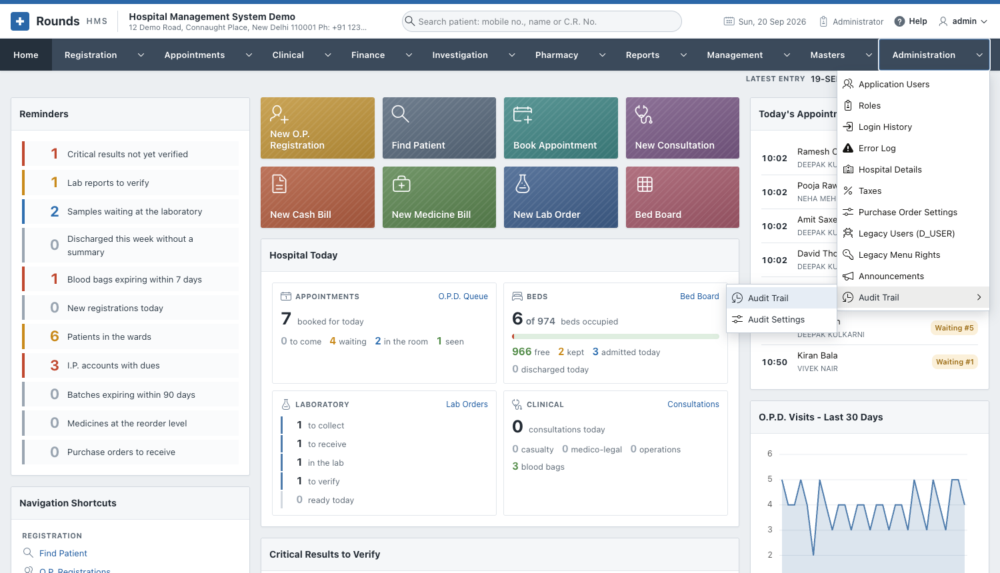
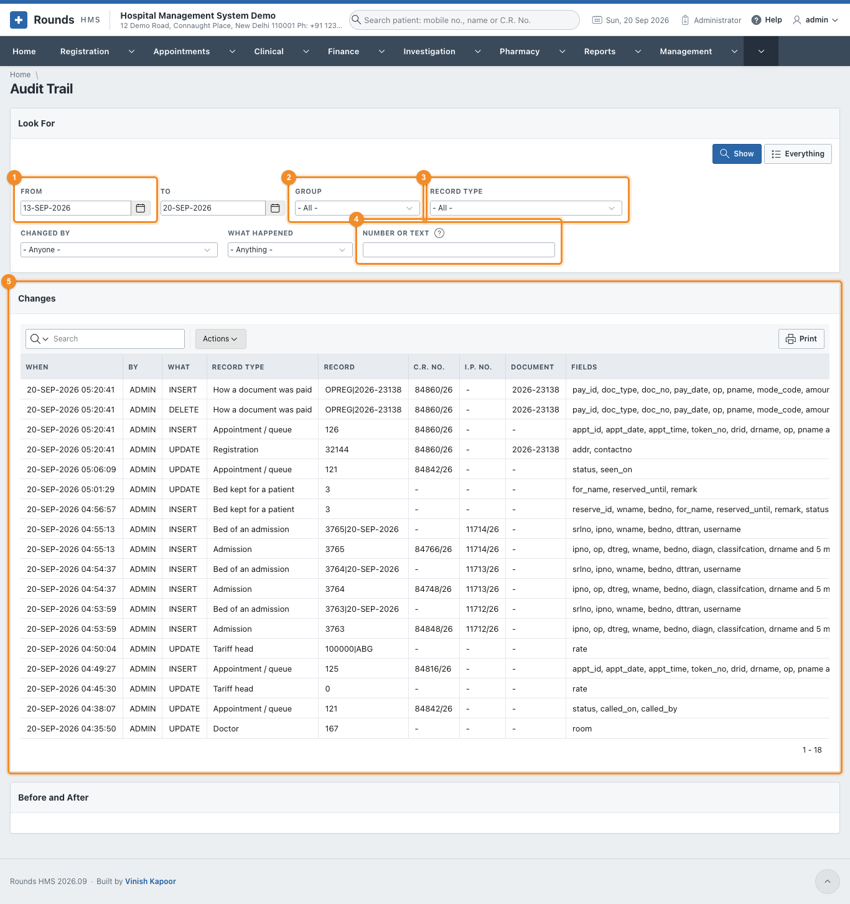
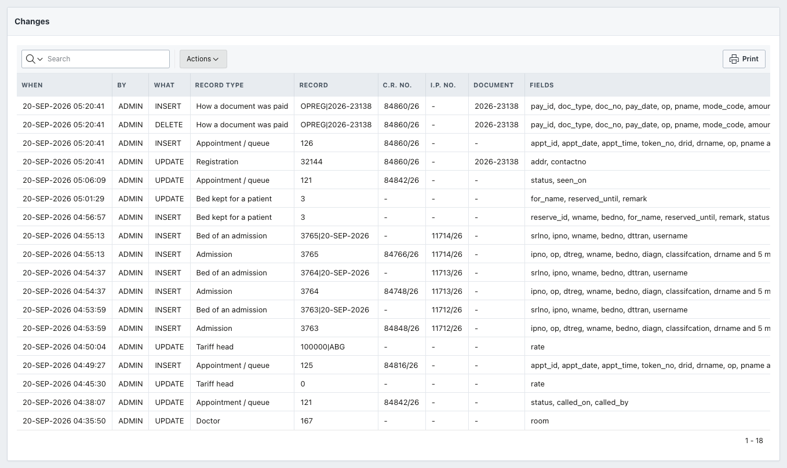
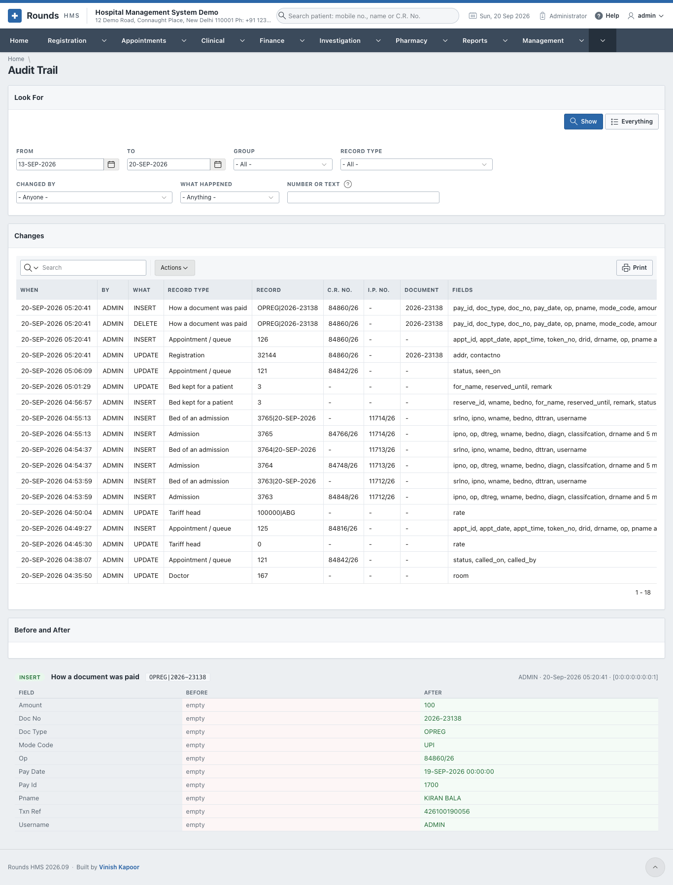
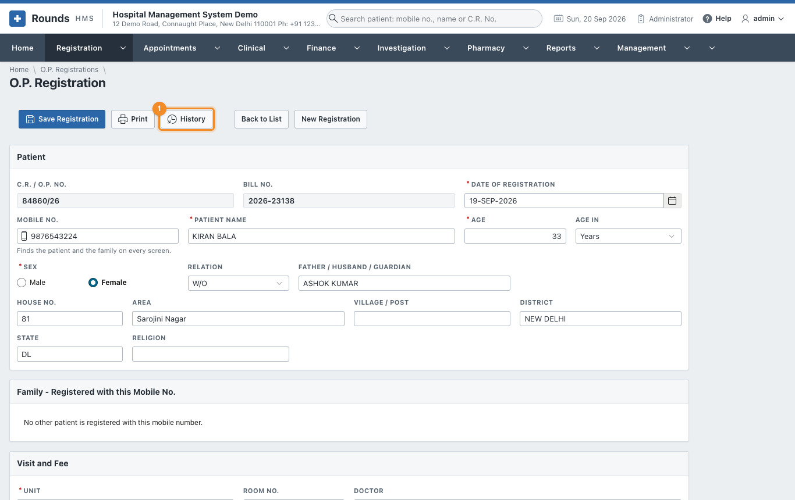
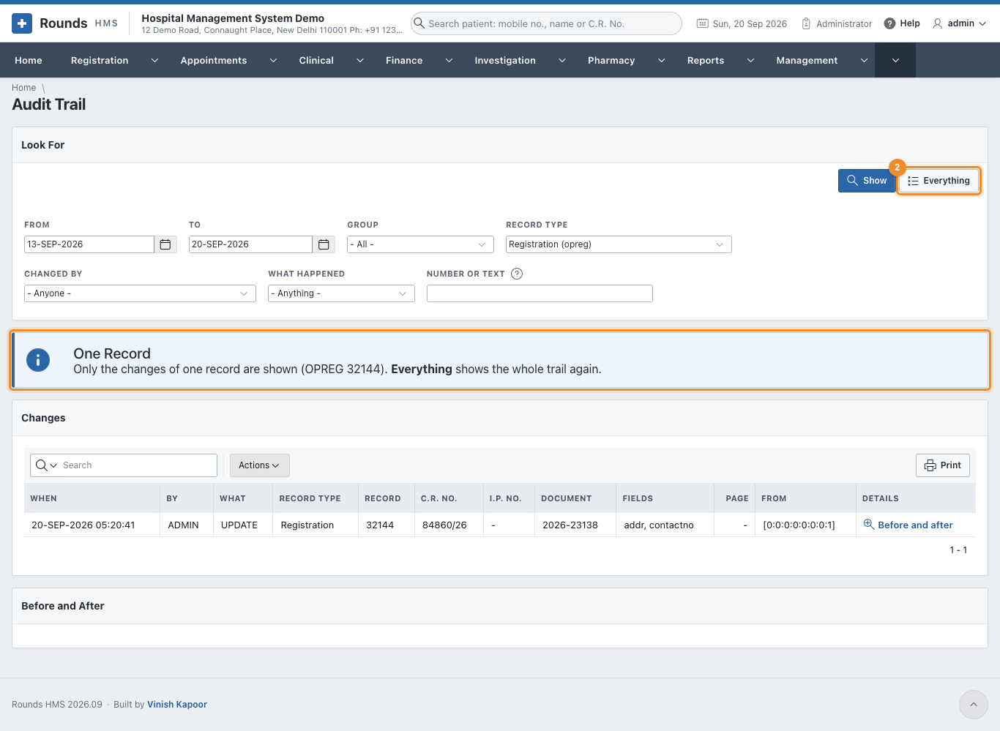
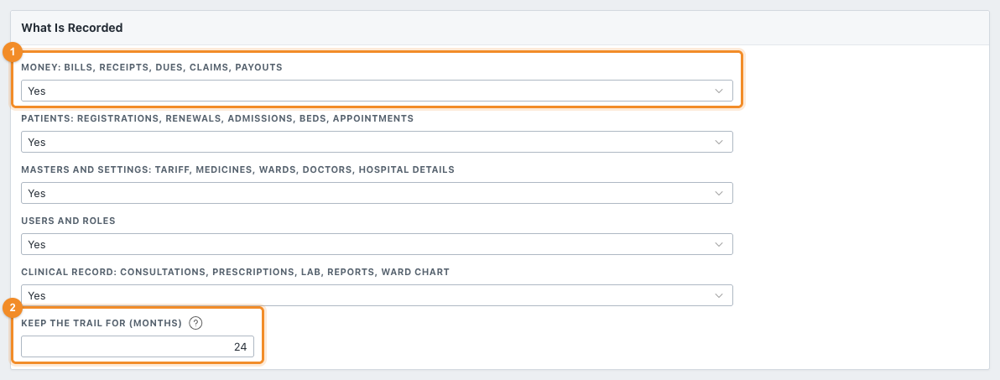
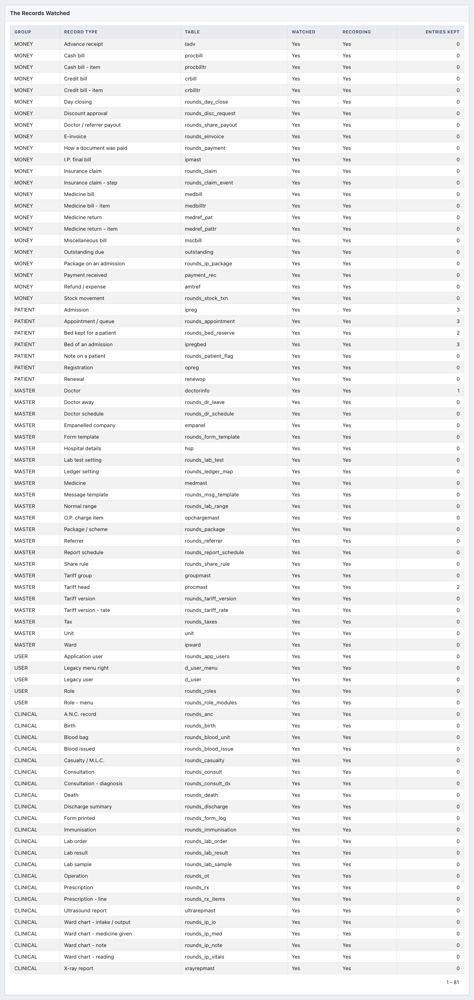

# Audit Trail

The audit trail answers one question: **who changed this record, when, and what did it say before?**

Every time a watched record is added, changed or deleted, an entry is written with the name of the user,
the time, the computer it came from, and every field that changed - the value before and the value after.
Entries are written by the database itself, not by the screens, so a change made anywhere is recorded.
An entry can never be edited, by anybody; only the months kept take old ones away.

**Administration > Audit Trail** opens a submenu of two:

| Option | Use it to |
|---|---|
| [Audit Trail](#looking-for-a-change) | Look for changes: by day, by user, by record, by number |
| [Audit Settings](#the-settings) | Choose what is recorded and for how long |

This is separate from the two logs next to it: [Login History](logs.md) records who signed in, and the
[Error Log](logs.md#error-log) records what went wrong. The audit trail records what was *changed*.

## Looking for a change

**Administration > Audit Trail > Audit Trail** opens on the last seven days:

1. 1 **From** and **To**: the days to look at.
2. 2 **Group**: money, patients, masters and settings, users and roles, or the
   clinical record.
3. 3 **Record Type**: one kind of record, e.g. *Cash bill* or *Registration*.
4. 4 **Number or Text**: a C.R. No., an I.P. No., a bill number, or a word from
   the names of the fields that changed.
5. 5 The changes, newest first.

**Changed By** narrows it to one user, and **What Happened** to added, changed or deleted records.
**Show** applies what you chose.

| Column | What it holds |
|---|---|
| **When** | the day and the time, to the second |
| **By** | the user who was signed in |
| **What** | *INSERT* added, *UPDATE* changed, *DELETE* deleted |
| **Record Type** | what kind of record it was, e.g. *Admission* |
| **Record** | which record, by its own key |
| **C.R. No.**, **I.P. No.**, **Document** | the patient or the document it belongs to, where the record has one |
| **Fields** | the names of the fields that changed |
| **Page**, **From** | the screen it was changed on and the computer it came from |

Use **Actions** on this list as on any other: to group, to sort, or to download what you are looking at.

## Before and after

**Before and after** on a row opens what actually changed:

Each field is on a line of its own: what it held before, and what it holds now. An added record shows all
its fields as new; a deleted one shows everything it held. The line above gives the user, the time and
the address of the computer.

## The history of one record

Record screens carry a **History** button, which opens the trail with that record already chosen:

1. 1 A note says whose history is shown.
2. 2 **Everything** goes back to the whole trail.

## The settings

**Administration > Audit Trail > Audit Settings** decides what is kept:

1. 1 Five groups, each **Yes** or **No**:

    | Group | What it covers |
    |---|---|
    | **Money** | bills, receipts, dues, claims, payouts, day closing, stock movements |
    | **Patients** | registrations, renewals, admissions, beds, appointments and tokens |
    | **Masters and settings** | tariff, medicines, wards, doctors, taxes, hospital details |
    | **Users and roles** | who may use the application, and what they may open |
    | **Clinical record** | consultations, prescriptions, lab, reports, ward chart |

2. 2 **Keep the Trail for (months)**: 24 to begin with. Entries older than this
   are taken away on the first of each month.

1. 1 **Save** applies the switches and the months.
2. 2 **Remove Old Entries Now** takes away the entries older than the months kept,
   without waiting for the first of the month. It asks first.

Switching a group off removes the recording from its records, and switching it on puts it back. **Nothing
already recorded is lost either way.**

### What is watched

The bottom of the screen lists every record type that can be watched, its table, whether it is switched
on, whether it is recording at this moment, and how many entries are kept for it:

**Recording** is the useful one: it says *Yes* only when the database is really writing entries for that
record. A row that is watched but not recording means the recording could not be put in place - the
[Error Log](logs.md#error-log) says why.

!!! warning "Switching a group off leaves a gap"
    While a group is off, nothing about it is recorded, and there is no way to find out afterwards what
    happened in that time. Leave the groups on unless there is a reason not to.

!!! tip "How much room it takes"
    An entry is small, but a busy hospital makes thousands a day. Twenty-four months suits most; a
    hospital that must keep changes longer for its own rules can raise it, and one short of room can
    lower it and click **Remove Old Entries Now**.

!!! question "Something went wrong?"
    - *A change is not in the trail*: its group was switched off at the time, or the change is older than
      the months kept.
    - *The user is not who you expected*: the trail records the user who was signed in on that screen.
      Work done by a scheduled job or straight in the database is recorded under the database user.
    - *A record type is watched but not recording*: something stopped its recording being put in place -
      open **Audit Settings**, switch the group off and on again, and look at the
      [Error Log](logs.md#error-log) if it still does not record - a recording that cannot be put in
      place writes a note there saying why.
