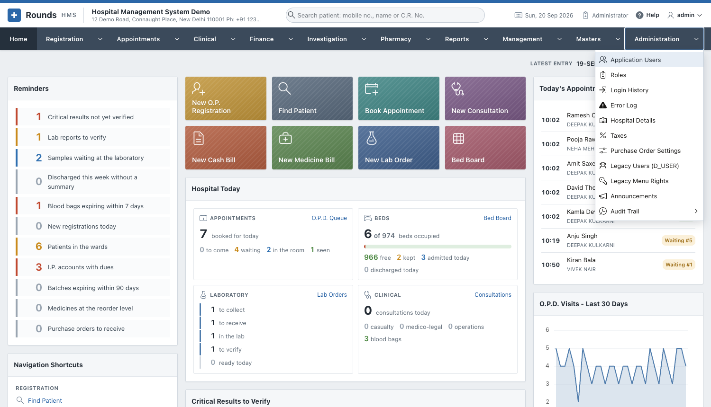

# Administration

The **Administration** menu is for the administrator. It holds:

- the users, their roles and what each role may open;
- the hospital's details, printed on every document;
- the taxes of the bills;
- the logs of sign-ins and errors;
- the audit trail: who changed which record, and what it said before.

| Page | Options |
|---|---|
| [Users and Roles](users.md) | Application Users, Roles, Change Password, Login History |
| [Hospital Settings](settings.md) | Hospital Details, Taxes, Purchase Order Settings, Announcements |
| [Logs](logs.md) | Error Log, Legacy Users (D_USER), Legacy Menu Rights |
| [Audit Trail](audit.md) | Audit Trail, Audit Settings |

!!! note
    **Message Templates** is in the [Masters](../masters/messages.md) menu, and **Messages Sent** in the
    [Reports](../reports/messages.md) menu.
