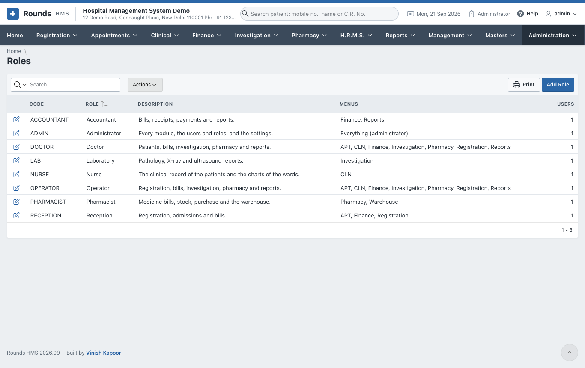
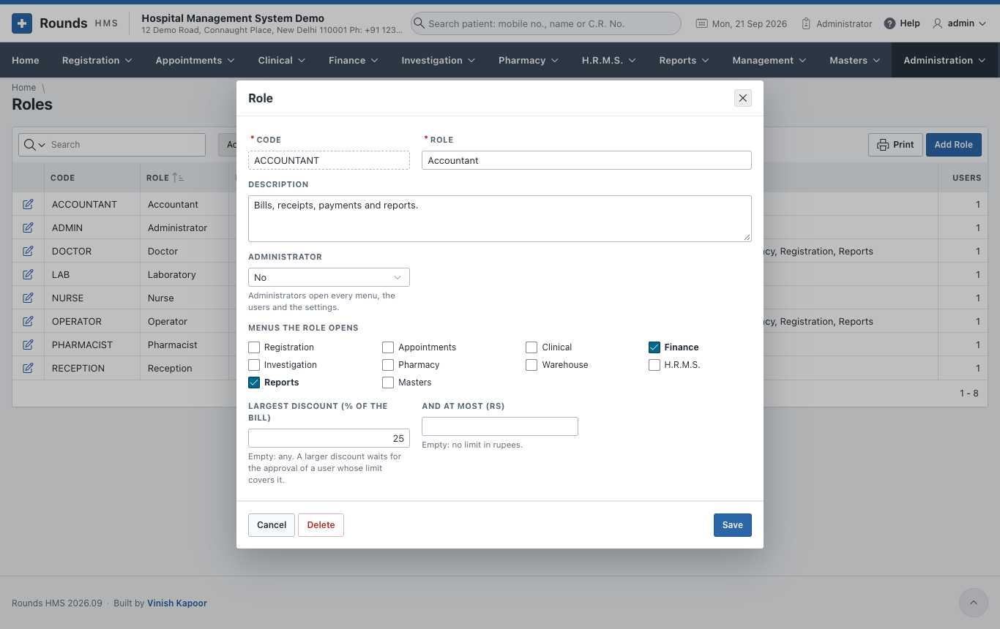
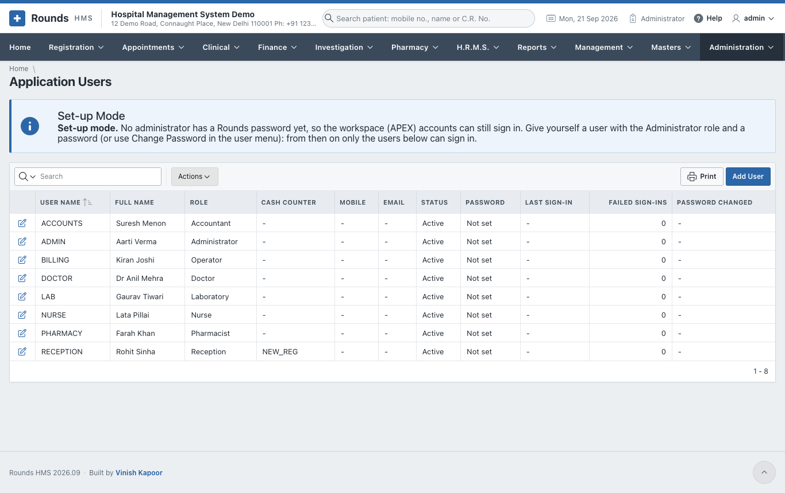
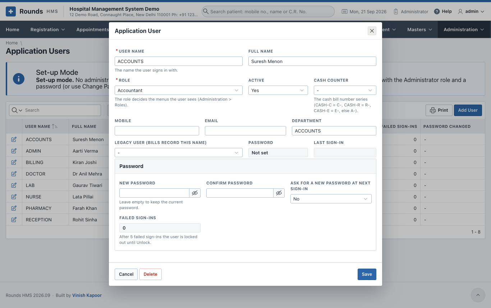
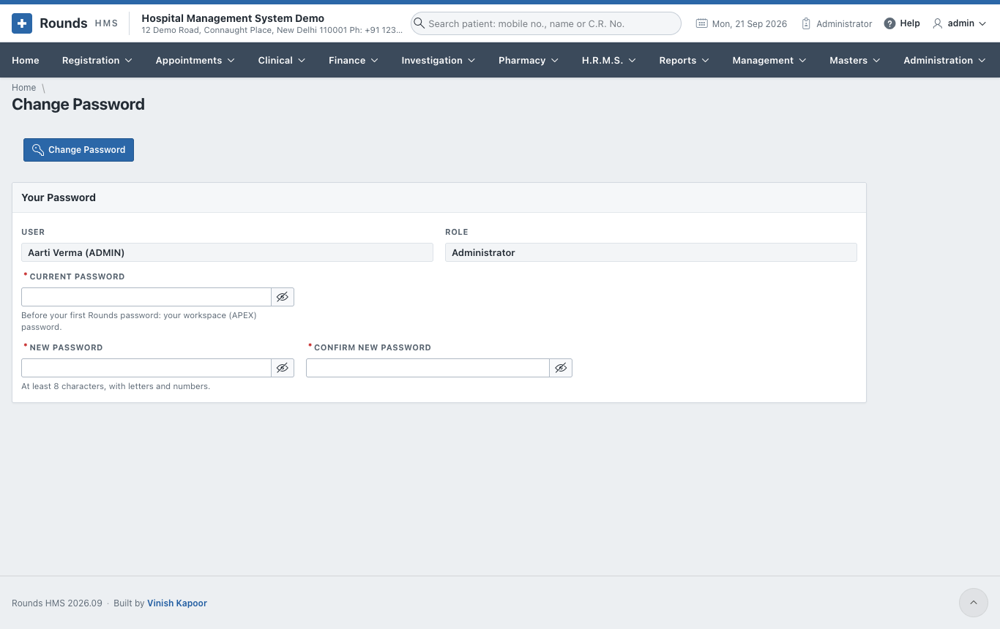
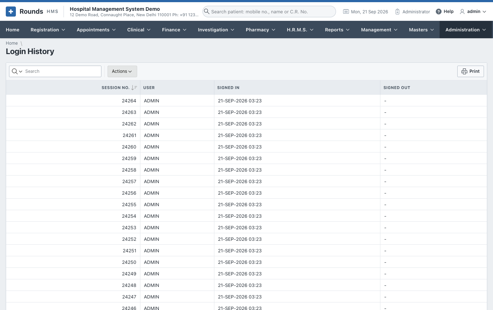

# Users and Roles

## Roles

A **role** decides:

- which menus a user sees;
- whether the user is an administrator;
- how big a discount the user may give without approval.

**Administration > Roles** lists the roles and how many users hold each:

| Field | Meaning |
|---|---|
| **Code** and **Role** | the short code and the name, e.g. *RECEPTION* / *Reception* |
| **Description** | what the role does |
| **Administrator** | **Yes** opens every menu, the users and the settings |
| **Menus the role opens** | tick the menus: Registration, Appointments, Clinical, Finance, Investigation, Pharmacy, H.R.M.S., Masters, Reports ... |
| **Largest Discount (% of the bill)** | empty: any discount. A larger discount waits for the approval of a user whose limit covers it ([Discount Approvals](../finance/rates.md#discount-approvals)). |
| **And at Most (Rs)** | a limit in rupees as well; empty: no limit in rupees |

The roles supplied are Administrator, Reception, Operator, Accountant, Pharmacist, Laboratory, Nurse and
Doctor. Change them to fit the hospital, or add your own.

## Application Users

**Administration > Application Users** lists everyone who signs in:

!!! info "Set-up mode"
    Until an administrator has a Rounds password, the workspace (APEX) accounts can still sign in, so that
    nobody is locked out while setting up. Give yourself a user with the **Administrator** role and a
    password. From then on, only the users of this list can sign in.

**Add User**, or the pencil of a user:

1. **User Name**: the name the user signs in with.
2. **Full Name**, **Mobile**, **Email** and **Department**.
3. **Role**: the menus the user sees.
4. **Cash Counter**: the series of the cash bill numbers. CASH-C gives bills C-..., CASH-R gives R-...,
   CASH-E gives E-...; any other counter gives A-...
5. **Legacy User**: the name bills record, when the user also worked in the old system.
6. **Active**: **No** stops the user signing in, and keeps their history.
7. **Password**:
    - **New Password** and **Confirm Password**; leave them empty to keep the current one;
    - **Ask for a New Password at Next Sign-in**: the user must choose their own the first time.
8. Click **Save**.

After 5 failed sign-ins a user is locked out. **Failed Sign-ins** shows the count, and **Unlock** lets
them in again.

## Change Password

Every user changes their own password from the user menu (their name at the top right) >
**Change Password**:

1. **Current Password**.
2. **New Password**: at least 8 characters, with letters and numbers.
3. **Confirm New Password**, then **Change Password**.

A user whose password was set by the administrator is taken to this page after signing in, until they
choose their own.

## Login History

**Administration > Login History** lists every sign-in and sign-out: who and when.

