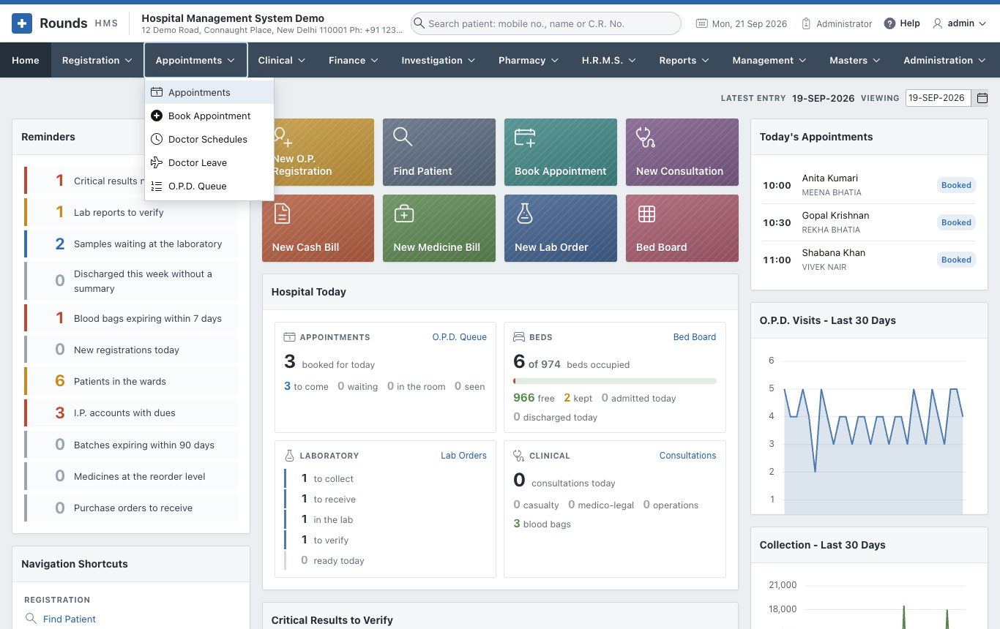
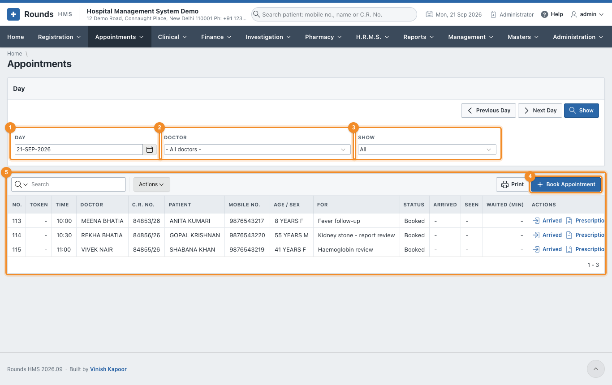
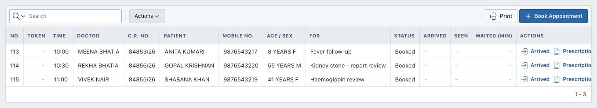

# Appointments

The **Appointments** menu books patients with a doctor and runs the day's queue:

- who is booked;
- who has arrived, and their token number;
- who has been seen;
- how long each patient waited.

It also holds the clinic hours and the leave of every doctor, which decide the free times offered when
booking, and the [token display](queue.md#the-screen-of-the-waiting-area) of the waiting area.

| Option | Use it to |
|---|---|
| [Appointments](#the-diary-of-the-day) | See the diary of a day, mark patients arrived and seen, reschedule or cancel |
| [Book Appointment](book.md) | Book a patient with a doctor on a day and at a time |
| [Doctor Schedules](schedules.md) | Set the clinic days and hours of each doctor, and the length of an appointment |
| [Doctor Leave](schedules.md#doctor-leave) | Record the days a doctor is away, so nobody is booked then |
| [O.P.D. Queue](queue.md) | Run the day's queue: give tokens, call patients in, and the screen of the waiting area |

## The diary of the day

**Appointments > Appointments** opens the diary of today:

1. 1 **Day**: the day to show. **Previous Day** and **Next Day** move one day at a
   time.
2. 2 **Doctor**: one doctor, or all doctors.
3. 3 **Show**: all appointments, or only the ones booked, waiting, seen ...
4. 4 **Book Appointment** books a new one.
5. 5 The appointments of the day, by time:
    - **Token**: the queue number given when the patient arrives.
    - **Status**:
        - **Booked**: not here yet;
        - **Waiting**: arrived, not seen yet;
        - **Seen**: the doctor has seen the patient;
        - **Cancelled** or **No-show**: did not happen.
    - **Arrived**, **Seen** and **Waited (min)**: when the patient came, when the doctor saw them, and how
      long they waited.

### What to do with an appointment

The **Actions** column of each row offers what fits its status:

| Action | When | What it does |
|---|---|---|
| **Arrived** | the patient is at the desk | marks them waiting and gives them the next token of that doctor |
| **Seen** | the doctor has seen them | marks the appointment seen and records the time |
| **Prescription** | any time | opens a [new prescription](../registration/prescriptions.md) for the patient |
| **Visit** | the patient needs a renewal slip | opens [Renew Registration](../registration/renewal.md) for the patient |
| **Reschedule** | booked or waiting | opens the appointment to change the doctor, the day or the time |
| **No-show** | the patient did not come | asks, then marks it not turned up |
| **Cancel** | the patient cancelled | asks, then cancels it |
| **Undo** | seen, cancelled or no-show by mistake | puts it back to booked |

**Print** prints the diary as shown, e.g. to give each doctor the list of the day.

!!! tip "Tokens without times"
    A clinic that works on a first-come basis gives the whole clinic one slot in
    [Doctor Schedules](schedules.md). Patients are booked "in the queue", and the token given on
    **Arrived** decides the order. [O.P.D. Queue](queue.md) is the screen that then runs the day.
