# O.P.D. Queue and Token Display

Every patient who comes for the O.P.D. gets a **token number**. The desk gives it, the doctor calls it,
and a screen in the waiting area shows which token is with which doctor, in which room. Nobody has to
call out names, and the patients can see how the line is moving.

Three screens do the work:

| Screen | Who uses it | Where |
|---|---|---|
| [O.P.D. Queue](#the-desk) | the registration desk | **Appointments > O.P.D. Queue** |
| [My Queue](#the-doctors-own-screen) | the doctor in the room | **Clinical > My Queue** |
| [Token Display](#the-screen-of-the-waiting-area) | the screen in the waiting area | its own address, no sign-in |

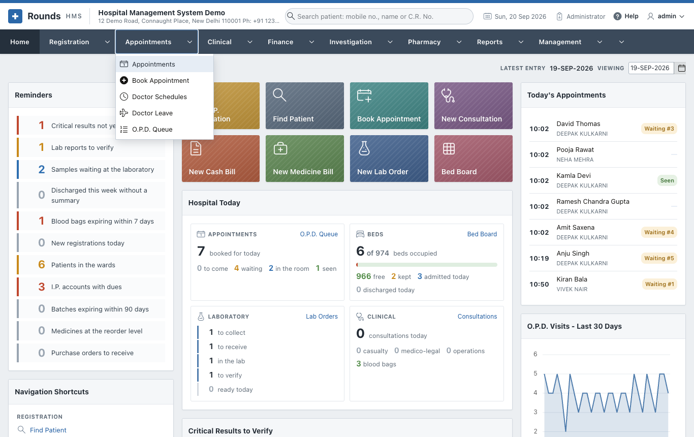

## How the tokens are counted

By default **each doctor has their own tokens**: 1, 2, 3 for the first three patients of that doctor
today. Two doctors sitting in two rooms each start at 1, and the display tells them apart by the room.

A department can be set to give **one line for the whole department** instead, which suits a department
whose doctors share the patients as they come. Then the tokens carry a short prefix, e.g. *MED-12*, and
whichever doctor is free calls the next one. See [the settings](#the-settings) below.

Tokens are given by themselves:

- **at registration and renewal** - a patient registered for a doctor joins that doctor's queue and the
  registration slip carries the token;
- **when a booked patient arrives** - **Arrived** in the [diary](index.md#the-diary-of-the-day) gives the
  token;
- **at the desk**, for a walk-in who is already registered (below).

Tokens start again at 1 every morning.

## The desk

**Appointments > O.P.D. Queue** shows the whole queue of today:

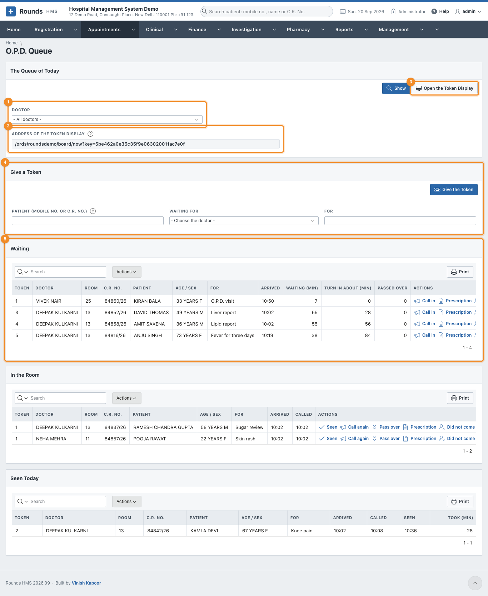

1. 1 **Doctor**: one doctor, or all of them. **Show** applies it.
2. 2 **Address of the Token Display**: the address to open on the screen in the
   waiting area. Copy it once and leave that screen open; it never asks for a sign-in.
3. 3 **Open the Token Display** opens the same screen in a new window, to check it.
4. 4 **Give a Token** for a walk-in patient (below).
5. 5 **Waiting**, then **In the Room**, then **Seen Today**.

The lists refresh by themselves every half minute, so the desk always sees the queue as it is.

### Give a token to a walk-in

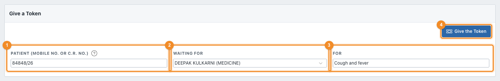

1. 1 **Patient**: the mobile number or the C.R. No. of a registered patient.
2. 2 **Waiting for**: the doctor.
3. 3 **For**: the complaint, e.g. *cough and fever*. It is shown to the doctor.
4. 4 **Give the Token**. The next token of that doctor is given and the patient
   appears in **Waiting**.

### Waiting

Each row carries the token, the doctor and the room, the patient, what they came for, when they arrived
and how long they have been waiting. **Turn in about (min)** is an estimate: how many patients are ahead,
multiplied by the minutes the doctor is taking today. Until the doctor has seen anybody today, the length
of a slot in [Doctor Schedules](schedules.md) is used instead.

The **Actions** of a waiting patient:

| Action | What it does |
|---|---|
| **Call in** | calls the token: the display shows it and the patient moves to **In the Room** |
| **Prescription** | opens a [new prescription](../registration/prescriptions.md) for the patient |
| **Did not come** | asks, then marks the patient as not turned up |

The printer next to each row prints the **token slip** for the patient:

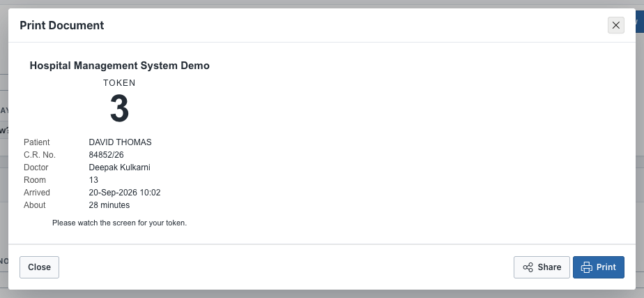

### In the room

| Action | What it does |
|---|---|
| **Seen** | the visit is finished; the patient moves to **Seen Today** |
| **Call again** | shows the token on the display once more |
| **Pass over** | the patient did not come in; the token goes back to the end of the line |
| **Did not come** | marks the patient as not turned up |

A patient who was passed over is counted in **Passed Over** and waits behind the others, so the same
token is not called again and again.

### Seen today

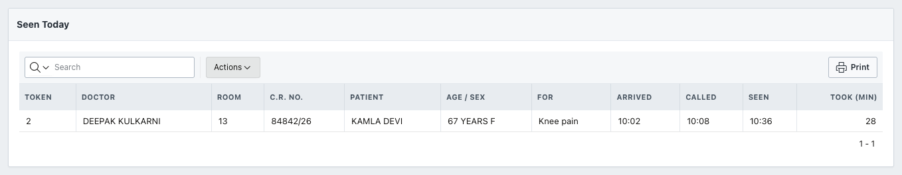

Who has been seen, when they were called, when they were seen, and how long the consultation took.

## The doctor's own screen

**Clinical > My Queue** is the same queue seen from the room. It opens on the doctor who is signed in.

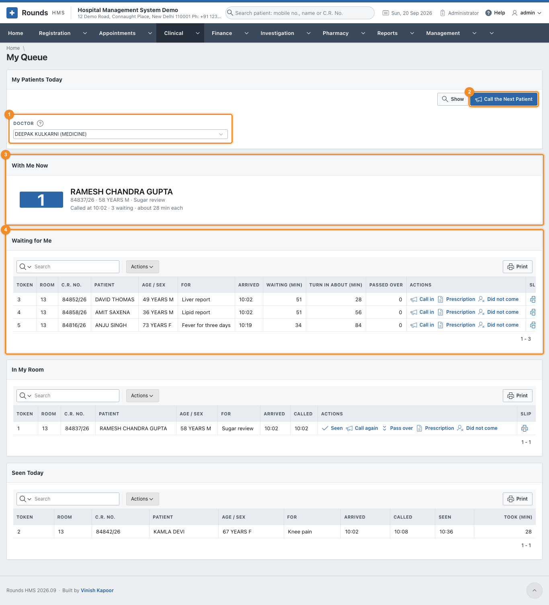

1. 1 **Doctor**: filled in with the signed-in doctor. A receptionist helping a
   doctor can choose another one.
2. 2 **Call the Next Patient** calls the next token in one click - no need to pick
   the row. The patient who has waited longest is called; a patient who was passed over waits behind the
   others.
3. 3 **With Me Now**: the token in the room at the moment, in large type.
4. 4 **Waiting for Me**, then **In My Room** and **Seen Today**, with the same
   actions as at the desk.

## The screen of the waiting area

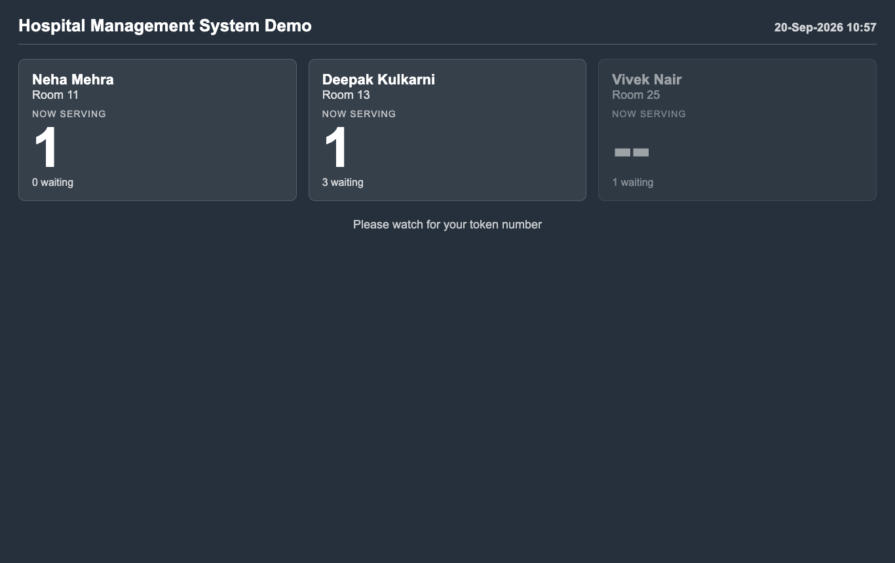

A card for each doctor who is seeing patients: the doctor, the room, the token being seen now, and how
many are still waiting. The screen refreshes by itself; how often is set in
[Hospital Details](#the-settings).

Open it on the television or the computer of the waiting area with the address shown on the desk screen.
Some points about it:

- it shows **tokens only** - no patient names, so nothing private is on the wall;
- it needs **no sign-in**, and opening it does not disturb anybody who is signed in on that computer;
- where the browser can speak, it reads out a new token when it appears.

!!! tip "Put it on full screen"
    Open the address, then press ++f11++ (Windows) or ++cmd+ctrl+f++ (Mac). The screen then shows nothing
    but the tokens.

!!! warning "The address carries a key"
    The address ends with a long key, which is what lets the screen be opened without signing in. Keep it
    to the screens of the hospital. If it gets out, **Hospital Details** can make a new one, and the old
    address stops working.

## The settings

### The department

**Masters > Units** decides how a department counts its tokens:

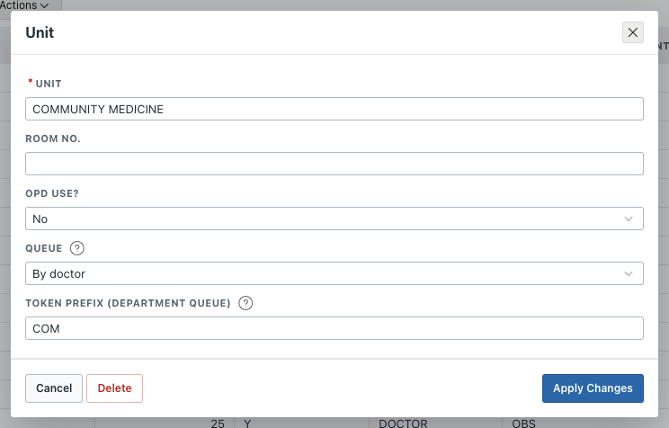

- **Room No.**: the room of the department, used for a doctor who has no room of their own.
- **Queue**: *By doctor* (each doctor counts their own tokens) or *By department* (one line for the whole
  department).
- **Token Prefix**: shown before the number of a department queue, e.g. `MED` gives *MED-12*.

### The doctor

**Masters > Doctors** holds where the doctor sits:

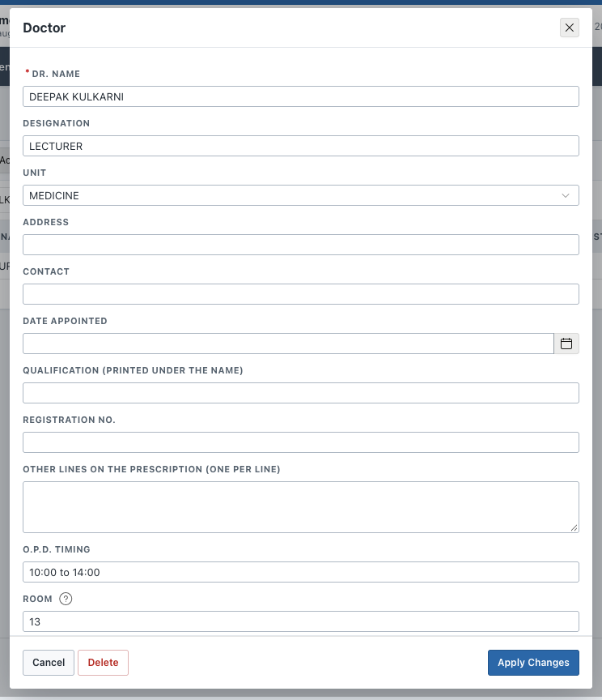

- **Room**: the room shown on the display for this doctor. Empty: the room of the doctor's department.
- **O.P.D. Timing**: the hours printed on the prescription.

### The hospital

**Administration > Hospital Details**:

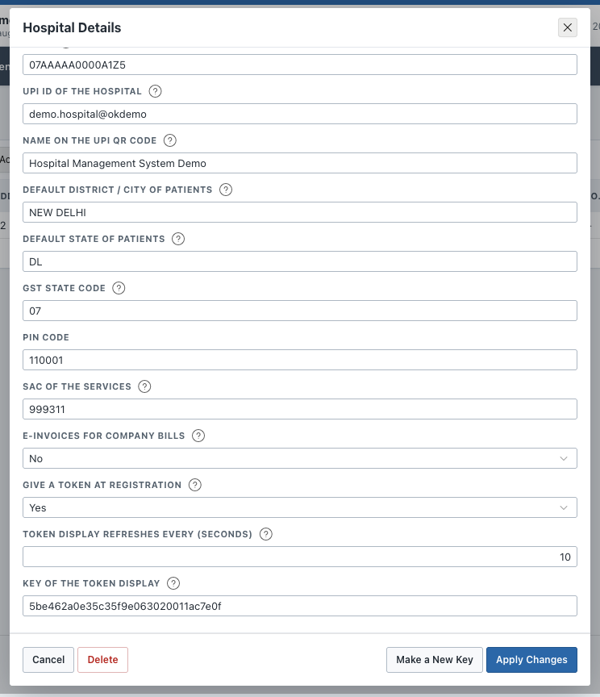

- **Give a Token at Registration**: *Yes* puts every patient registered or renewed for a doctor into that
  doctor's queue, and prints the token on the slip.
- **Token Display Refreshes Every (seconds)**: how often the screen in the waiting area looks for a new
  token. Ten seconds suits most waiting rooms.
- **Key of the Token Display**: the key in the address of the display, which cannot be typed over.
  **Make a New Key** at the bottom of the record replaces it - every address handed out so far then stops
  working, so copy the new one from **Appointments > O.P.D. Queue** and set the waiting-area screen again.

## How long patients waited

**Reports > O.P.D. Queue and Waiting Times** counts the visits that finished - seen, or did not come:

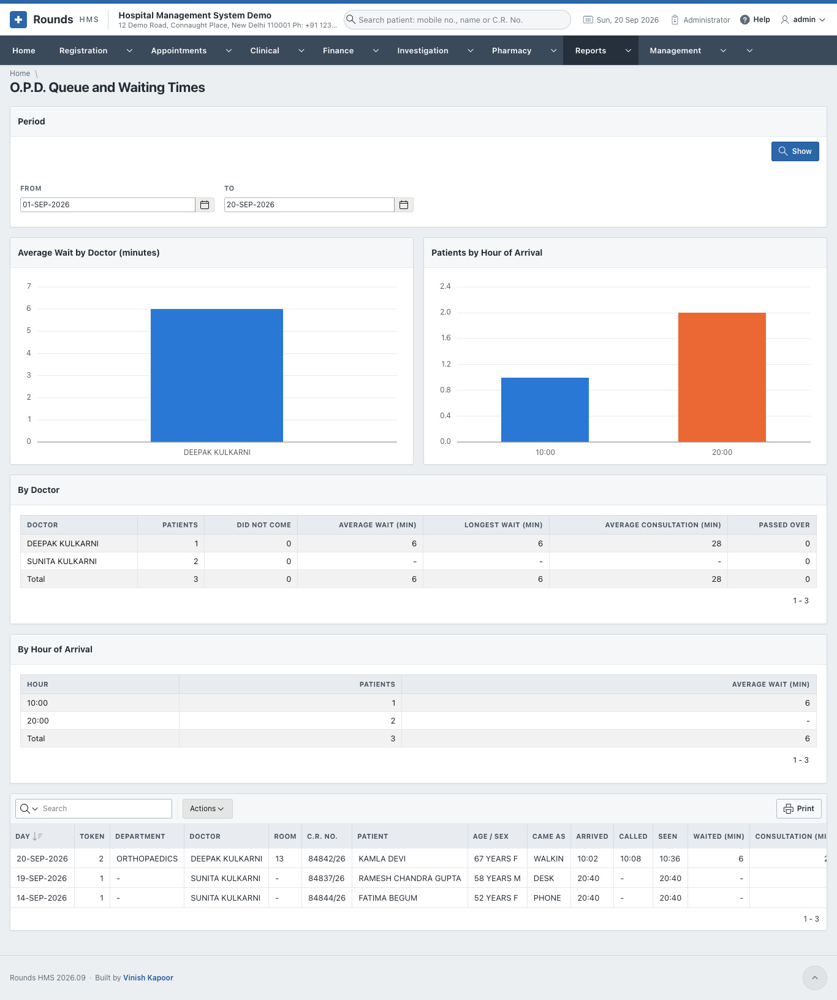

- **Average Wait by Doctor**: from the token being given to the patient being called.
- **Patients by Hour of Arrival**: when the crowd comes, which is what decides how many doctors are needed
  in the morning.
- **By Doctor**: patients, those who did not come, the average and longest wait, the average consultation,
  and how many were passed over.
- The list at the bottom has one line for each visit, and **Actions** filters or downloads it.

!!! note "The period"
    The report opens on the month up to the last day with work in it. To see today, set **To** to today
    and click **Show**.

!!! question "Something went wrong?"
    - *The display says "Wrong address"*: the key in the address is not the one in **Hospital Details** -
      copy the address again from **Appointments > O.P.D. Queue**.
    - *The display is empty*: no doctor has called a token yet today.
    - *A patient has no token*: they were registered without a doctor, or **Give a Token at Registration**
      is off. Give the token at the desk.
    - *The room is wrong on the display*: set the **Room** of the doctor in **Masters > Doctors**; without
      it the room of the department is used.
