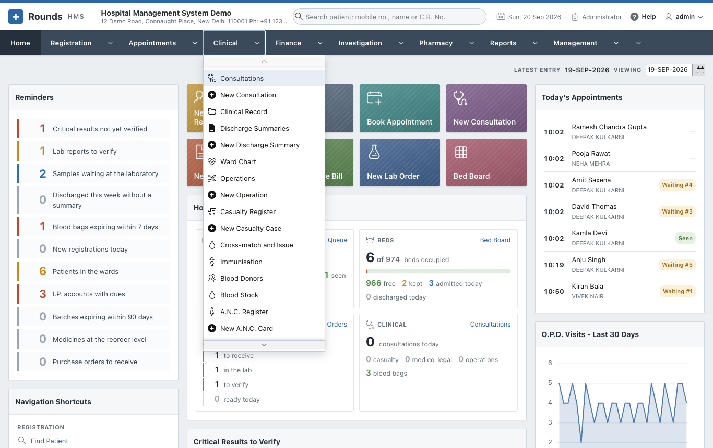

# Clinical

The **Clinical** menu is the doctor's and the nurse's record of the patient:

- the queue of patients waiting for the doctor today;
- consultations, with diagnoses coded in I.C.D.-10;
- allergies and long-standing problems;
- the discharge summary;
- the daily ward chart;
- operations and the casualty register, with medico-legal cases;
- the blood bank;
- immunisation, antenatal care, births and deaths;
- the consent forms, letters and certificates to print.

| Option | Use it to | Page |
|---|---|---|
| My Queue | See the patients waiting for you today and call the next one in | [O.P.D. Queue](../appointments/queue.md#the-doctors-own-screen) |
| Consultations / New Consultation | Write the doctor's note of a visit: vitals, complaints, examination, diagnosis, advice | [Consultations](consultations.md) |
| Clinical Record | See everything clinical about one patient, and record allergies and long-standing problems | [Consultations](consultations.md#the-clinical-record) |
| Discharge Summaries / New Discharge Summary | Write the summary the patient takes home | [In the Wards](inpatient.md) |
| Ward Chart | Record the day of an admitted patient: temperature, pulse, B.P., intake and output, medicines given, notes | [In the Wards](inpatient.md#the-ward-chart) |
| Operations / New Operation | Record an operation, its note, and the implants and consumables used | [Operations and Casualty](operations.md) |
| Casualty Register / New Casualty Case | Record an emergency, and the M.L.C. when the police must be told | [Operations and Casualty](operations.md#casualty) |
| Blood Donors, Blood Stock, Cross-match and Issue | Run the blood bank | [Blood Bank](blood-bank.md) |
| Immunisation | Keep a child's vaccination card | [Mother and Child](mother-child.md) |
| A.N.C. Register / New A.N.C. Card | Follow a pregnancy visit by visit | [Mother and Child](mother-child.md#antenatal-care) |
| Birth Register / New Birth, Death Register / New Death | Keep the registers of births and deaths | [Mother and Child](mother-child.md#births-and-deaths) |
| Consents and Forms | Print consent forms, referral letters, the M.L.C. intimation and certificates, in English or Hindi | [Consents and Forms](forms.md) |
| Follow-up Recall | See the patients due to come back | [Consents and Forms](forms.md#follow-up-recall) |

!!! tip "Please Note"
    Every clinical screen shows a **Please Note** line once the patient is chosen. It lists the patient's
    allergies and long-standing problems from the [Clinical Record](consultations.md#the-clinical-record),
    so nobody prescribes penicillin to a patient allergic to it.
