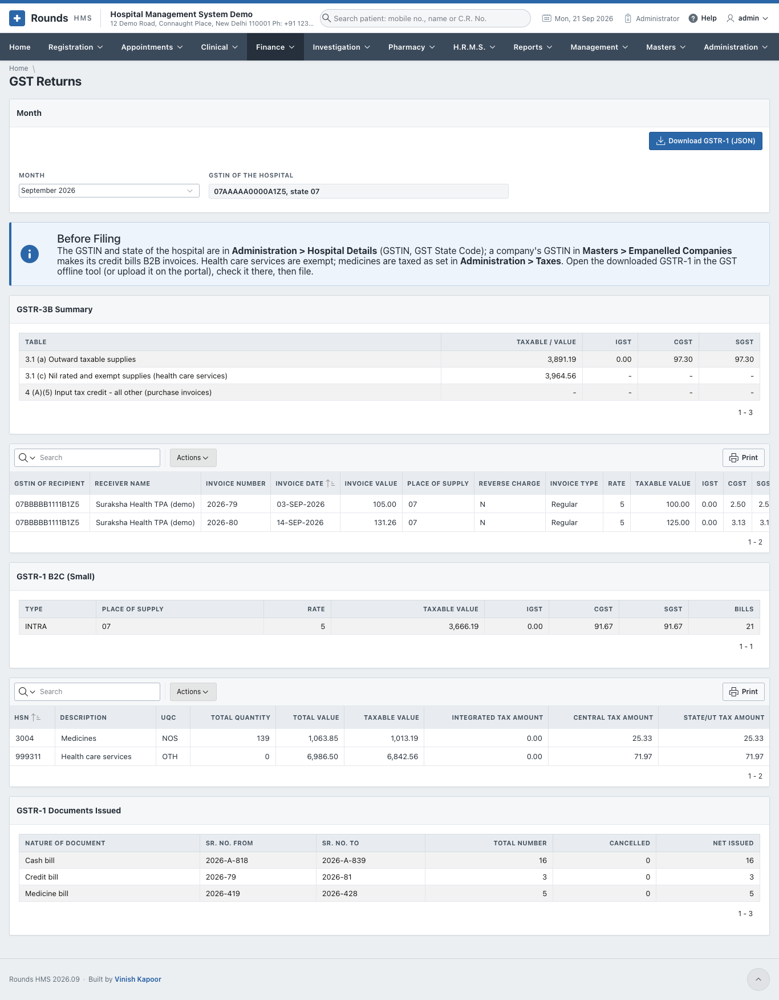
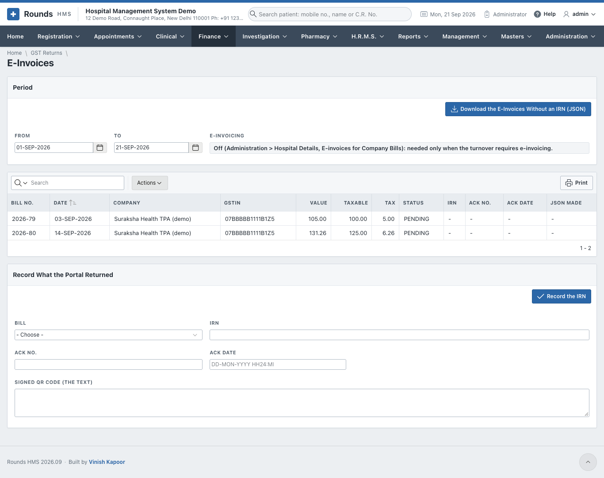
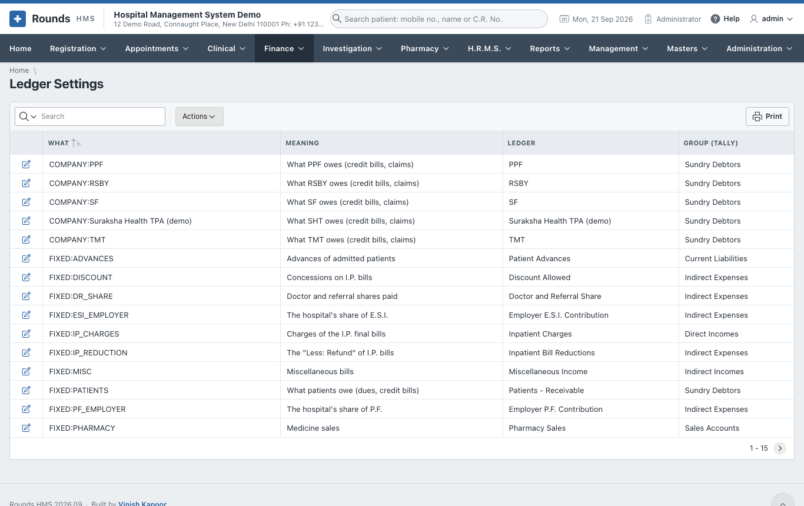
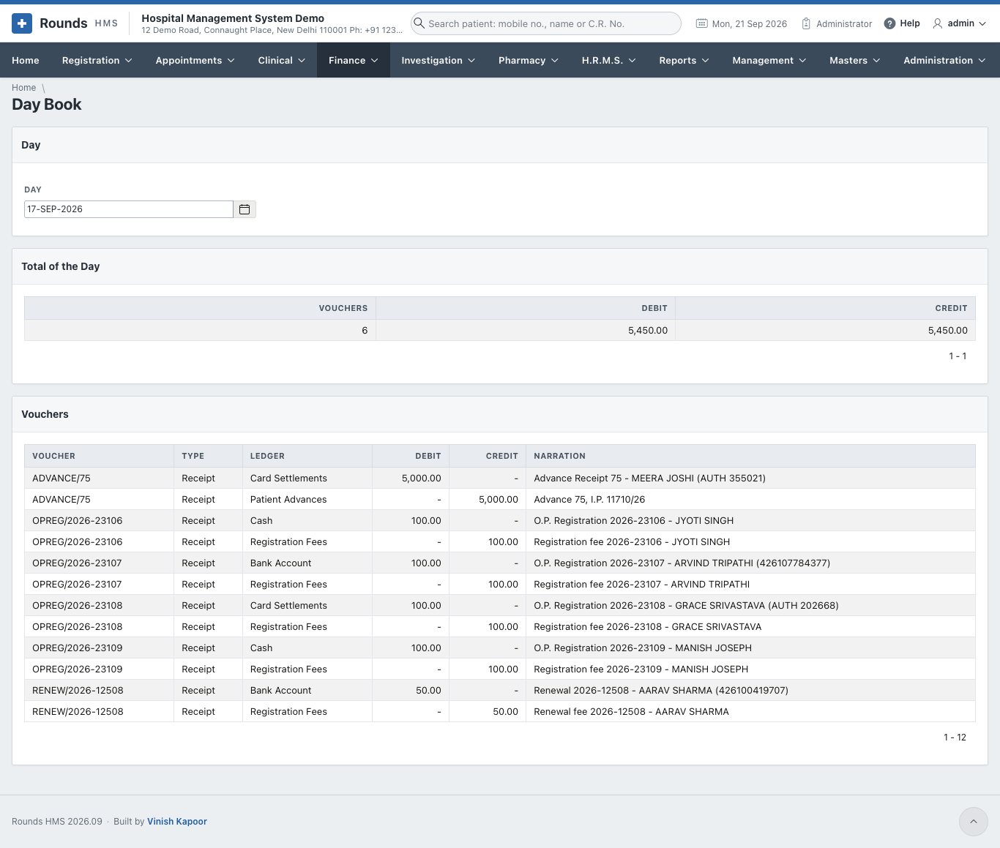
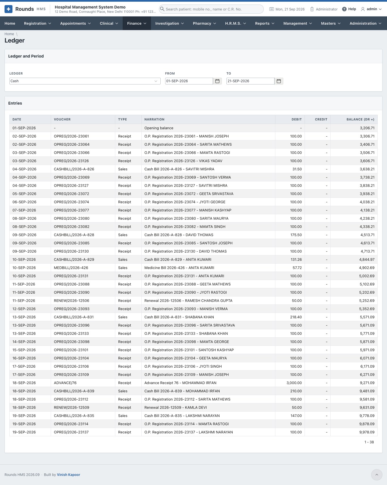
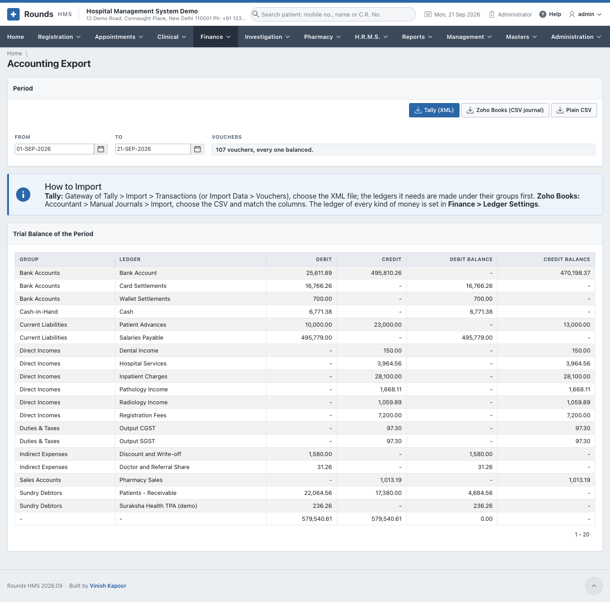

# GST and the Accounts

## GST Returns

**Finance > GST Returns** prepares the monthly GST returns from the bills.

1. Choose the **Month**. **GSTIN of the Hospital** comes from **Administration > Hospital Details**.
2. **Before Filing** lists what to check: the hospital's GSTIN and state, and the GSTIN of the companies
   billed on credit. A company with a GSTIN makes its bills **B2B**.
3. The sections of the returns:
    - **GSTR-3B Summary**: the taxable value and the tax;
    - **GSTR-1 B2B Invoices**: the bills to registered companies;
    - **GSTR-1 B2C (Small)**: everything else, by state and rate;
    - **GSTR-1 HSN / SAC Summary**;
    - **GSTR-1 Documents Issued**: the number series used.
4. **Download GSTR-1 (JSON)** saves the file to upload in the GST portal's offline tool.

## E-Invoices

A hospital whose turnover requires e-invoicing must register its B2B bills on the government's portal.
Switch it on in **Administration > Hospital Details** (**E-invoices for Company Bills**).

1. Choose **From** and **To**. **B2B Bills** lists the company bills, with and without an IRN.
2. **Download the E-Invoices Without an IRN (JSON)** saves the file to upload on the e-invoice portal.
3. **Record What the Portal Returned**: for each **Bill**, enter the **IRN**, **Ack No.**, **Ack Date** and
   the **Signed QR Code**. Then **Record the IRN**. The printed bill then carries the IRN and its QR code.

## Ledger Settings

**Finance > Ledger Settings** says which ledger of the accountant every kind of money goes to. For
example:

- **Cash** goes to *Cash*;
- **UPI** goes to the bank account the UPI settles into;
- **Pathology Income** goes to *Direct Incomes*;
- **Output CGST** goes to *Duties and Taxes*.

Set it once, to match the ledgers in Tally or Zoho Books. The salaries of [payroll](../hrms/payroll.md#salaries-in-the-accounts)
have their own lines too: one for each salary head (*PAYHEAD:BASIC* ...), and *Salaries Payable*, *Employer
P.F. Contribution* and *Employer E.S.I. Contribution*.

## Day Book and Ledger

**Finance > Day Book** shows every voucher of a **Day** with its debit and credit lines, and the **Total of
the Day**.

Salaries appear here too: each locked month of payroll is a journal *SALARY/2026-08* on the last day of the
month, and recording the payment is a voucher *SALARYPAID/2026-08* on the day it was paid (see
[Salaries in the accounts](../hrms/payroll.md#salaries-in-the-accounts)).

**Finance > Ledger** shows one **Ledger** (Cash, a bank, an income ...) for a period: every entry with its
debit, credit and running balance.

## Accounting Export

**Finance > Accounting Export** sends the accounts of a period to the accountant's software:

1. Choose **From** and **To**. **Vouchers** checks that every voucher balances.
2. **Trial Balance of the Period** shows the totals of every ledger.
3. Download:
    - **Tally (XML)**: in Tally, *Gateway of Tally > Import > Transactions*. The ledgers it needs are
      created under their groups first;
    - **Zoho Books (CSV journal)**: in Zoho Books, *Accountant > Manual Journals > Import*;
    - **Plain CSV**: for any other software or a spreadsheet.

