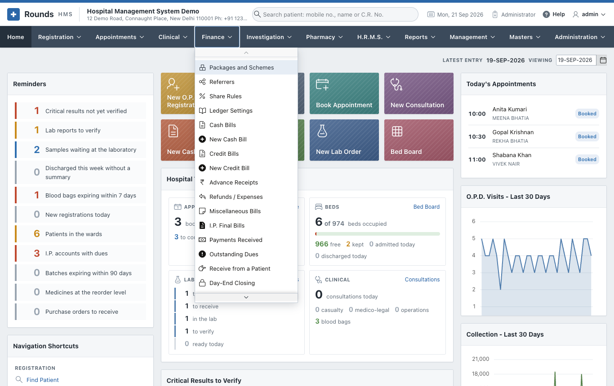

# Finance

The **Finance** menu holds every bill and every rupee: what a patient is charged, how they pay, what they
still owe, what the insurer settles, and what goes to the accountant.

| Page | Options |
|---|---|
| [Bills](bills.md) | Cash Bills / New Cash Bill, Credit Bills / New Credit Bill, Miscellaneous Bills, Refunds / Expenses |
| [In-Patient Billing and Dues](inpatient-billing.md) | Advance Receipts, I.P. Final Bills, Payments Received, Outstanding Dues, Receive from a Patient |
| [The End of the Day](day-end.md) | Day-End Closing, Day-End Closings, Collections by Mode, Receivables Ageing |
| [Insurance and Packages](insurance.md) | Insurance Claims (with their papers), Items Insurers Do Not Pay, Packages and Schemes |
| [Doctor and Referral Shares](shares.md) | Referrers, Share Rules, Doctor and Referral Shares, Share Payouts |
| [Rates and Discounts](rates.md) | Tariff Versions, Discount Approvals |
| [GST and the Accounts](gst-accounts.md) | GST Returns, E-Invoices, Ledger Settings, Day Book, Ledger, Accounting Export |

## How a payment is recorded

Every screen that takes money (a registration, a bill, an advance, a receipt) or gives it back (a refund)
has the same **payment fields**:

| Field | Meaning |
|---|---|
| **Paid By** | cash, UPI / QR code, debit or credit card, wallet, payment link, bank transfer (NEFT / IMPS / RTGS) or cheque |
| **Transaction ID / Ref. No.** | for anything other than cash: the UPI reference, card approval code, UTR or cheque number |
| **UPI QR Code** | with UPI, a QR code of the exact amount; the patient scans it with any UPI app |
| **Paid in Two Ways** | **Yes** splits the payment, e.g. part UPI and the rest cash, with **Rest Paid By** and **Amount by the Second Mode** |

The way each document was paid is printed on it ("Paid by: UPI 500.00 (Ref ...), Cash 100.00"). The
day-end closing counts it by mode, and the accounts post it to the right ledger.

!!! note "Set up once"
    - The **UPI ID** for the QR codes: **Administration > Hospital Details**.
    - The ledgers of each mode for the accountant: [Ledger Settings](gst-accounts.md#ledger-settings).
