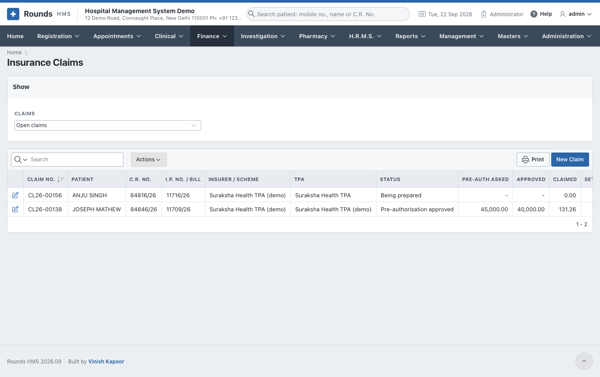
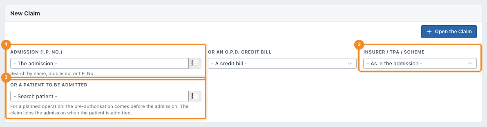
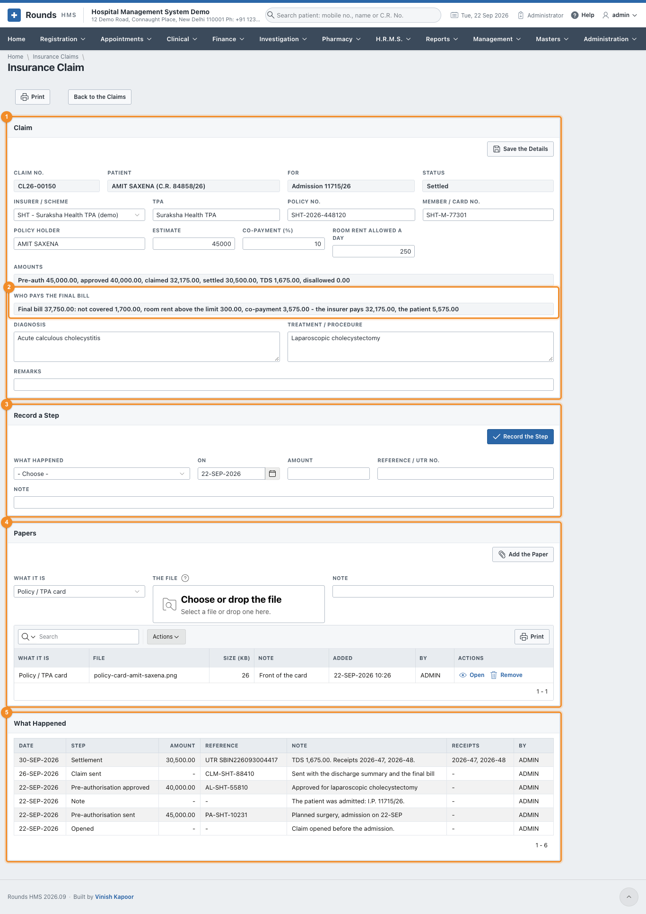
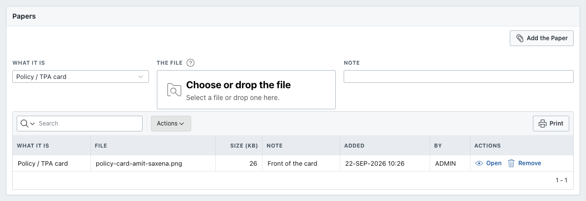
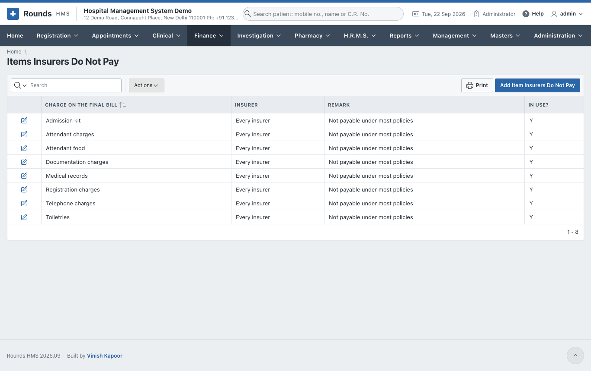
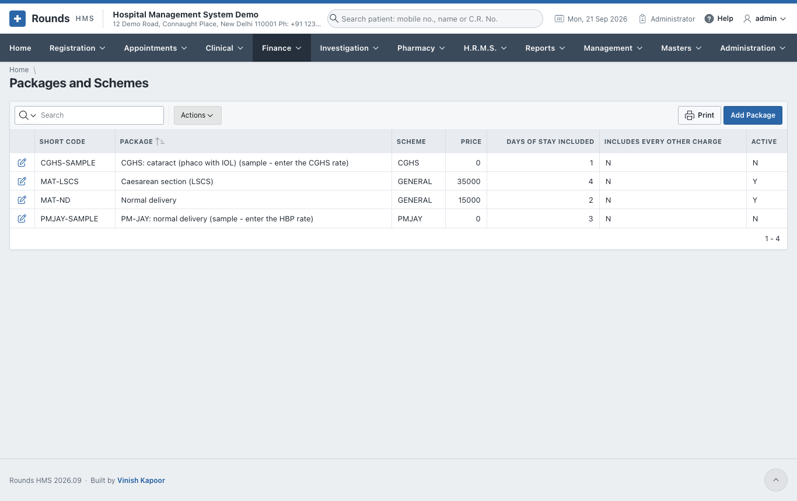
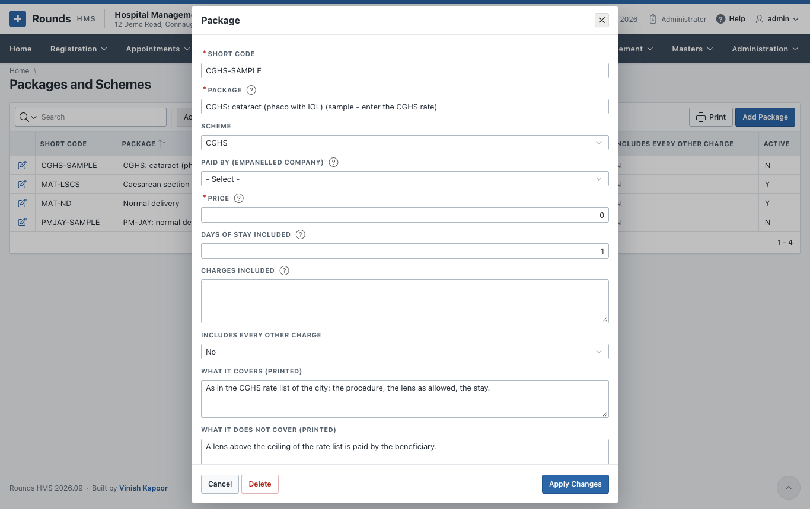

# Insurance and Packages

## Insurance claims

A cashless admission is paid by an insurer, a TPA or a scheme. **Finance > Insurance Claims** follows each
claim from the pre-authorisation to the money received.

The usual way through:

1. **Before the admission**, for a planned operation: open the claim for the patient and send the
   pre-authorisation ([below](#before-the-admission)).
2. **At the admission**: choose the insurer as the **Empanelment** and fill in the policy on the
   [admission](../registration/admission.md#an-insured-patient). Saving opens the claim, or joins the one
   opened before.
3. **In the ward**: record each step as it happens: approval, query, enhancement. The admission shows what
   needs attention.
4. **At discharge**: the [final bill](inpatient-billing.md#an-insured-patients-bill) divides the bill
   between the insurer and the patient.
5. **After discharge**: add the papers, send the claim, and record the settlement.

**Claims** (at the top) filters the list: open claims, settled claims, all.

### Open a claim

A claim for an admission is opened by the admission itself. Open one here for an O.P.D. credit bill, for an
older admission, or before an admission. Click **New Claim**:

1. 1 Choose the **Admission (I.P. No.)**, or **Or an O.P.D. Credit Bill**.
2. 2 Choose the **Insurer / TPA / Scheme**.
3. Click **Open the Claim**. The claim gets its **Claim No.**

### Before the admission

For a planned operation, the pre-authorisation is sent before the patient comes in. Leave the admission and
the bill empty, and choose 3 **Or a Patient to Be Admitted** with the insurer.
The claim shows **For: Before the admission**. Fill in the policy and record **Pre-authorisation sent**.

When the patient is admitted with that insurer, the admission takes this claim over. Its history then
says *The patient was admitted: I.P. ...*.

### Follow a claim

1. 1 **Claim**: fill in the **Policy No.**, **Member / Card No.**, **Policy Holder**,
   **TPA**, the **Estimate**, the **Co-payment (%)**, the **Room Rent Allowed a Day**, the **Diagnosis** and
   **Treatment / Procedure**. Click **Save the Details**. **Amounts** shows the pre-authorisation, approved,
   claimed, settled, TDS and disallowed amounts.
2. 2 **Who Pays the Final Bill**: once the I.P. final bill is saved, the bill, what
   is not covered, the room rent above the limit, the co-payment, and what the insurer and the patient pay.
3. 3 **Record a Step** every time something happens. Choose **What Happened**:

    | Step | Record |
    |---|---|
    | Pre-authorisation sent | the amount asked for, the reference |
    | Query / query replied | what was asked or answered, in the **Note** |
    | Pre-authorisation approved (or enhancement) | the amount approved, the approval number |
    | Pre-authorisation denied | the reason |
    | Claim sent | the claim reference; the amount claimed is the insurer's part of the final bill unless you give another |
    | Settled / part settled | the **Amount** received, the **Reference / UTR No.**, the **TDS Kept by the Insurer**, and what was **Disallowed** |
    | Appealed, closed, note | as needed |

    With a settlement, **Write the Disallowed Off** decides who bears the disallowed amount:

    - **Yes**: the hospital writes it off;
    - **No**: the patient is asked to pay it.

    Click **Record the Step**. The status of the claim moves on, and only the steps that can follow are
    offered next.
4. 4 **Papers** (below).
5. 5 **What Happened** lists every step with its date, amount and reference.
6. **Print** prints the claim with its history and the division of the bill.

### Papers

Every paper the insurer asks for is kept with its claim:

1. **What It Is**: the policy or TPA card, a photo ID, the pre-authorisation form, the approval letter, a
   query and its reply, investigation reports, the discharge summary, the final bill, the settlement
   letter, or other.
2. **The File**: choose or drop a scan or a photo (PDF, JPG or PNG), and add a **Note** if useful.
3. **Add the Paper**.

**Open** shows a paper in a new tab. **Remove** takes one added by mistake off the claim, after asking.

### Items insurers do not pay

**Finance > Items Insurers Do Not Pay** lists the charges that are left to the patient when an insured bill
is divided:

The usual non-medical items come filled in: registration charges, admission kit, attendant food,
attendant charges, toiletries, telephone, documentation and medical records. Change the list to your
hospital's:

- **Charge on the Final Bill**: exactly as the final bill names it (capitals do not matter);
- **Insurer / TPA / Scheme**: one insurer only, or empty for every insurer;
- **In Use?**: **No** keeps the row without applying it.

A settlement is posted as a payment against the admission's dues, and the TDS and write-off go to their
ledgers in the accounts.

## Packages and schemes

**Finance > Packages and Schemes** holds the fixed-price packages, e.g. a normal delivery or a cataract
operation, and the scheme rates (PM-JAY, CGHS ...).

A package has:

- a **Code** and **Name**, and its **Scheme**;
- the **Amount** and the usual **Stay (days)**;
- the **Inclusions** and **Exclusions**, printed for the patient;
- the tariff items it includes, or all of them.

A package is chosen on the [admission](../registration/admission.md), and **Apply the Package** on the
[I.P. final bill](inpatient-billing.md#ip-final-bill) charges it.
