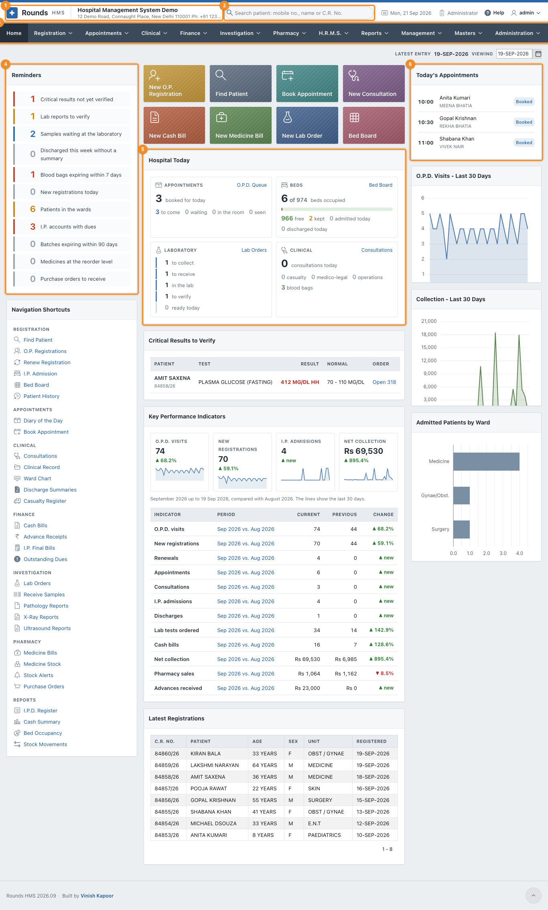
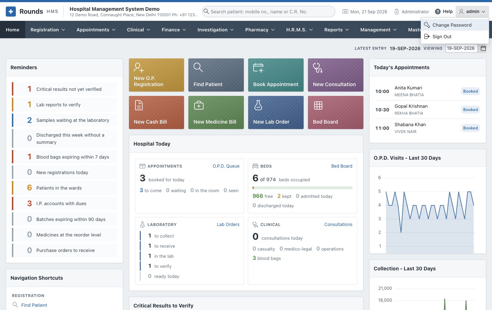

# Getting Started

## Sign in

Open the address of Rounds HMS that your administrator gave you, in any web browser (Chrome, Edge,
Firefox, Safari) on a computer, a tablet or a phone.

The left half shows your hospital (from **Administration > Hospital Details**) and what Rounds HMS
covers. The sign-in form is on the right:

1. Type your **username** and **password**. The eye button shows the password as you type.
2. Click **Sign In**.

On a phone, the hospital is shown above the form:

{ width="300" }

The first time, or after the administrator has reset your password, you are asked to choose your own
password ([Change Password](../administration/users.md#change-password)). After 5 wrong passwords the
user is locked. Ask the administrator to unlock it.

## The screen

1. 1 **The header**: the Rounds HMS logo (click it to come back Home), and the name
   and address of the hospital.
2. 2 **Search patient**: type a mobile number, a name, a C.R. No. or an I.P. No. and
   press ++enter++, from any page:
    - one patient found: their [Patient History](../registration/patient-history.md) opens;
    - several found (a family, a common name): [Find Patient](../registration/find-patient.md) opens with
      the list.

    Next to it: today's date, your **role**, your **cash counter**, **Help** (opens this guide in a new
    tab) and your user menu.
3. 3 **The menu bar**: Registration, Appointments, Clinical, Finance, Investigation,
   Pharmacy, H.R.M.S., Reports, Management, Masters, Administration. You see only the menus your role opens.
4. 4 **Reminders**: what needs doing, e.g. critical results not verified, samples
   waiting, discharges without a summary, blood bags about to expire, medicines at the reorder level.
   Click a line to go to it. Each role sees the reminders of its own work.
5. 5 **Hospital Today**: the tiles of the most used screens (New O.P. Registration,
   Find Patient, Book Appointment, New Consultation, New Cash Bill, New Medicine Bill, New Lab Order, Bed
   Board), then today's appointments, beds, laboratory and clinical work. **Appointments** counts who is
   still to come, who is waiting, who is in the room and who has been seen, and **O.P.D. Queue** beside it
   opens [the queue](../appointments/queue.md).
6. 6 **Today's Appointments** (with the token of each patient who is waiting),
   **O.P.D. Visits** and **Collection** of the last 30 days,
   and below them the **Key Performance Indicators** and the **Critical Results to Verify**.

**Viewing** (top right of the Home page) shows the Home page of another day.

## The user menu

Click your name at the top right:

- **Change Password**;
- **Sign Out**. Always sign out on a shared computer.

The line at the bottom of every page gives the release of Rounds HMS (e.g. *Rounds HMS 2026.09*).

## How the screens work

- **Lists and forms.** A menu option in the plural (*Cash Bills*, *O.P. Registrations*) opens a list. A
  pencil opens a row, and a button at the top right adds a new one. An option starting with *New* opens
  an empty form.
- **Required fields** are marked with a red star. A message at the top of the page says what is missing.
- **Finding the patient.** Every screen that needs a patient has a **Mobile No.** field: type the number
  and press ++tab++. Or search the **C.R. No.** field with the list button beside it (by name, mobile or
  number).
- **The doctor** of a patient is filled in on every screen from the patient's registration. It can
  always be changed.
- **Dates** are typed as 18-SEP-2026, or picked from the calendar button.
- **Printing.** **Print** shows the document in a window with three buttons: **Print** (to the printer or a
  PDF), **Share** (the PDF, from a phone or tablet) and, where it makes sense, **WhatsApp** (a message to
  the patient).
- **Lists** can be searched, filtered, sorted and downloaded with **Actions** (see
  [Reports](../reports/index.md#how-every-report-works)).

## What each role sees

| Role | Menus |
|---|---|
| Administrator | everything, with Management, Masters and Administration |
| Reception | Registration, Appointments, Finance |
| Operator | Registration, Appointments, Clinical, Finance, Investigation, Pharmacy, Reports |
| Accountant | Finance, Reports |
| Pharmacist | Pharmacy |
| Laboratory | Investigation |
| Nurse | Clinical |
| Doctor | Registration, Appointments, Clinical, Finance, Investigation, Pharmacy, Reports |

These are the roles supplied. The administrator can change them in
[Roles](../administration/users.md#roles). No role supplied opens **H.R.M.S.**: give it to the role of
whoever keeps the staff records (see [H.R.M.S.](../hrms/index.md#who-can-use-it)).

## Next

- [First-time Setup](setup.md): what to fill in before the first patient.
- [Installation](install.md): for the person who installs Rounds HMS.
