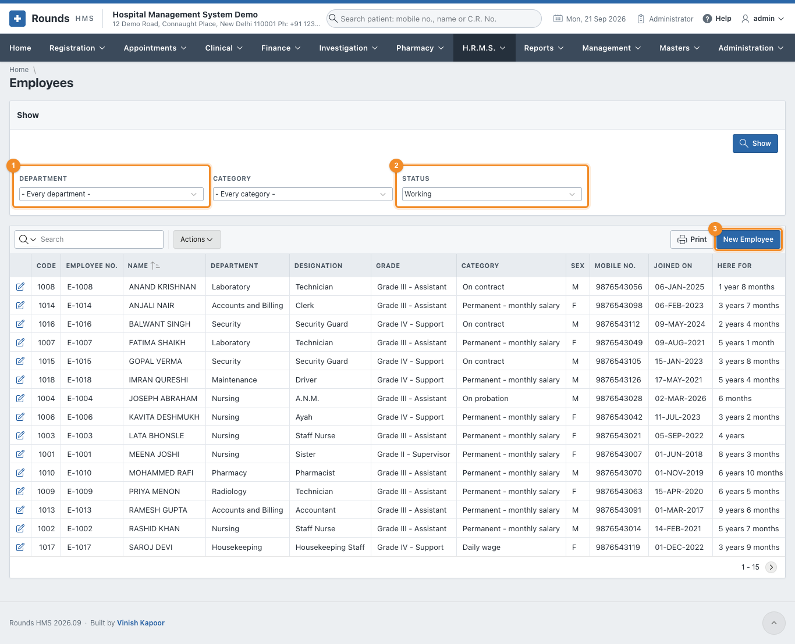
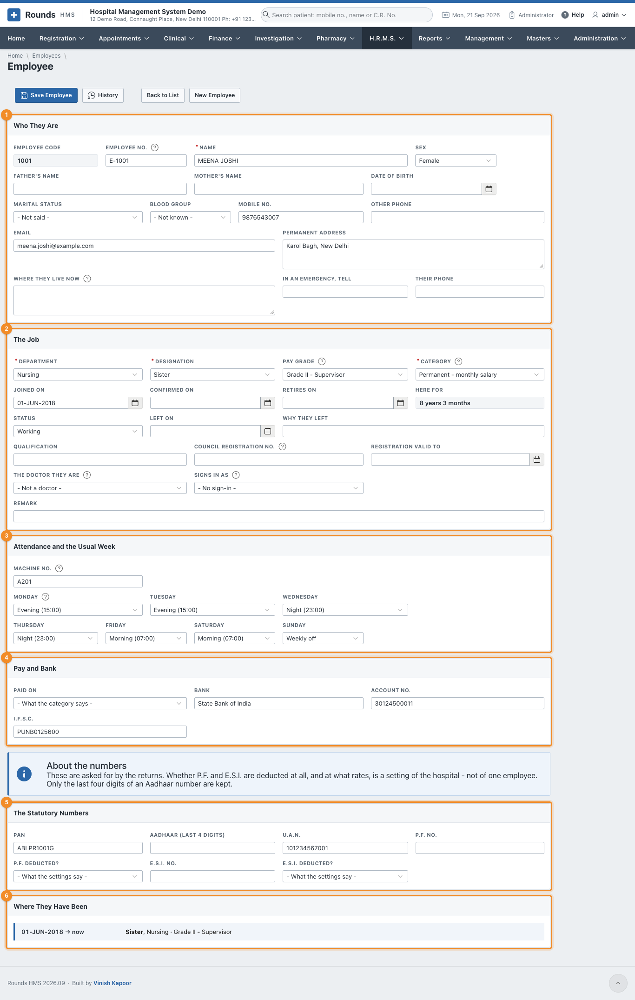
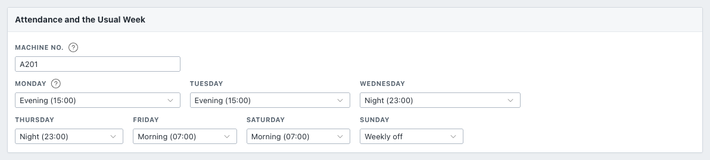
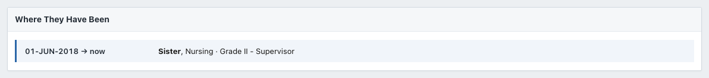

# Employees

**H.R.M.S. > Employees** lists the staff.

1. 1 **Department** and **Category** narrow the list.
2. 2 **Status**: **Working** by default. Choose **Left**, **Retired**, or **Everybody**
   to find someone who is no longer here. Click **Show**.
3. 3 **New Employee** opens an empty record. Click a name to open that employee.

Like every list, it can be searched, sorted, printed or downloaded (see
[how every report works](../reports/index.md#how-every-report-works)).

## The employee's record

The record has six parts. Only **Name**, **Department**, **Designation** and **Category** must be filled
in to save; the rest can follow.

### Who they are

1 The person: name, sex, parents, date of birth, blood group, phones, e-mail, the
permanent address and where they live now, and whom to call in an emergency.

- **Employee Code** is given by the application when the record is first saved.
- **Employee No.** is the number on their card. Left empty, the next one is given (*E-1001*,
  *E-1002* ...). Two employees cannot have the same number.

### The job

2 What they do here.

| Field | Meaning |
|---|---|
| **Department**, **Designation** | from [Setting Up](setup.md) |
| **Pay Grade** | left empty, the grade of the designation is taken |
| **Category** | decides whether attendance is kept, whether they are on the roster, and whether payroll pays them ([Employee Categories](setup.md#employee-categories)) |
| **Joined on**, **Confirmed on**, **Retires on** | **Here for** works out the length of service |
| **Status** | Working, On notice, Left, Retired or Suspended. **Left** and **Retired** need **Left on** |
| **Council Registration No.** and **Registration Valid to** | for nurses, pharmacists and doctors |
| **The Doctor They Are** | joins a doctor on the staff to **Masters > Doctors**, so both records are the same person |
| **Signs in as** | the user they sign in with (**Administration > Application Users**) |

### Attendance and the usual week

3 How this person's days are kept.

- **Machine No.**: what the attendance machine at the door calls this person. Needed only when
  attendance comes from a machine.
- **Monday** to **Sunday**: the shift they are usually on each day, or **Weekly off**. The
  [Duty Roster](roster-attendance.md#duty-roster) is filled from this week. A day left **Not set** takes
  the department's weekly off, or the first shift.

A nurse who rotates can be given a week like the one above: two evenings, two nights, two mornings and a
Sunday off. Changes to a particular week are made on the roster itself.

### Pay and bank

4 **Paid On** (left empty, the category decides), and the **Bank**, **Account No.**
and **I.F.S.C.** the salary goes to. The [Bank Payment Statement](reports.md#bank-payment-statement) lists
anyone whose bank details are missing.

### The statutory numbers

5 **PAN**, the last four digits of **Aadhaar** (the full number is not kept),
**U.A.N.**, **P.F. No.** and **E.S.I. No.** The returns ask for them.

**P.F. Deducted?** and **E.S.I. Deducted?** are normally left at **What the settings say**, so the
hospital's [Payroll Settings](setup.md#payroll-settings) decide. Choose **No** for someone who is
exempt.

### Where they have been

6 Every posting: the department, designation and grade, and from when to when.

A new line starts by itself whenever the department, the designation or the grade changes and the record
is saved. A transfer or a promotion therefore leaves its own history, and nothing needs to be typed
here.

**Save Employee** saves the record. **History** (administrators) shows every change made to it, by whom
and when (see [Audit Trail](../administration/audit.md)).

## When somebody leaves

Do not delete the record: their attendance, leave and payslips point to it. Set **Status** to **Left**
(or **Retired**), fill in **Left on** and **Why They Left**, and save. They leave the roster and the staff
count, and their last month is paid only up to that day.
