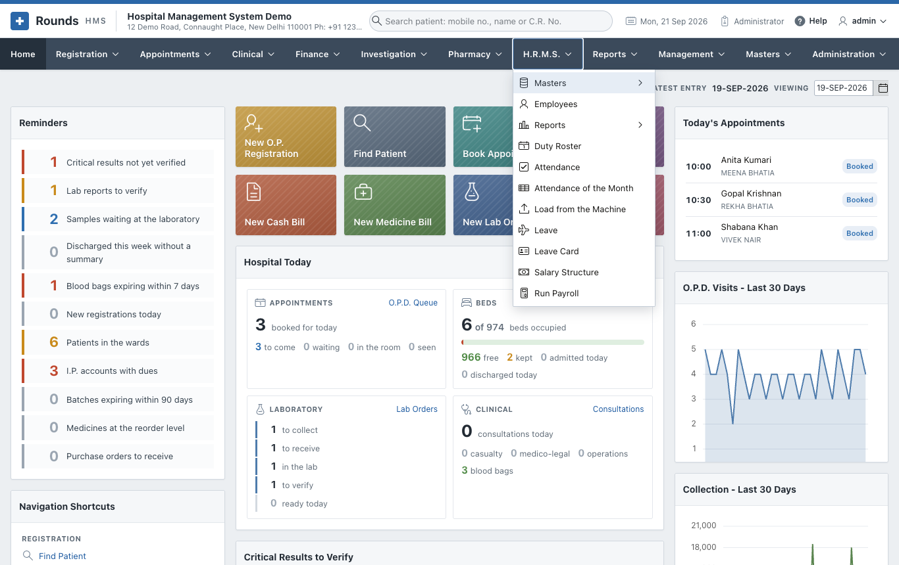

# H.R.M.S.

The **H.R.M.S.** menu keeps the hospital's staff and pays them. It covers:

- **employees**: who they are, their job, their bank and statutory numbers, and where they have worked;
- **the duty roster**: who is on which shift on which day;
- **attendance**: marked on the screen, or loaded from the machine at the door;
- **leave**: asked for, allowed or refused, with each person's balance;
- **payroll**: each person's salary, the month worked out and locked, the payslips, and the salaries
  reaching the accounts.

Everything about H.R.M.S. lives in its own menu, including its lists and its reports. Nothing about staff
is kept under the hospital's **Masters** or **Reports** menus.

| Page | What it is for |
|---|---|
| [Setting Up](setup.md) | **Masters**: departments, designations, grades, categories, shifts, holidays, machines, salary heads, leave types, and the attendance and payroll settings |
| [Employees](employees.md) | The staff list and each employee's record, with their usual week |
| [Duty Roster and Attendance](roster-attendance.md) | **Duty Roster**, **Attendance**, **Attendance of the Month**, **Load from the Machine** |
| [Leave](leave.md) | **Leave** and the **Leave Card** |
| [Payroll](payroll.md) | **Salary Structure**, **Run Payroll**, the payslip, and salaries in the accounts |
| [Reports](reports.md) | The ten H.R.M.S. reports, from staff strength to the bank statement |

## Who can use it

A role opens H.R.M.S. when its **Menus the role opens** includes **H.R.M.S.** (see
[Users and Roles](../administration/users.md#roles)). Four screens are for an **Administrator** only,
because they decide what people are paid:

- **Attendance Settings** and **Payroll Settings**;
- **Salary Structure**;
- **Run Payroll**.

An H.R.M.S. clerk can keep the employees, the roster, the attendance and the leave, and read every
report, but cannot change a salary or run the payroll.

## Everything is a setting

Hospitals keep their staff in different ways, so each choice is a setting, not a rule built into the
application:

| Question | Where it is answered |
|---|---|
| Is attendance marked on the screen, loaded from a machine, or taken from the roster? | [Attendance Settings](setup.md#attendance-settings), and per department in **Staff Departments** |
| How is the machine's file laid out? | [Attendance Machines](setup.md#attendance-machines) |
| How late is late, and how long is a full day? | Attendance Settings, and per shift in [Shifts](setup.md#shifts) |
| Who is on the roster, who has attendance kept, and who is paid by payroll? | [Employee Categories](setup.md#employee-categories) |
| What kinds of leave are given, how many days, and do they carry forward? | [Leave Types](setup.md#leave-types) |
| What is a salary made of? | [Salary Heads](setup.md#salary-heads) |
| Are P.F. and E.S.I. deducted, and at what rates? | [Payroll Settings](setup.md#payroll-settings) |
| What are the professional tax steps of your state? | [Slabs of a Head](setup.md#slabs-of-a-head) |

## The order to set it up

The first time, work through the menu in this order:

1. **Masters**: check the lists supplied (departments, designations, grades, categories, shifts, leave
   types and salary heads come filled in), add your holidays, and answer the two settings pages.
2. **Employees**: add the staff, each with their department, designation, category and usual week.
3. **Salary Structure**: give each employee their salary.
4. From then on, every month: fill the **Duty Roster**, keep the **Attendance** and the **Leave**, then
   **Run Payroll**, lock the month and record the payment.
