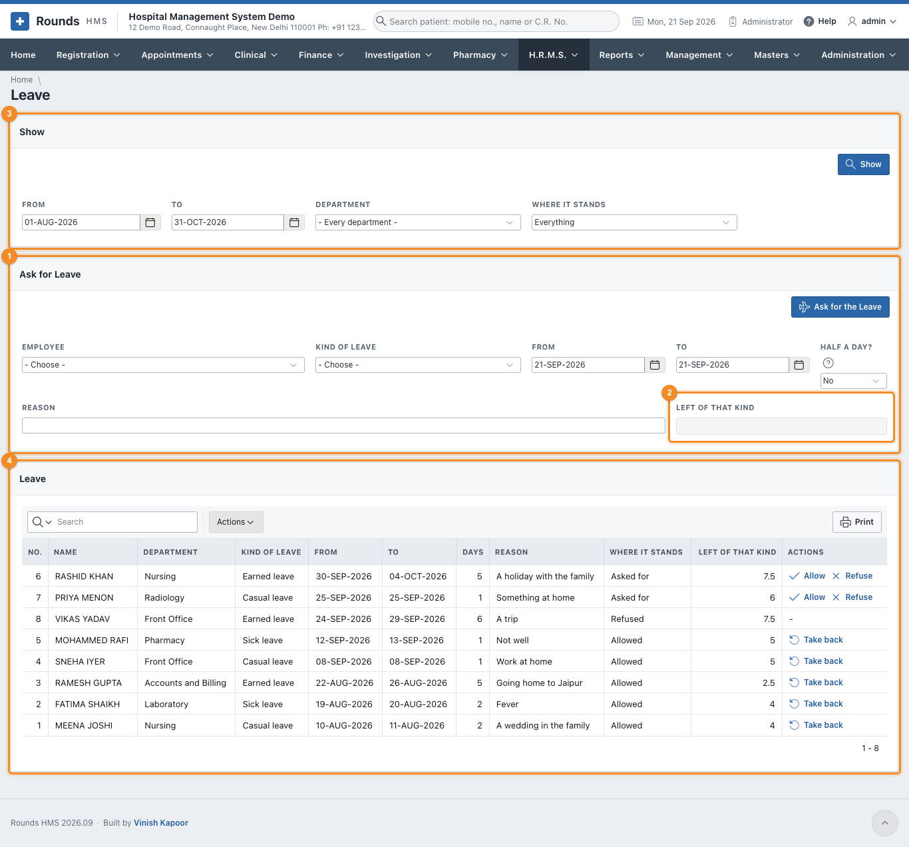
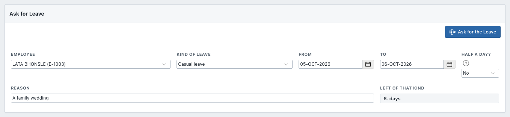
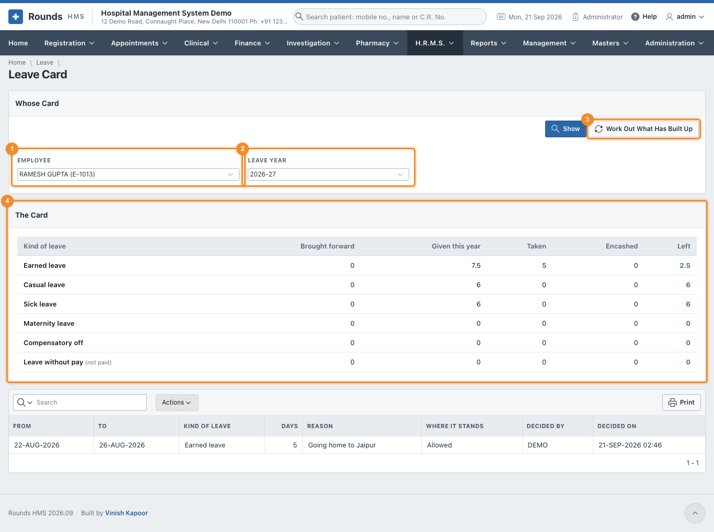

# Leave

Leave is asked for, then **allowed** or **refused**. Allowing it writes the
[duty roster](roster-attendance.md#duty-roster) and the [attendance](roster-attendance.md#attendance) of
those days, and counts the days against the person's balance. Taking it back undoes all three.

The kinds of leave, how many days each gives and how they build up are set in
[Leave Types](setup.md#leave-types). The leave year runs from 1 April to 31 March.

## Leave

**H.R.M.S. > Leave** is where leave is asked for and decided.

1. 1 **Ask for Leave** (below).
2. 2 **Left of That Kind**: once the employee and the kind of leave are chosen, what
   they have left.
3. 3 **Show**: the period, the department and **Where It Stands** (asked for,
   allowed, refused, taken back, or everything).
4. 4 **Leave**: every application, newest first, with the days it counts and what
   the person has left.

### Ask for leave

1. Choose the **Employee** and the **Kind of Leave**. **Left of That Kind** shows the balance.
2. **From** and **To**. For half a day, give the same day in both and choose **Half a Day? = Yes**.
3. A **Reason**, and **Ask for the Leave**.

The application appears in the list as **Asked for**. A kind of leave that needs nobody's word is
allowed at once.

**Days** counts only the working days. Weekly offs and holidays between the first and the last day are
not counted, unless the kind of leave says they are (maternity leave, for example). So leave from a
Saturday to a Monday, over a Sunday off, is two days.

Leave is refused when it:

- falls on days already asked for or allowed;
- falls only on weekly offs and holidays;
- is longer than that kind allows at one time;
- is more than will have built up by its first day. The message says how many days are left: ask for
  those, and the rest as **Leave without pay**.

### Deciding

The **Actions** of each application:

| It stands | Actions |
|---|---|
| **Asked for** | **Allow** or **Refuse** |
| **Allowed** | **Take back**: the days go back to the balance, and the roster and the attendance of those days are undone |
| **Refused**, **Taken back** | nothing more |

Allowing leave that is not paid (leave without pay) counts those days as **loss of pay** in the
[payroll](payroll.md).

## Leave Card

**H.R.M.S. > Leave Card** is one person's leave for one leave year.

1. 1 **Employee** and 2 **Leave Year**. Click **Show**.
2. 3 **Work Out What Has Built Up** brings the days built up to today. Leave that
   builds up month by month gives a twelfth of the year's days each month; someone who joined during the
   year builds up only from then.
3. 4 **The Card**: for each kind of leave, what was **brought forward** from the
   year before, what was **given this year**, what was **taken**, **encashed**, and what is **left**. Below
   it, every application of the year.

In the example, 15 days of earned leave a year have built up to 7.5 by September. Five were taken in
August, so 2.5 are left.

!!! note "At the start of a new leave year"
    What is left of a kind that is carried forward moves to the new year, up to the most that kind
    allows. Other kinds start again from nought.
