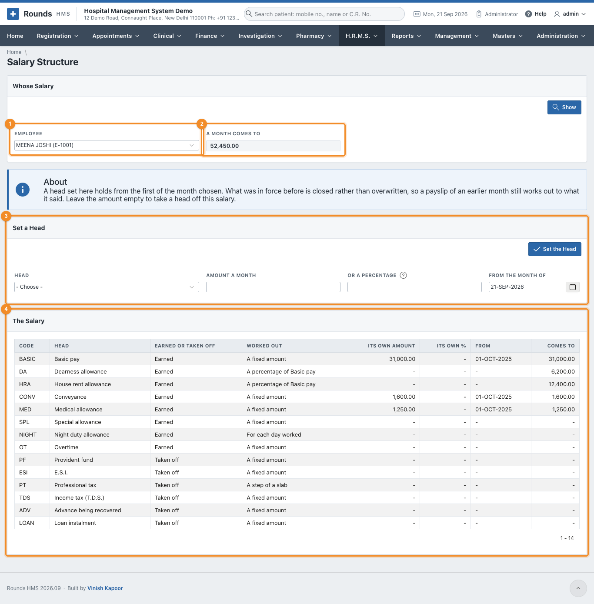
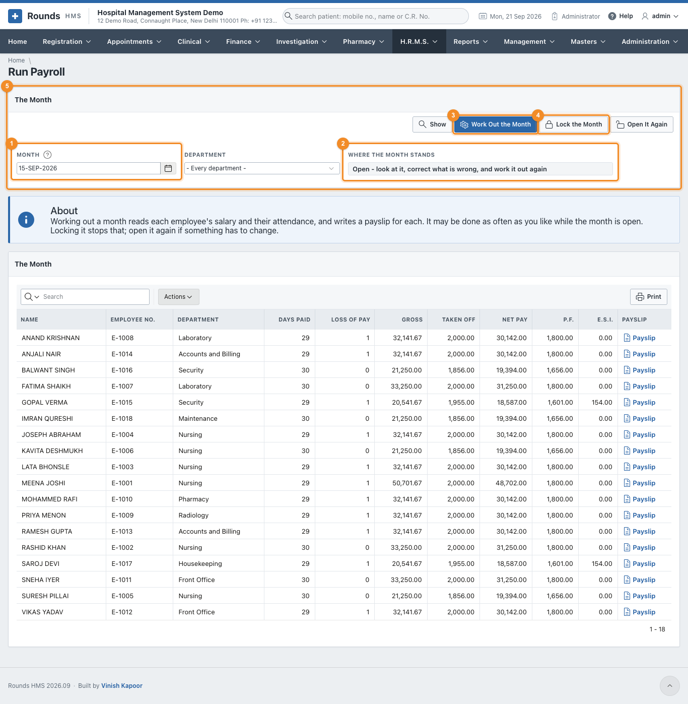
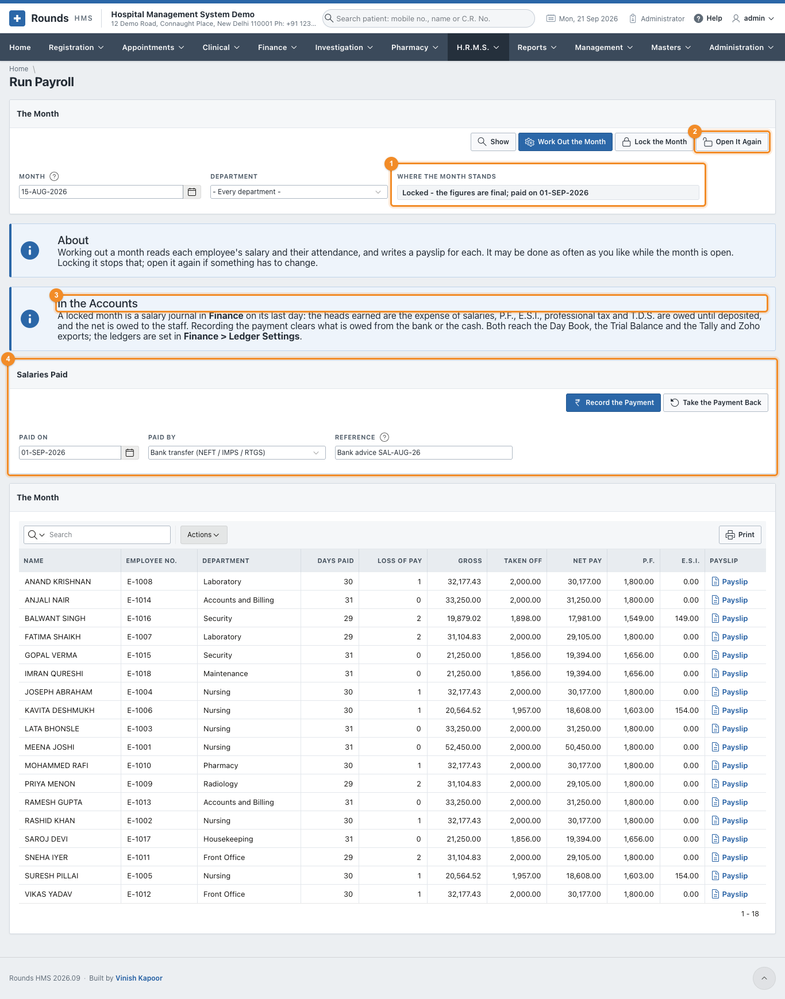
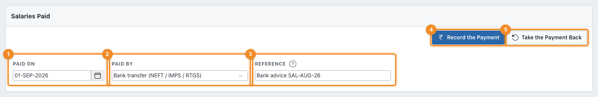
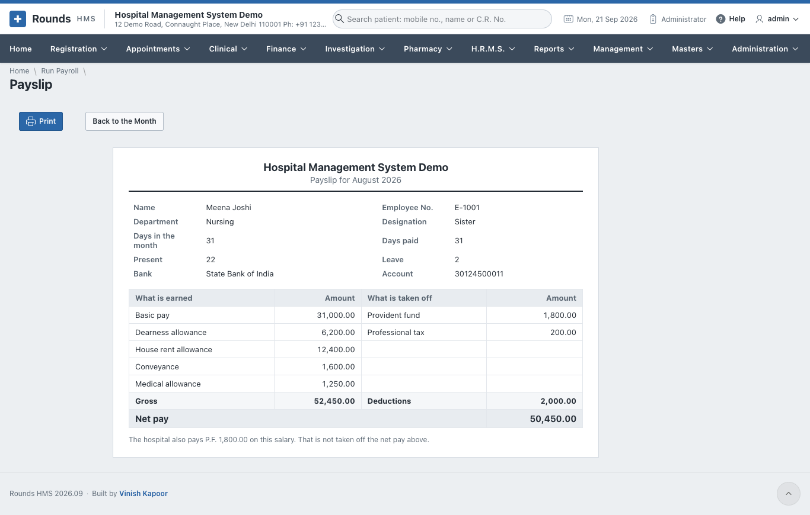
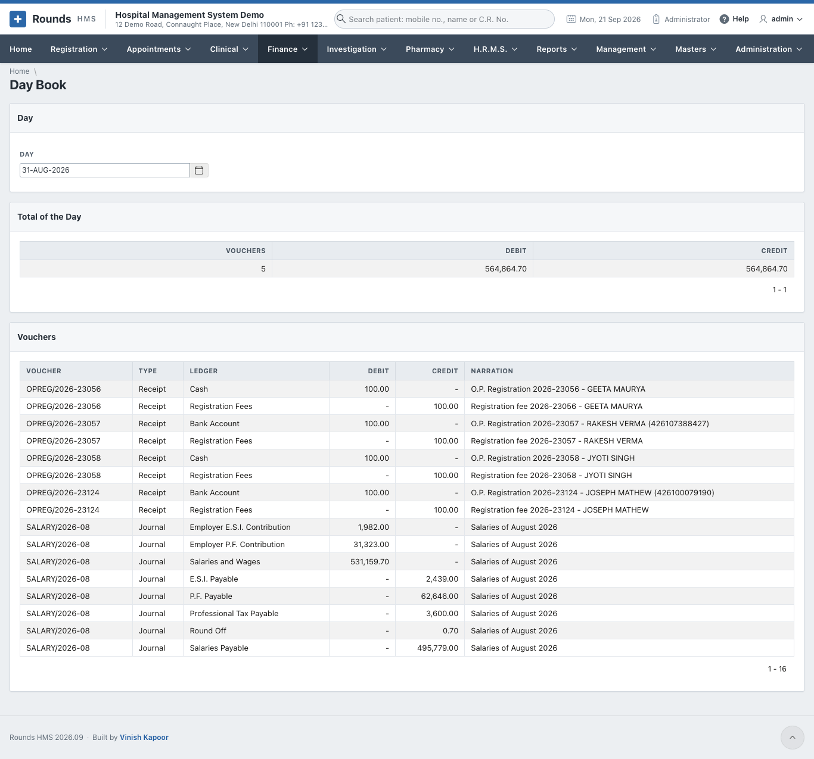
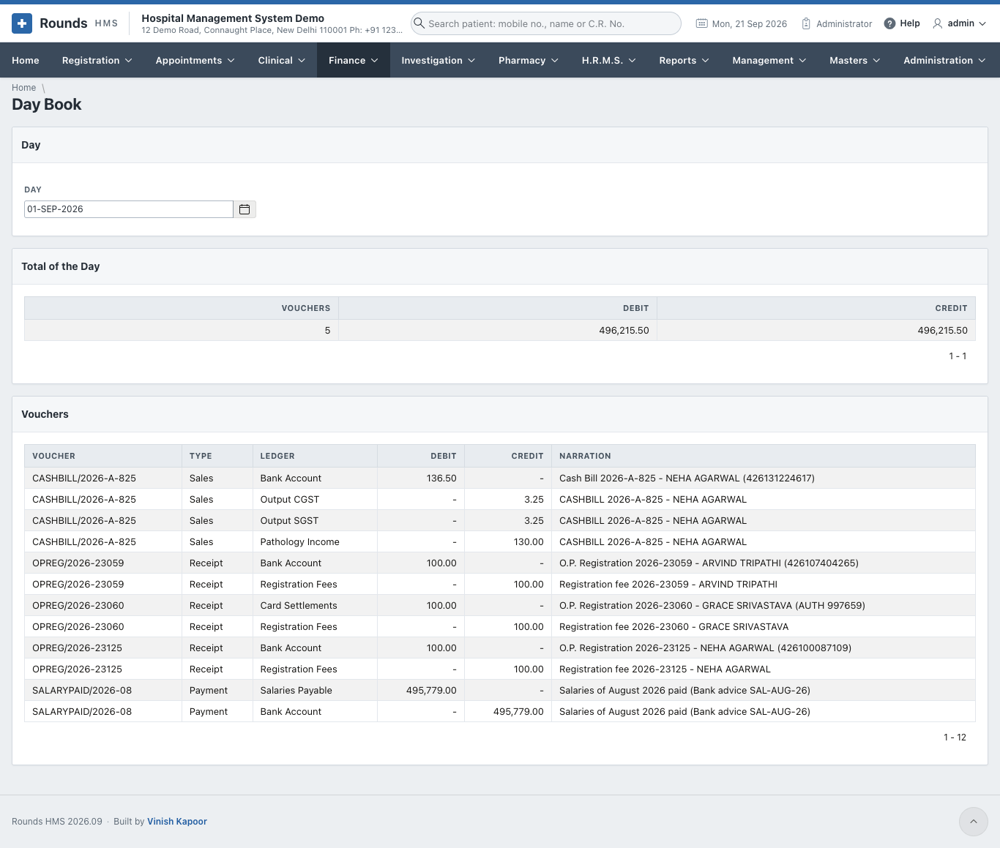
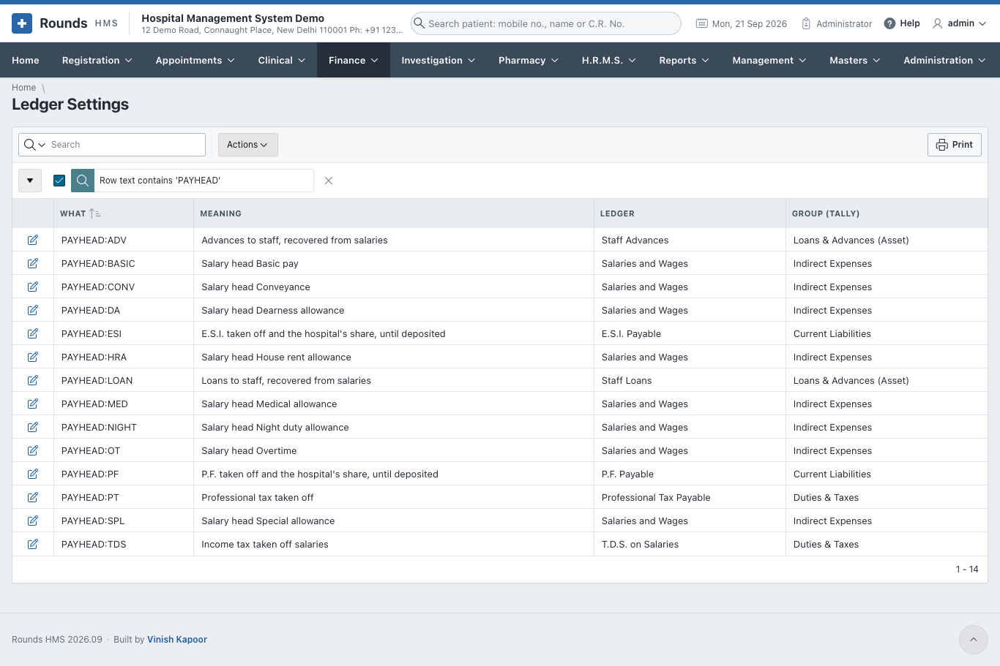

# Payroll

Payroll works a month out from two things: what each person's salary is made of, and what their
attendance and leave say. You look at the result, correct what is wrong and work it out again as often as
needed. Only then is the month **locked**. A locked month is final: its payslips can be printed, and it
reaches the accounts.

Three screens are used, all for administrators:

| Screen | Used |
|---|---|
| [Salary Structure](#salary-structure) | when someone joins, gets a rise, or has something to recover |
| [Run Payroll](#run-payroll) | once a month |
| [Payslip](#the-payslip) | from Run Payroll, for each person |

Before the first month, check [Salary Heads](setup.md#salary-heads) and
[Payroll Settings](setup.md#payroll-settings).

## Salary Structure

**H.R.M.S. > Salary Structure** is one person's salary, head by head.

1. 1 **Employee**. Click **Show**.
2. 2 **A Month Comes To**: the gross of a full month, as the salary stands today.
3. 3 **Set a Head** (below).
4. 4 **The Salary**: every head, how it is worked out, the person's **own amount**
   and the date it holds **from**, and what it **comes to** each month.

A head worked out as a percentage needs nothing here: in the example, D.A. and H.R.A. follow basic pay by
themselves.

### Set a head

1. Choose the **Head**, e.g. *Basic pay*.
2. **Amount a Month**, or **Or a Percentage** for a head worked out as a percentage.
3. **From the Month of**: the first month the new amount is paid.
4. **Set the Head**.

What was in force before is **closed, not overwritten**. A payslip of an earlier month still works out to
what it said. To take a head off a salary, set it with the amount left empty.

Use the same screen for **T.D.S.**: set *Income tax (T.D.S.)* to the amount to deduct each month. For an
advance or a loan, set *Advance being recovered* or *Loan instalment* to the monthly instalment. Take it
off again once it is recovered.

## Run Payroll

**H.R.M.S. > Run Payroll** is one month.

1. 1 **Month**: any day of the month. **Department** narrows it (every department by
   default).
2. 2 **Where the Month Stands**: not worked out yet, open, or locked (and whether it
   is paid).
3. 3 **Work Out the Month** writes a payslip for everyone paid by payroll who has a
   salary. Run it again after any correction: everything is worked out afresh.
4. 4 **Lock the Month**, when the figures are right.
5. 5 **The Month**: one row per person, with the days paid, the loss of pay, the
   gross, what is taken off, the net pay, P.F. and E.S.I., and a link to the **Payslip**.

### How a month is worked out

| | |
|---|---|
| **Days paid** | the days of the month (or thirty, as the settings say), less the **loss of pay** |
| **Loss of pay** | days **absent** (if the settings say an absent day is loss of pay) and days of **unpaid leave**. Someone who joined or left during the month is paid only for the days they were here |
| **Nothing marked** | if no attendance is kept for someone, the whole month is paid |
| **Each earning** | its amount for a full month, times the days paid, divided by the days of the month (unless the head is paid in full). A head *for each day worked* is its amount times the days present |
| **Overtime** | the overtime minutes of the month at the rate of the settings |
| **P.F.** | the employee's share of the wages that count towards P.F., up to the ceiling. The hospital's share is worked out the same way |
| **E.S.I.** | only for someone whose E.S.I. wage is within the limit: the employee's and the hospital's shares |
| **Professional tax** | the step of the slab the gross falls in |
| **Net pay** | the gross less everything taken off, rounded as the settings say |

The hospital's own share of P.F. and E.S.I. is not taken off the salary. It is shown under the payslip and
in the [Statutory Returns](reports.md#statutory-returns), and it goes to the accounts as an expense.

### Locking, and opening again

**Lock the Month** makes the figures final. A locked month cannot be worked out again: **Work Out the
Month** refuses until **Open It Again** is clicked. Open a month only to correct a mistake, then lock it
again.

1. 1 **Where the Month Stands**: *Locked - the figures are final; paid on
   01-SEP-2026*.
2. 2 **Open It Again** is refused once the salaries are recorded as paid: take the
   payment back first.
3. 3 **In the Accounts** explains what the month has written in Finance.
4. 4 **Salaries Paid** (below).

### Salaries paid

Once the bank has paid the salaries (or they were paid in cash), record it:

1. 1 **Paid On**: the day the money went out.
2. 2 **Paid By**: the mode of payment, e.g. *Bank transfer (NEFT / IMPS / RTGS)*.
   It decides the bank or cash ledger the payment comes from.
3. 3 **Reference**: the bank advice or cheque number.
4. 4 **Record the Payment**.
5. 5 **Take the Payment Back** undoes it, e.g. if it was recorded against the wrong
   month.

The list to hand the bank is the [Bank Payment Statement](reports.md#bank-payment-statement).

## The payslip

**Payslip** on a row of Run Payroll opens that person's payslip. **Print** prints it on one page.

It shows the days (of the month, paid, present, on leave), the bank account, every head earned and every
head taken off, the gross, the deductions and the **net pay**. Heads that come to nought are not shown.
Under it, the hospital's own share of P.F. and E.S.I., which is not taken off the net pay.

## Salaries in the accounts

A locked month becomes a **salary journal** in Finance, dated the last day of the month. Recording the
payment adds a **payment voucher** on the day it was paid. Both appear in the
[Day Book](../finance/gst-accounts.md#day-book-and-ledger), the ledgers, the Trial Balance and the Tally and
Zoho exports, with nothing to type in.

| Line | Debit or credit | Ledger (as supplied) |
|---|---|---|
| Every head earned (basic, D.A., H.R.A., allowances, overtime) | debit | *Salaries and Wages* |
| The hospital's share of P.F. and of E.S.I. | debit | *Employer P.F. Contribution*, *Employer E.S.I. Contribution* |
| P.F., both shares | credit | *P.F. Payable* |
| E.S.I., both shares | credit | *E.S.I. Payable* |
| Professional tax, T.D.S. | credit | *Professional Tax Payable*, *T.D.S. on Salaries* |
| Advances and loans recovered | credit | *Staff Advances*, *Staff Loans* |
| The net pay | credit | *Salaries Payable* |
| The rounding of the net pay | debit or credit | *Round Off* |

The payment voucher then debits *Salaries Payable* and credits the bank (or cash) of the mode it was paid
by, so *Salaries Payable* comes back to nought.

Every salary head has its own line in **Finance > Ledger Settings** (*PAYHEAD:BASIC*, *PAYHEAD:HRA* ...),
so the ledgers can be renamed to match Tally or Zoho Books. For example, basic pay and allowances can go to
separate ledgers. A head added later gets a ledger of its own kind by itself.

!!! note "Opening a locked month takes its journal out of the accounts"
    The journal belongs to the locked month. Opening the month again takes it out until the month is
    locked again, so a month already sent to Tally should not be opened without telling the accountant.

## A month, step by step

1. Check the month's [attendance](roster-attendance.md#attendance-of-the-month) and that all
   [leave](leave.md) has been decided.
2. **Run Payroll**: choose the month, **Work Out the Month**.
3. Open a few payslips and read the list. Correct what is wrong (attendance, leave, a salary) and **Work
   Out the Month** again.
4. **Lock the Month**.
5. Download the [Bank Payment Statement](reports.md#bank-payment-statement) and send it to the bank.
6. When the bank has paid, **Record the Payment**.
7. Print the payslips, and hand the [Statutory Returns](reports.md#statutory-returns) figures to whoever
   files the P.F. and E.S.I. returns.
