# H.R.M.S. Reports

**H.R.M.S. > Reports** holds the ten reports about the staff. They are kept here, not in the hospital's
**Reports** menu, so everything about the staff is in one place.

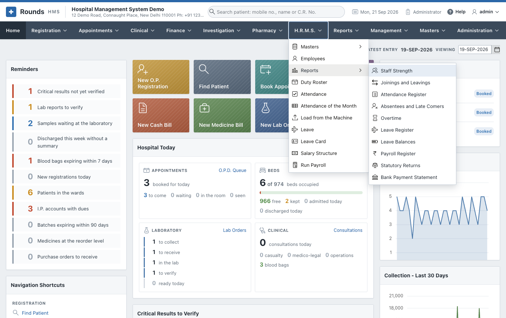

Each works like every other report (see
[how every report works](../reports/index.md#how-every-report-works)). Choose the period or the month and
the department, click **Show**, then search, sort, print or download the list below. Most open on the
current month.

| Report | What it shows |
|---|---|
| [Staff Strength](#staff-strength) | how many people work here, by department, designation and grade |
| [Joinings and Leavings](#joinings-and-leavings) | who joined and who left in a period |
| [Attendance Register](#attendance-register) | the attendance of a period, person by person and day by day |
| [Absentees and Late Comers](#absentees-and-late-comers) | every absence and every late arrival |
| [Overtime](#overtime) | the overtime worked |
| [Leave Register](#leave-register) | every application of a period |
| [Leave Balances](#leave-balances) | what everybody has left, kind by kind |
| [Payroll Register](#payroll-register) | a month's payroll, person by person |
| [Statutory Returns](#statutory-returns) | the P.F. and E.S.I. figures of a month |
| [Bank Payment Statement](#bank-payment-statement) | the list to hand the bank |

## Staff Strength

Everybody working today, by department and by designation, with two charts. Those who have left, retired
or are suspended are not counted.

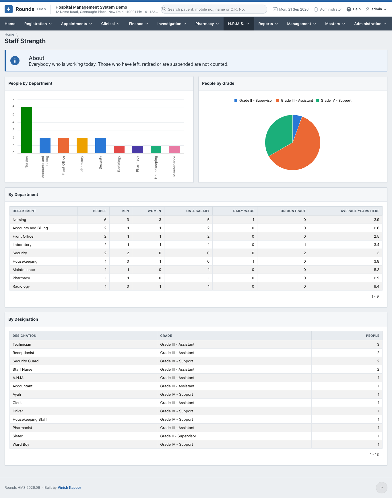

## Joinings and Leavings

Who came and who went in the period: the day, the department and designation, and why they left.

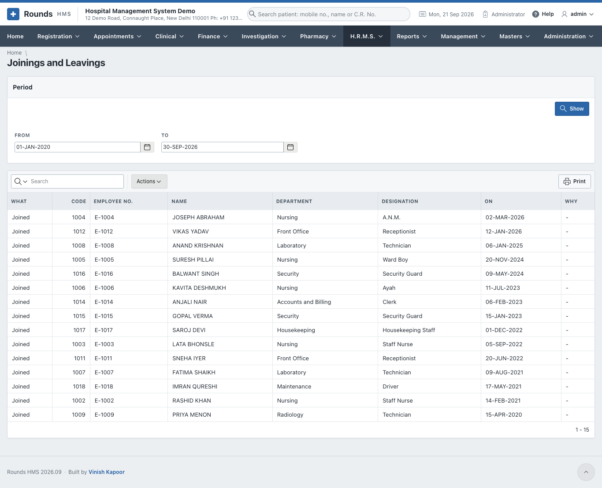

## Attendance Register

**By Employee** totals the period for each person: days present, absent, on leave, weekly offs,
holidays, the times late and the minutes late, and the overtime. **Day by Day** lists every marked day with
the shift, the times, the minutes worked, late, left early and overtime.

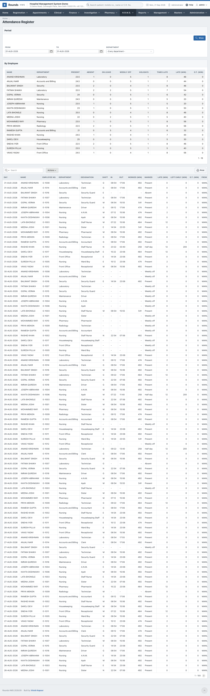

## Absentees and Late Comers

Everybody marked absent, and everybody who came after the grace of their shift, with their mobile number,
so a supervisor can follow up.

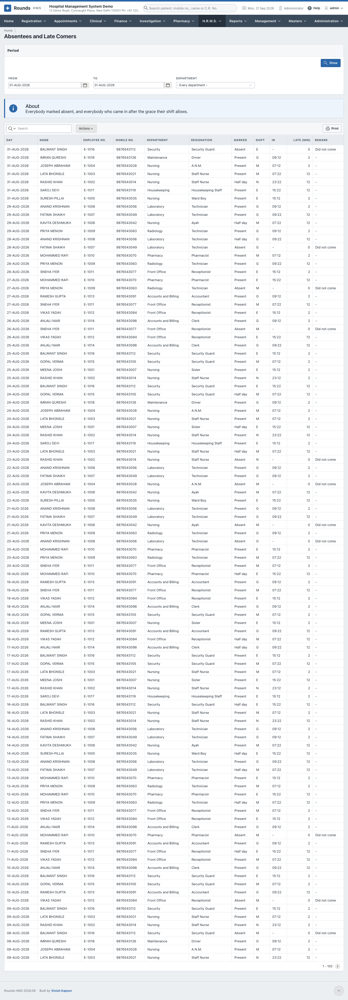

## Overtime

The overtime of the period, day by day. It is counted only where
[Attendance Settings](setup.md#attendance-settings) says to count it, and only past the minutes allowed
after the end of a shift.

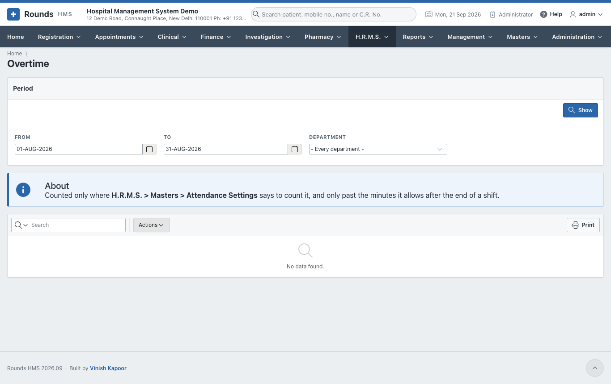

## Leave Register

**By Kind of Leave** totals the applications and days of the period; below it, every application with
where it stands.

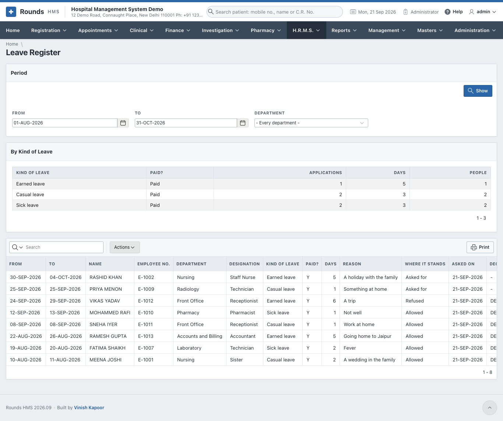

## Leave Balances

For a leave year, what everybody has of each kind: brought forward, given, taken, encashed and left. Narrow
it by department or kind of leave.

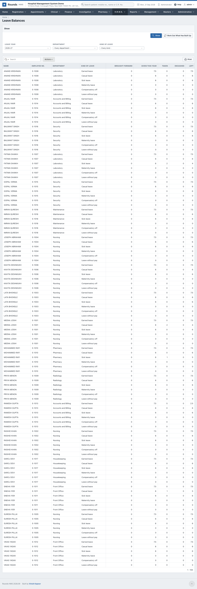

## Payroll Register

A month's payroll: **By Department** totals the people, the gross, what is taken off and the net pay.
**Employee by Employee** lists each payslip with the days paid, loss of pay, gross, deductions, net, and
P.F. and E.S.I.

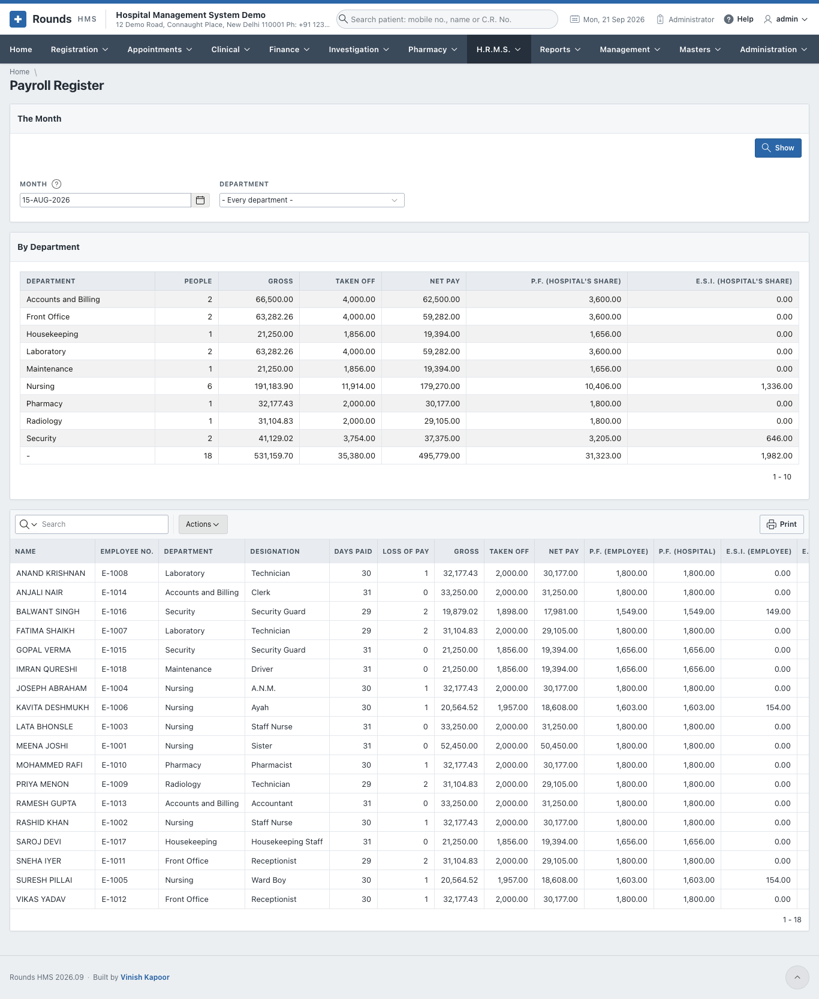

## Statutory Returns

The figures the P.F. and E.S.I. returns are built from, for a month. **P.F. and E.S.I., Employee by
Employee** gives the U.A.N., the P.F. and E.S.I. numbers, the gross, both shares of each and their totals.
**What the Month Owes** totals everything taken off the month's salaries, head by head (P.F., E.S.I.,
professional tax, T.D.S., advances), and the hospital's own share of P.F. and of E.S.I., with how many
people each covers.

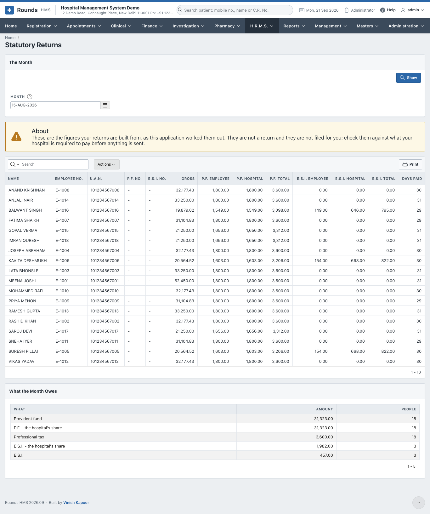

!!! warning "These are figures, not a return"
    Nothing is filed for you. Check the figures against what your hospital is required to pay before
    anything is sent.

## Bank Payment Statement

The list to hand the bank: each person's bank, account number, I.F.S.C. and net pay for the month.
**Actions > Download** saves it as a file (CSV or Excel) for the bank's bulk payment upload. Anybody whose
bank details are missing is shown at the top under **Watch Out**, so they can be filled in on the
[employee's record](employees.md#pay-and-bank) first.

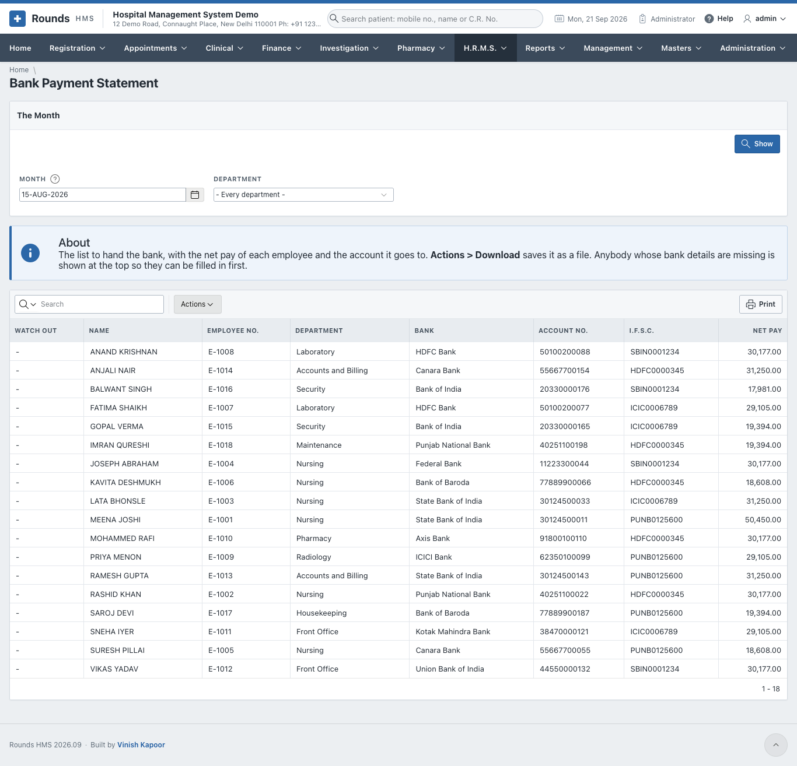
