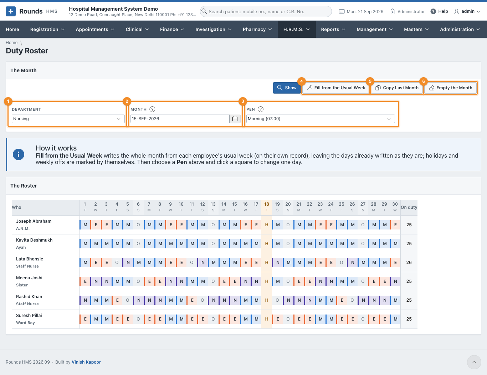
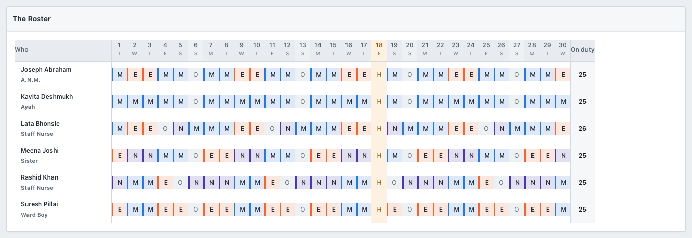
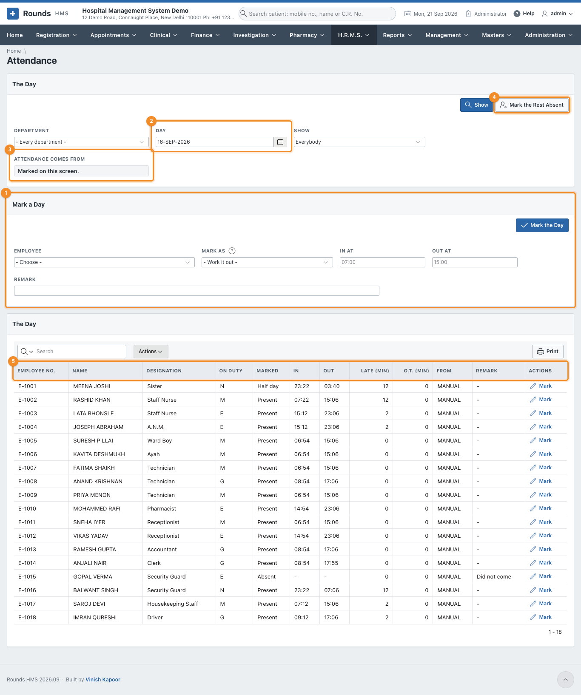
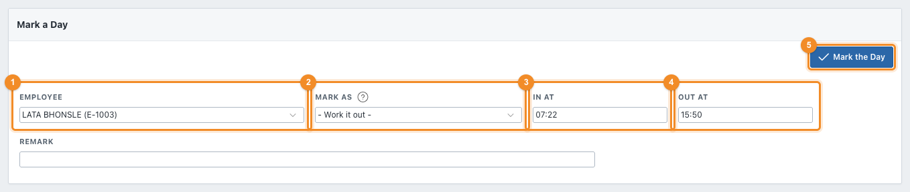
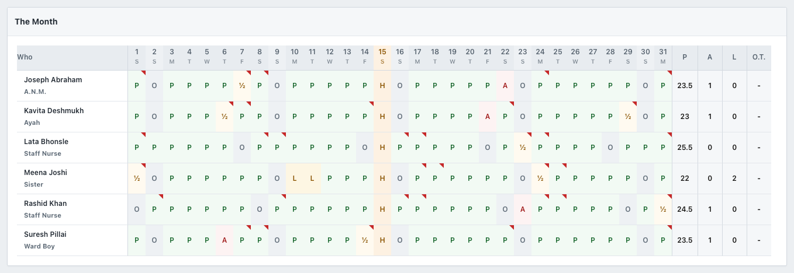
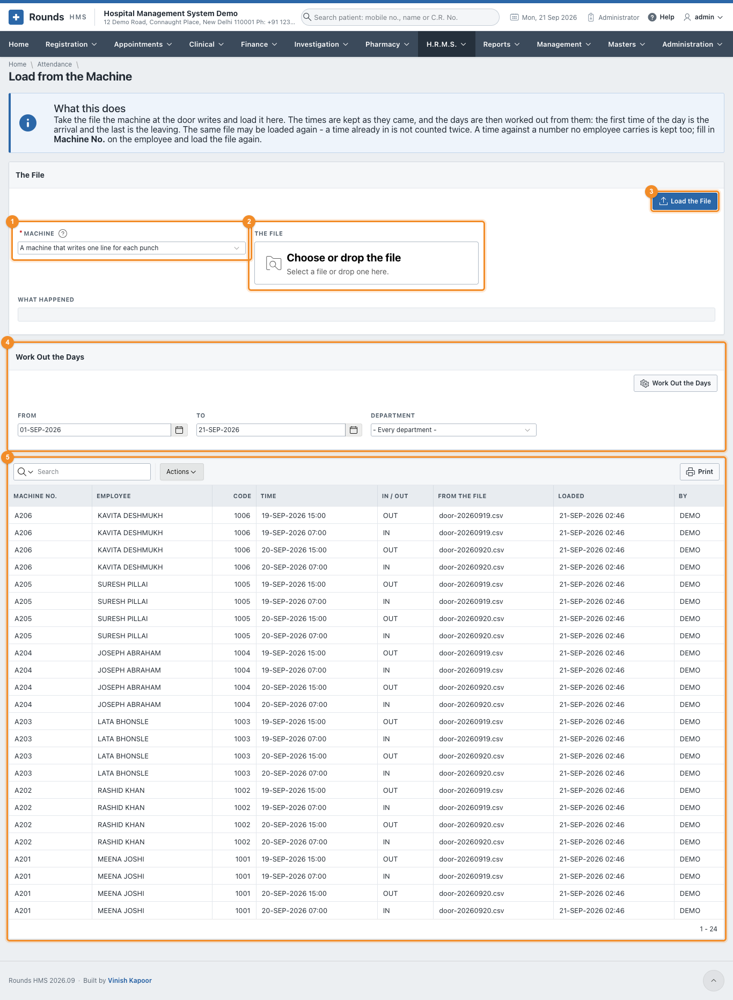

# Duty Roster and Attendance

The **duty roster** says who should be on which shift each day. **Attendance** records what really
happened. Payroll reads the attendance, and approved [leave](leave.md) writes both of them, so the three
always agree.

## Duty Roster

**H.R.M.S. > Duty Roster** shows one department for one month, one row per person and one square per
day.

1. 1 **Department**: one department, or every department.
2. 2 **Month**: any day of the month is enough. Click **Show**.
3. 3 **Pen**: what a click on a square writes. It can be a shift, **Off**, **On
   leave**, or **Nothing** (takes the day off the roster).
4. 4 **Fill from the Usual Week** writes the whole month from each person's
   [usual week](employees.md#attendance-and-the-usual-week). Days already written are left as they are;
   holidays are marked by themselves.
5. 5 **Copy Last Month** repeats last month's roster date for date: the 5th as
   last month's 5th. This month's holidays are marked by themselves, and a day that was a holiday last
   month is left empty, so **Fill from the Usual Week** can fill it afterwards.
6. 6 **Empty the Month** takes every day of the month off the roster, after
   asking.

Each square carries the letter of its shift in the shift's colour (**M** morning, **E** evening, **N**
night, **G** general); **O** is a weekly off, **L** leave and **H** a holiday. The holiday's column is
shaded, and **On duty** counts the days each person works.

### Making the roster of a month

1. Choose the department and the month, and click **Show**.
2. Click **Fill from the Usual Week**. The month is written in one go.
3. To change a day, choose the **Pen** (e.g. *Night (23:00)*) and click the square. The page comes back
   with that day written. Keep clicking squares with the same pen for as many days as needed.

!!! tip "Swapping two people"
    Choose the first person's shift as the pen and click the second person's square, then the other way
    round.

## Attendance

**H.R.M.S. > Attendance** is one day for everybody.

1. 1 **Mark a Day**: marks one person (below).
2. 2 **Day**, with the **Department** and **Show** (everybody, only those not
   marked yet, or only those marked). Click **Show**.
3. 3 **Attendance Comes From** tells you how this department keeps attendance
   (see [Attendance Settings](setup.md#attendance-settings)).
4. 4 **Mark the Rest Absent** marks everyone not yet marked on this day as absent,
   after asking. Use it at the end of the day, once the people who came have been marked.
5. 5 **The Day**: everybody with their duty from the roster (**On Duty**), what they
   are marked as, the times, the minutes late and the overtime. **Mark** on a row puts that person into
   **Mark a Day**.

### Mark a day

1. 1 **Employee**.
2. 2 **Mark as**: leave it at **Work it out** and give the times. Or choose
   **Present**, **Absent**, **Half day**, **On leave**, **Weekly off**, **Holiday** or **On duty
   outside** yourself.
3. 3 **In at** and 4 **Out at**, e.g. *07:22* and
   *15:50*.
4. 5 **Mark the Day**. The list refreshes and the form empties for the next person.

When it is left to work out, the day is judged against the person's shift:

| Worked out | How |
|---|---|
| **Late** | minutes past the start of the shift, beyond the grace |
| **Present** or **Half day** | the time between in and out, against a full day and a half day. Less than a half day is **Absent** |
| **Overtime** | minutes past the end of the shift, beyond what the settings allow, if overtime is counted |

In the example, someone on the morning shift (07:00 to 15:00, ten minutes' grace) who comes at 07:22 and
leaves at 15:50 is **present**, **12 minutes late**, with overtime counted after the end of the shift.

A day marked again replaces what was there. After **A Day Stays Open for (days)** in the settings, a
day can no longer be changed.

## Attendance of the Month

**H.R.M.S. > Attendance of the Month** is the muster roll: a department for a month, one letter per
person per day.

| Letter | Means |
|---|---|
| **P** | present |
| **½** | half day |
| **A** | absent |
| **L** | on leave |
| **O** | weekly off |
| **H** | holiday |
| **D** | on duty outside |

A square with a **red corner** was a late arrival. Rest the pointer on a square to see the times. At the
right, **P** counts the days present (a half day is ½), then **A** absent, **L** on leave and the
overtime of the month.

## Load from the Machine

**H.R.M.S. > Load from the Machine** reads the file the attendance machine at the door writes. It is
needed only when attendance comes from a machine.

1. 1 **Machine**: how its file is read is set in
   [Attendance Machines](setup.md#attendance-machines).
2. 2 **The File**: choose the file the machine wrote.
3. 3 **Load the File**. **What Happened** says how many times were read, how many
   were already in, and how many lines could not be read.
4. 4 **Work Out the Days**: for a period and a department, turns the times into
   attendance. The first time of a day is the arrival and the last is the leaving, unless the file says
   which is which.
5. 5 **The Times Last Loaded** shows the times as they came from the file.

The same file can be loaded twice: a time already in is not counted again. A time against a number no
employee carries is kept too. Fill in **Machine No.** on that
[employee](employees.md#attendance-and-the-usual-week) and click **Work Out the Days** again.
