# Setting Up

**H.R.M.S. > Masters** holds the lists every other H.R.M.S. screen chooses from, and the two pages of
settings. Most lists come filled in with what a hospital usually has; change them to match yours.

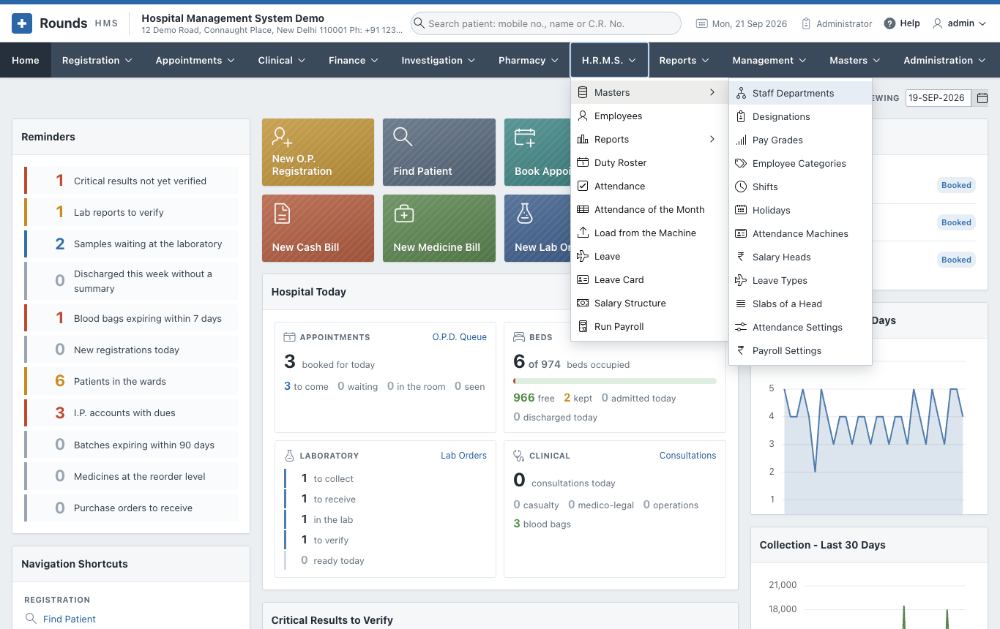

Every list works the same way. Click a row to open it in a window, change it, and **Apply Changes**.
**Create** adds a new one. A row that is no longer used is kept and set **In Use? = No**, so the old
records that point to it still read correctly.

## Staff Departments

The departments the staff work in: Nursing, Laboratory, Front Office, Security and so on.

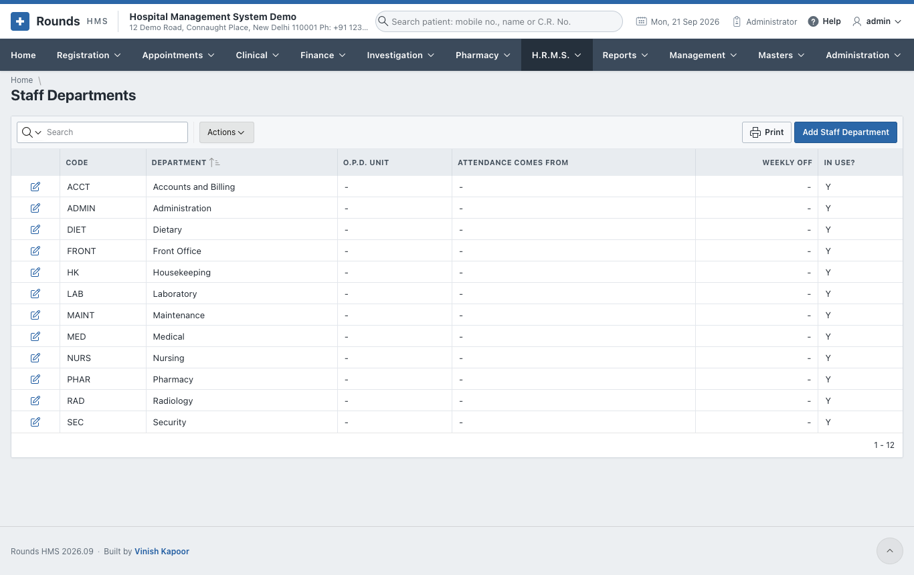

| Field | Meaning |
|---|---|
| **Code** and **Department** | e.g. *NURS* / *Nursing* |
| **O.P.D. Unit** | the department of the patients this one answers to, where there is one (Medicine, Pathology ...) |
| **Attendance Comes From** | only where this department keeps attendance differently from the rest of the hospital, e.g. one department has a machine and the others do not |
| **Weekly Off** | the day off of anyone in this department who has no usual week of their own |

Leave the last two empty to use the hospital's answers from [Attendance Settings](#attendance-settings).

## Designations and Pay Grades

**Designations** are the posts: Sister, Staff Nurse, Technician, Receptionist. Each can carry a **Pay
Grade**, which an employee takes when they are given that designation.

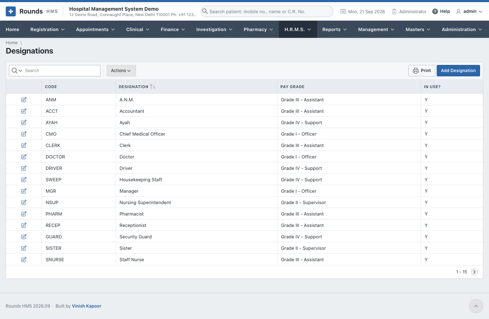

**Pay Grades** group the posts by level, with the monthly pay each grade runs **from** and **to**. The
range is only a guide; a salary is set on the [Salary Structure](payroll.md#salary-structure).

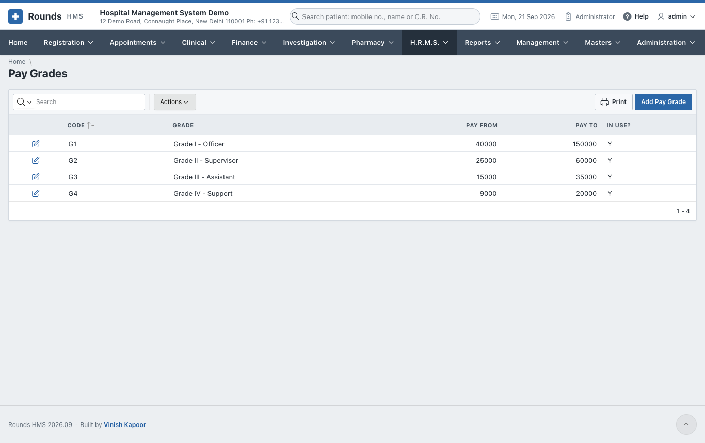

## Employee Categories

A category says how a group of staff is treated: permanent, on probation, daily wage, on contract,
trainee, visiting doctor.

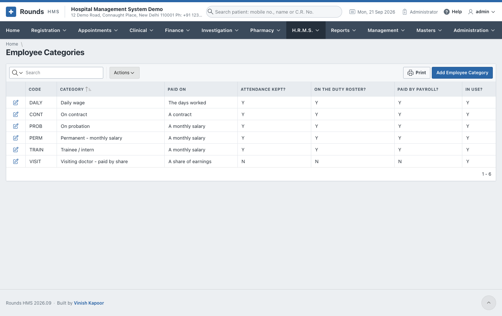

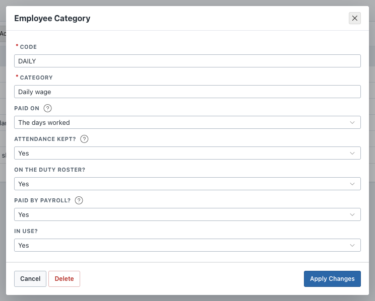

| Field | Meaning |
|---|---|
| **Paid On** | a monthly salary, the days worked, the hours worked, a contract, or a share of what they earn for the hospital |
| **Attendance Kept?** | **No** for people who are not marked present or absent, e.g. a visiting doctor |
| **On the Duty Roster?** | **No** keeps them off the roster |
| **Paid by Payroll?** | **No** for people paid another way, e.g. doctors paid by the [share payouts](../finance/shares.md) of Finance |

## Shifts

The shifts of the roster. **Morning**, **Evening**, **Night**, **General** and **Half day** come filled
in.

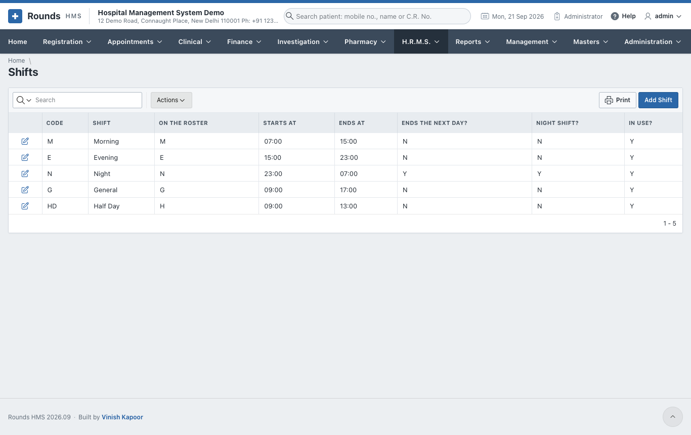

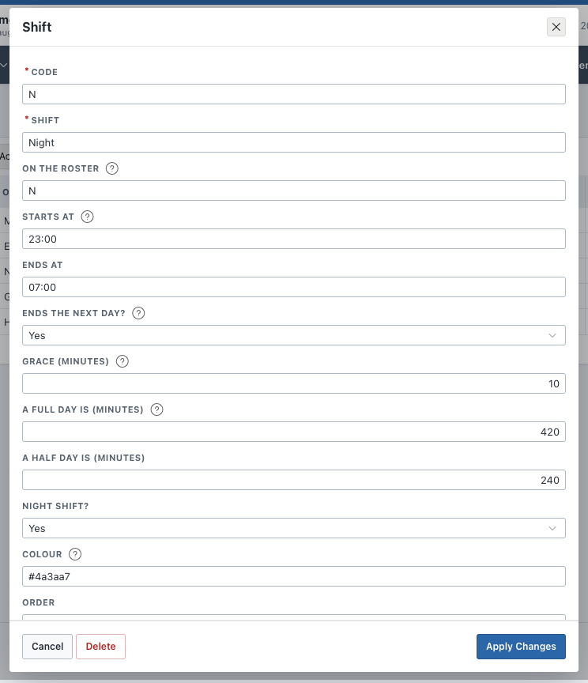

| Field | Meaning |
|---|---|
| **On the Roster** | one or two letters shown in the squares of the roster, e.g. *N* |
| **Starts at** / **Ends at** | the clock, e.g. *23:00* and *07:00* |
| **Ends the Next Day?** | **Yes** for a shift that runs past midnight |
| **Grace (minutes)** | somebody who comes within this many minutes of the start is not late |
| **A Full Day Is** / **A Half Day Is (minutes)** | how long someone must stay for a full day or a half day. Left empty, the hospital's answer is used |
| **Colour** | the colour of its squares on the roster |

!!! tip "Keep a full day a little under the shift"
    For an eight-hour shift, set a full day at **420 minutes** (seven hours), not 480. Otherwise
    somebody who comes ten minutes late and stays to the end of the shift is counted only half a day.

## Holidays

The hospital's holidays, one row per day. A holiday is marked on the roster and in the attendance by
itself. **Optional?** is for a holiday each person may take or not.

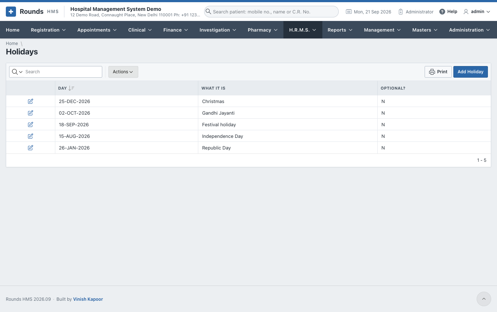

## Attendance Machines

Only needed when attendance comes from a machine at the door. A machine writes a file of the times it
read. This page says how to read that file, so any machine's file can be loaded without changing the
application.

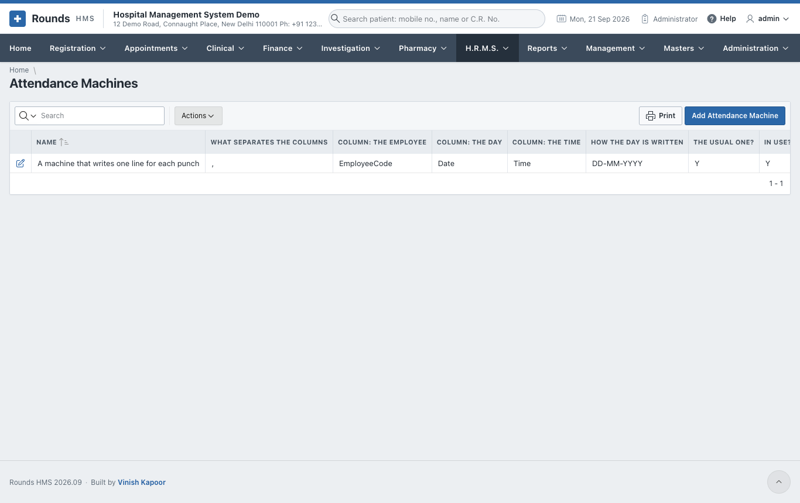

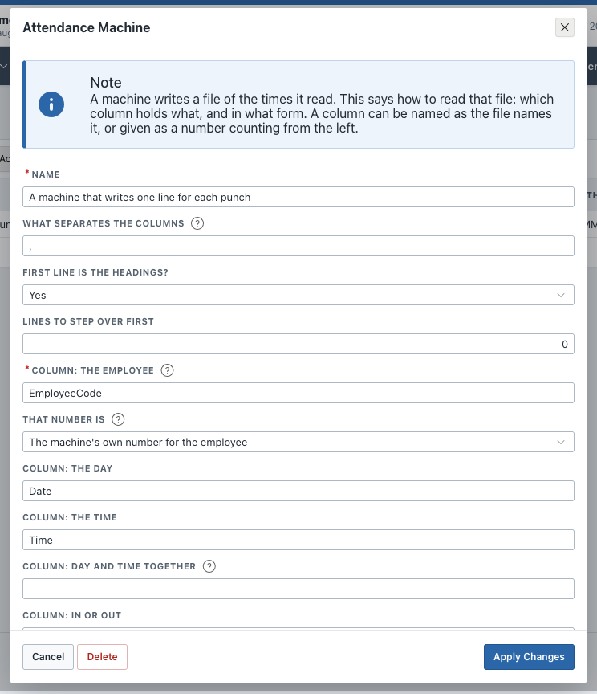

| Field | Meaning |
|---|---|
| **What Separates the Columns** | a comma for a .csv file, a semicolon, or a tab |
| **First Line Is the Headings?** and **Lines to Step Over First** | for a file that starts with headings or a title |
| **Column: the Employee** | the heading of the column, or its number counting from the left |
| **That Number Is** | the machine's own number for the employee (**Machine No.** on the [employee](employees.md#attendance-and-the-usual-week)), or the employee code |
| **Column: the Day** / **the Time**, or **Day and Time Together** | where the date and the time are |
| **How the Day Is Written** / **How the Time Is Written** | e.g. *DD-MM-YYYY* and *HH24:MI* |
| **Column: In or Out** with **What "In" / "Out" Looks Like** | where the file says whether it was an arrival or a leaving. Without it, the first time of the day is the arrival and the last is the leaving |
| **The Usual One?** | the machine chosen first on **Load from the Machine** |

## Leave Types

The kinds of leave the hospital gives. Earned, casual, sick, maternity, compensatory off and leave
without pay come filled in.

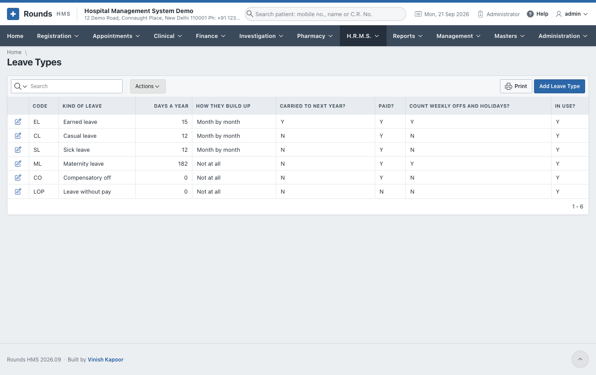

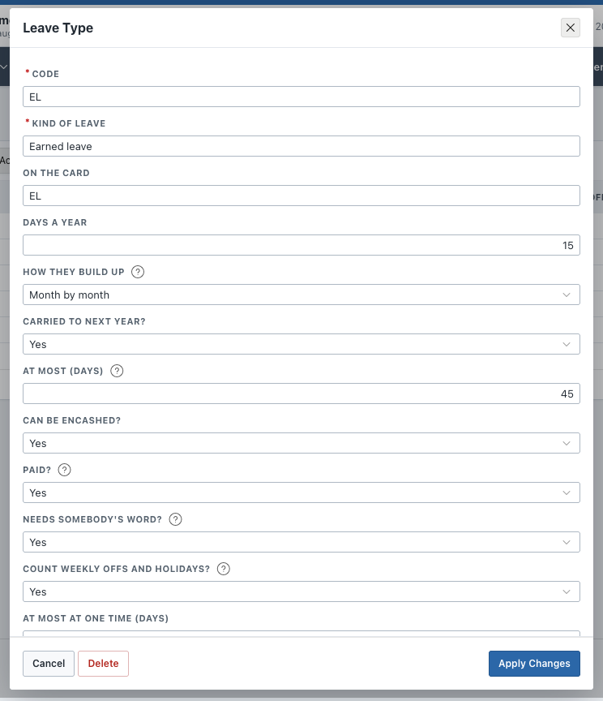

| Field | Meaning |
|---|---|
| **Days a Year** | how many days of it a year gives |
| **How They Build Up** | **Month by month** (a twelfth each month), **All at the start of the year**, or **Not at all** (a kind of leave simply allowed when needed) |
| **Carried to Next Year?** and **At Most (days)** | whether what is left moves to the next leave year, and how much of it |
| **Paid?** | **No** for leave without pay: payroll counts those days as loss of pay |
| **Needs Somebody's Word?** | **No**: asking for it is enough, it is allowed at once |
| **Count Weekly Offs and Holidays?** | **Yes** for long leave such as maternity, where every day counts. **No**: a Saturday-to-Monday leave over a Sunday off counts two days, not three |
| **At Most at One Time**, **Half a Day Allowed?** | limits on one application |

The leave year starts on 1 April.

## Salary Heads

A salary is made of **heads**. Each is **earned** or **taken off**, and each is worked out in one of four
ways:

| Worked out | Example |
|---|---|
| **A fixed amount** | Basic pay, conveyance |
| **A percentage of another head** | D.A. at 20% of basic, H.R.A. at 40% of basic |
| **An amount for each day worked** | a night duty allowance for each night |
| **A step of a slab** | professional tax |

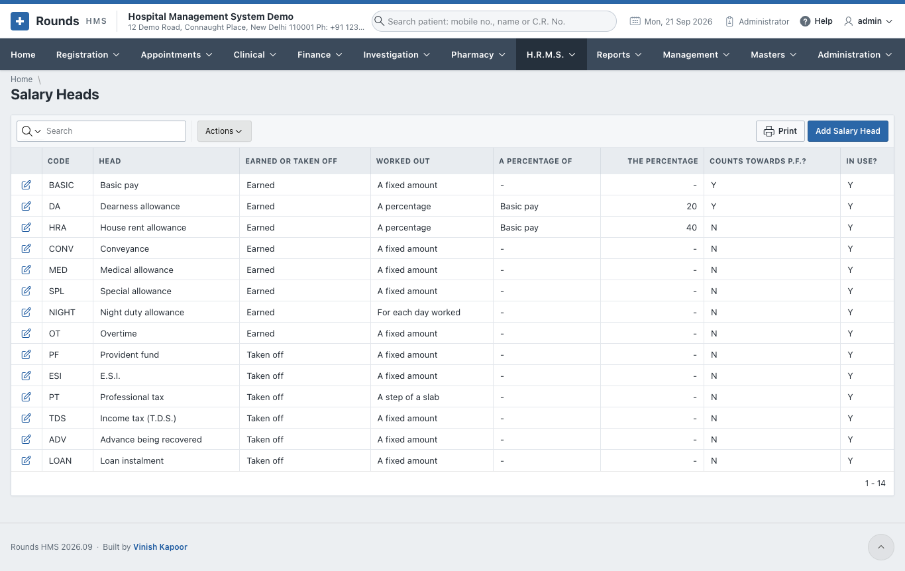

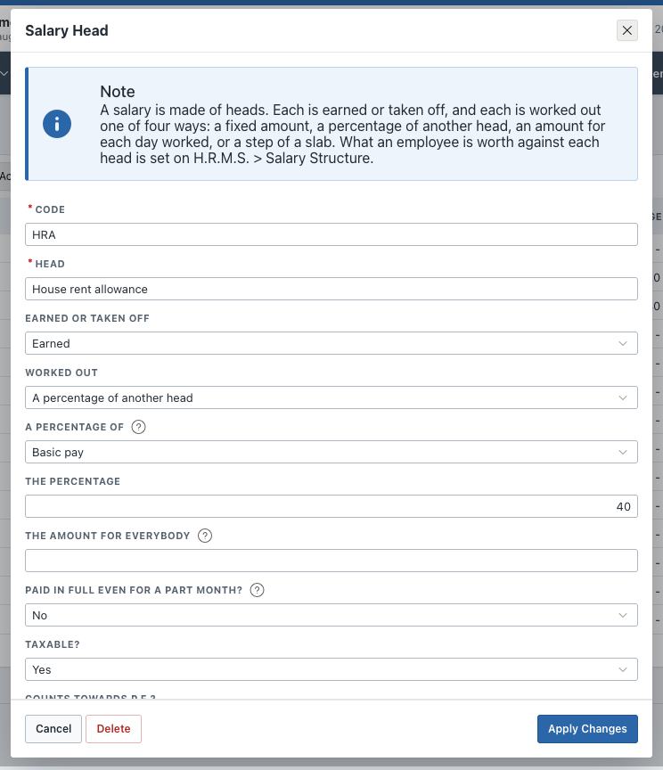

| Field | Meaning |
|---|---|
| **A Percentage of** / **The Percentage** | only for a head worked out as a percentage |
| **The Amount for Everybody** | where every employee gets the same. An employee's own amount on the salary structure is used first |
| **Paid in Full Even for a Part Month?** | **No**: the amount follows the days paid. Deductions are usually **Yes** |
| **Counts Towards P.F.?** / **Towards E.S.I.?** | whether this head is part of the wage P.F. or E.S.I. is worked out on |
| **Shown on the Payslip?** | **No** hides a head that is always nought |

P.F. and E.S.I. are heads too. Their amounts come from the rates of
[Payroll Settings](#payroll-settings), not from the salary structure.

## Slabs of a Head

The steps of a head worked out on a slab. The professional tax steps supplied are only an example: put
in the steps of your own state.

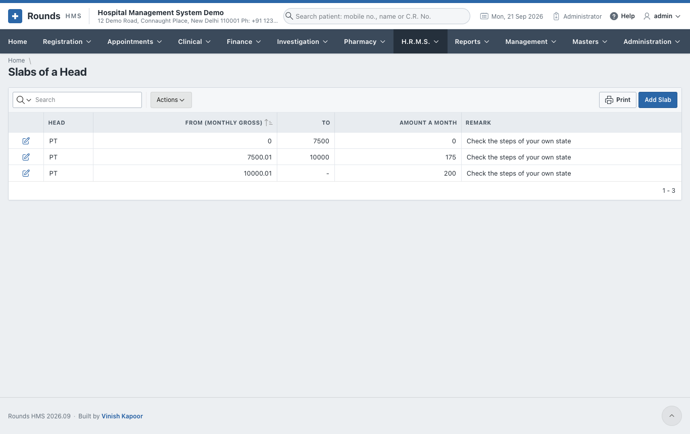

**From** and **To** are the monthly gross; **Amount a Month** is what is taken off for a gross in that
range. Leave the last step's **To** empty for everything above it.

## Attendance Settings

*(Administrators only.)* How the hospital keeps attendance.

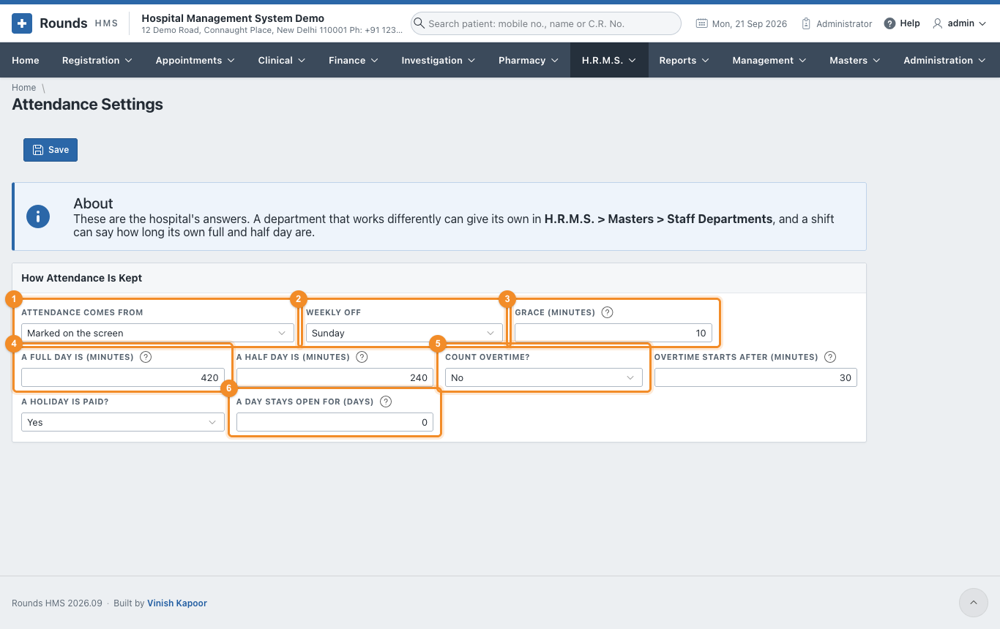

1. 1 **Attendance Comes From**:
    - **Marked on the screen**: somebody marks each day on [Attendance](roster-attendance.md#attendance);
    - **A machine at the door**: its file is loaded on [Load from the Machine](roster-attendance.md#load-from-the-machine);
    - **The duty roster alone**: nobody is marked day by day. Whoever is on the roster is taken as
      present; mark only an absence, a half day or a day on duty outside.
2. 2 **Weekly Off**: the hospital's day off, for anyone without a usual week.
3. 3 **Grace (minutes)**: how late someone may come before counting as late.
4. 4 **A Full Day Is** and **A Half Day Is (minutes)**: less than a half day counts
   as absent. A shift may give its own answer.
5. 5 **Count Overtime?** and **Overtime Starts After (minutes)** past the end of the
   shift. **A Holiday Is Paid?** says whether payroll pays for holidays.
6. 6 **A Day Stays Open for (days)**: after this many days, a day's attendance can
   no longer be changed. Nought keeps every day open.

A department can give its own answer to the first two in [Staff Departments](#staff-departments).

## Payroll Settings

*(Administrators only.)* The rates payroll works with. They change from time to time and from state to
state, so they are kept here rather than written into the application.

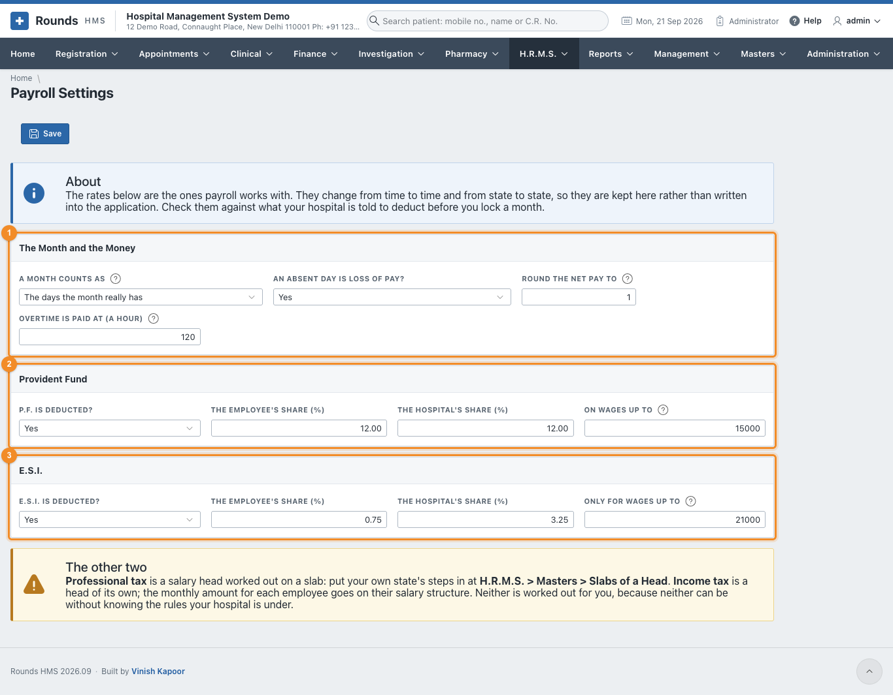

1. 1 **The Month and the Money**:
    - **A Month Counts As**: the days the month really has, or always thirty. A part month is paid
      against this;
    - **An Absent Day Is Loss of Pay?**;
    - **Round the Net Pay to**: 1 for the rupee, 10 for the ten;
    - **Overtime Is Paid at (a hour)**: empty means overtime is counted but not paid.
2. 2 **Provident Fund**: whether it is deducted, the employee's and the
   hospital's share, and **On Wages up to**: P.F. is worked out on the lower of this and the wage that
   counts towards it.
3. 3 **E.S.I.**: whether it is deducted, the two shares, and **Only for Wages up
   to**: someone earning more is outside E.S.I.

!!! warning "Income tax and professional tax are not worked out for you"
    **Professional tax** is the slab you fill in for your state ([Slabs of a Head](#slabs-of-a-head)).
    **Income tax (T.D.S.)** is an amount you set for each employee on their
    [salary structure](payroll.md#salary-structure). Neither can be worked out without knowing the rules
    your hospital is under, so check both with your accountant.
