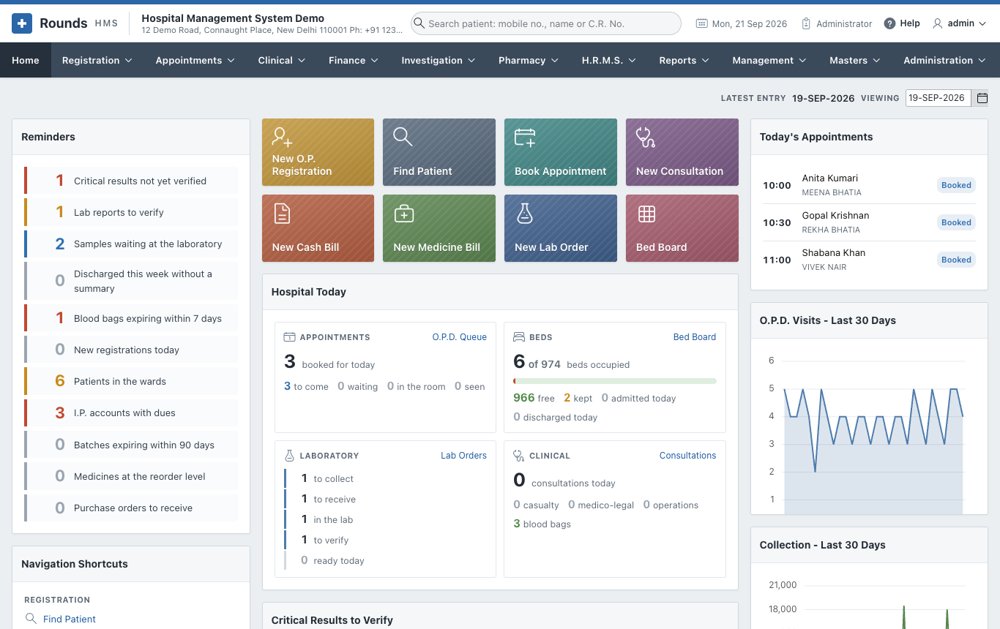

# Rounds HMS - User Guide

Rounds HMS runs the day of a hospital in one place. It covers:

- the registration desk and the wards;
- appointments and the doctor's clinical record;
- bills, payments, insurance claims and accounts;
- the laboratory, X-ray and ultrasound;
- the pharmacy and its stock;
- the staff: employees, the duty roster, attendance, leave and payroll;
- the registers and reports the hospital has to keep.

It runs in a web browser, on a computer, a tablet or a phone.

## How to read this guide

Each chapter follows one menu of the application, in the order the menu shows it. A page of the guide
takes one screen:

1. what the screen is for;
2. the steps to use it, in order;
3. what to check, and what to do when something goes wrong.

The screenshots carry orange numbers such as 1 2. The
same numbers appear in the steps below each picture. Click a picture to see it full size.

!!! note "The data in the pictures is invented"
    The screenshots come from a demonstration copy of Rounds HMS with invented data. Every patient,
    doctor, mobile number, payment reference and amount in them is made up. Names that look real are
    only common Indian names.

## The chapters

| Chapter | What it covers |
|---|---|
| [Getting Started](getting-started/index.md) | Signing in, the screen, finding a patient from anywhere, the settings to make once |
| [Registration](registration/index.md) | New patients, returning patients, admissions, beds, prescriptions, certificates |
| [Appointments](appointments/index.md) | Booking, the day's diary, doctor schedules and leave |
| [Clinical](clinical/index.md) | Consultations, discharge summaries, the ward chart, operations, casualty, blood bank, immunisation, antenatal care, births and deaths, consent forms |
| [Finance](finance/index.md) | Cash and credit bills, advances, the I.P. final bill, dues, day-end closing, insurance claims, doctor shares, GST and the accounts |
| [Investigation](investigation/index.md) | Lab orders, samples, results, X-ray and ultrasound reports |
| [Pharmacy](pharmacy/index.md) | Medicine bills and returns, stock, purchase orders and entries |
| [H.R.M.S.](hrms/index.md) | Employees, the duty roster, attendance, leave, payroll and payslips, and the staff reports |
| [Reports](reports/index.md) | The registers and summaries, and how to print or download them |
| [Management](management/index.md) | For administrators: the key figures, revenue, occupancy, lab turnaround, payer mix, staff cost, and reports mailed on a schedule |
| [Masters](masters/index.md) | Units, doctors, the tariff, wards, medicines and report formats |
| [Administration](administration/index.md) | Users and roles, hospital details, taxes, logs |
| [Workflows](workflows/index.md) | Whole journeys from start to end: an O.P.D. visit, an admission to discharge, a lab test, a cashless claim |
| [FAQ](faq.md) | Common questions and problems |
