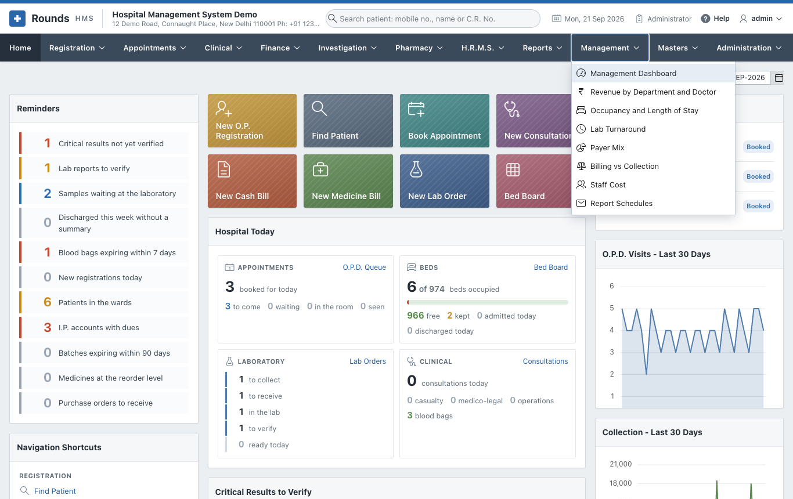

# Management

The **Management** menu shows how the hospital is doing: money, patients, beds and the laboratory,
for any period, against the period before it. It also mails reports to the people who need them, on a
schedule.

Only an **Administrator** sees this menu. No other role opens it, whatever its modules.

| Page | What it shows |
|---|---|
| [Management Dashboard](dashboard.md) | The key figures of a period against the period before, and six charts |
| [Analyses](analyses.md) | Revenue by Department and Doctor, Occupancy and Length of Stay, Lab Turnaround, Payer Mix, Billing vs Collection |
| [Staff Cost](staff-cost.md) | What the staff cost the hospital, month by month against the revenue, and by department |
| [Report Schedules](schedules.md) | Reports mailed every day, week or month to a list of addresses |

Every page works like the [reports](../reports/index.md#how-every-report-works): choose **From** and **To**,
click **Show**. A page opens on the current month.

## Where the figures come from

Nothing is typed in for these pages: they read the bills, receipts, admissions and lab orders.

| Figure | Counted from |
|---|---|
| **Revenue** | every bill once: registration and renewal fees, the lines of cash and credit bills, the I.P. final bill (charges and the advance), medicine bills less returns, miscellaneous bills |
| **Department** | the unit of a registration, the tariff group of a bill line (Pathology, Radiology ...), the ward of an I.P. bill, Pharmacy for medicines |
| **Payer** | the empanelled company of the bill; for an I.P. bill without one, the insurer or TPA of a [claim](../finance/insurance.md#insurance-claims) on the admission; otherwise **Self-pay** |
| **Collected** | every payment received, less refunds and returns (doctors' payouts are not counted) |
| **Outstanding** | what patients and insurers owe now, as in [Outstanding Dues](../finance/inpatient-billing.md#outstanding-dues) |
| **Bed occupancy** | bed-days used out of the beds of every ward (from **Masters > I.P. Wards**) times the days of the period |
| **Average length of stay** | the days from admission to discharge of the patients discharged in the period (a same-day stay counts as one day) |
| **Staff cost** | the locked and open months of [payroll](../hrms/payroll.md): the gross pay and the hospital's own share of P.F. and E.S.I. |
| **Lab turnaround** | the hours from the order to the verified report; **on time** when within the longest target of its tests (**Investigation > Lab Test Settings**, 24 hours when none is set) |
