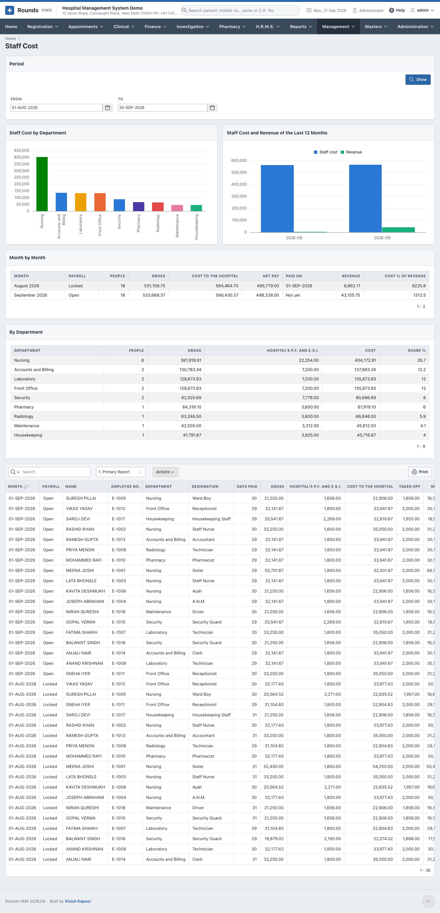

# Staff Cost

**Management > Staff Cost** shows what the staff cost the hospital, from the [payroll](../hrms/payroll.md)
of H.R.M.S. The cost of a person is their **gross pay** and the hospital's **own share of P.F. and E.S.I.**,
which is not taken off their salary but is still paid by the hospital.

Choose **From** and **To** and click **Show**. Every month of payroll that falls in the period is counted.

In the picture the demonstration hospital has a full staff but only a few days of invented bills, so its
**Cost % of Revenue** is far above anything a real hospital would show.

| Part | What it shows |
|---|---|
| **Staff Cost by Department** | the cost of each department, largest first |
| **Staff Cost and Revenue of the Last 12 Months** | the cost of each month beside the revenue of the same month |
| **Month by Month** | the payroll of each month (locked or open), the people, the gross, the **cost to the hospital**, the net pay, the day it was paid, the revenue of the month, and **Cost % of Revenue** |
| **By Department** | the people, the gross, the hospital's P.F. and E.S.I., the cost, and each department's share of the whole |
| **Details** | person by person, month by month |

!!! note "Read an open or a part month with care"
    A month whose payroll is still **Open** can change until it is locked. For the current month, the
    revenue is only the revenue so far, so its **Cost % of Revenue** looks high until the month ends.
