# Hospital and Tariff

## Units

The departments of the O.P.D. (Medicine, Surgery, Eye ...).

- **Unit**: the name, as printed.
- **Room No.**: fills in on a registration when the unit is chosen, and is the room shown on the token
  display for a doctor who has none of their own.
- **OPD Use?**: **Yes** offers the unit at the registration desk.
- **Queue** and **Token Prefix**: how this department counts its O.P.D. tokens - see
  [O.P.D. Queue](../appointments/queue.md#the-department).

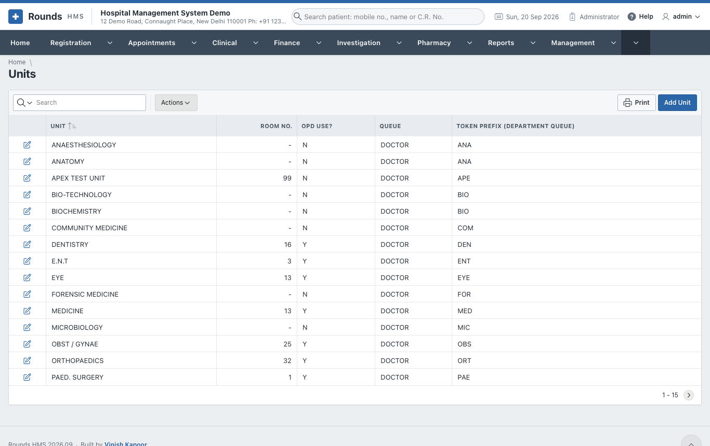

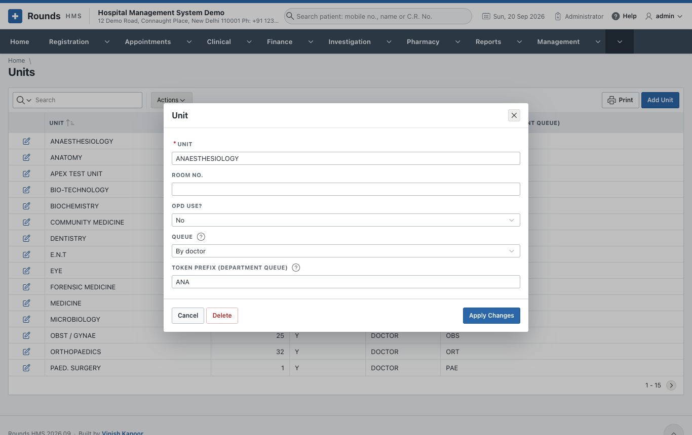

## Doctors

The doctors of the hospital.

- **Dr. Name**, **Designation** and **Unit**. The unit decides where the doctor appears.
- **Address**, **Contact** and **Date Appointed**.
- **Qualification (printed under the name)**, **Registration No.** and **Other Lines on the
  Prescription** (one per line). These make the doctor's letterhead on prescriptions.
- **O.P.D. Timing**, printed for patients. The bookable clinic hours are in
  [Doctor Schedules](../appointments/schedules.md).
- **Room**: where the doctor sits, shown on the
  [token display](../appointments/queue.md#the-screen-of-the-waiting-area). Empty: the room of the
  doctor's unit.

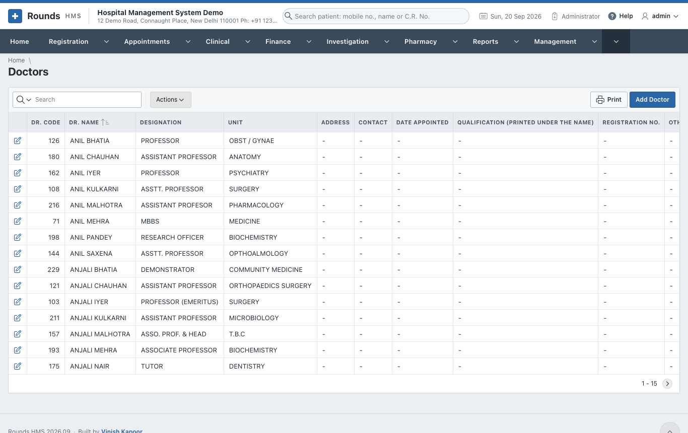

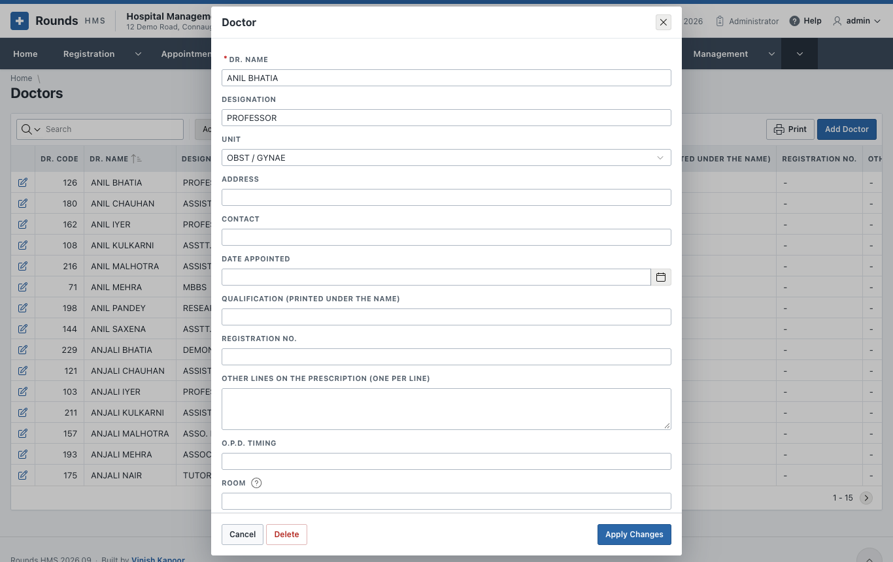

## OP Charge Items

The fees of registration. **NEW REGISTRATION** is the registration fee offered on a new registration and a
paid renewal. Each item has a **Charge**, and optionally **Any Other Head** with its **Other Charge**; the
**Total** is their sum.

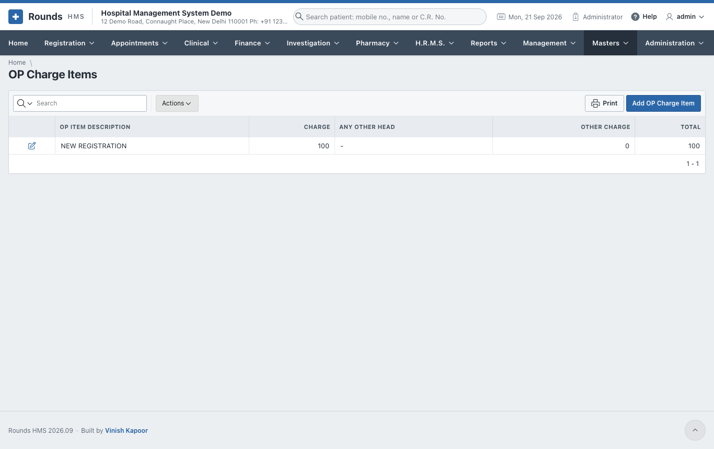

## Cash Groups, Subgroups and Heads (the tariff)

The **tariff** is every service the hospital charges for, with its rate:

- **Cash Groups**: the departments of the tariff, e.g. PATHOLOGY, RADIOLOGY, IPD.
- **Cash Subgroups**: the categories within a group, e.g. HAEMATOLOGY, X-RAY, ULTRASOUND.
- **Cash Heads (Tariff)**: each service with its **Rate**, under a **Cash Group** and **Subgroup /
  Category**. **Empanelment (tariff)** makes a head part of a company's own tariff, with its own rate.

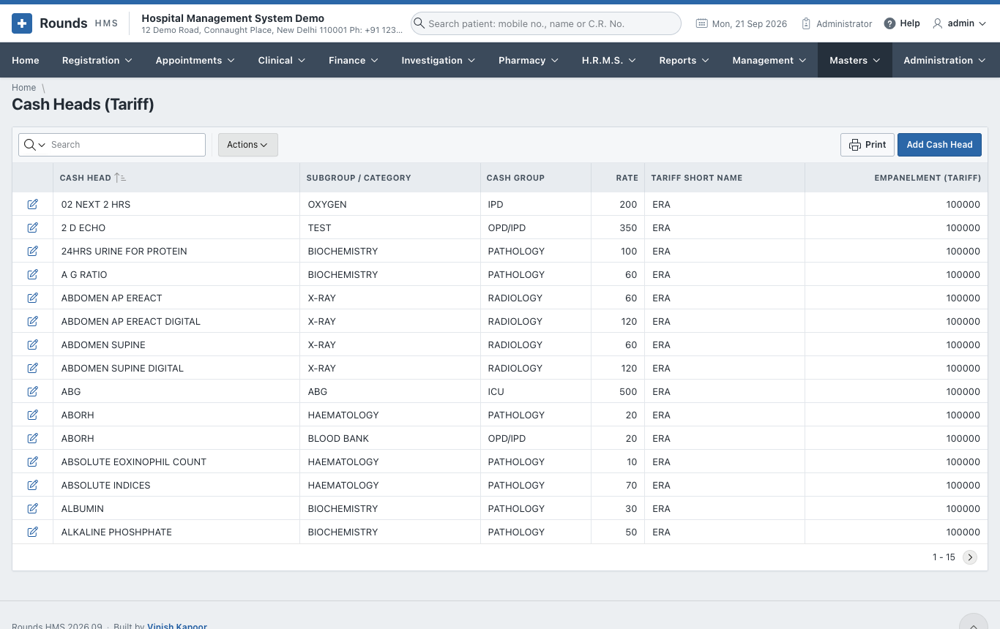

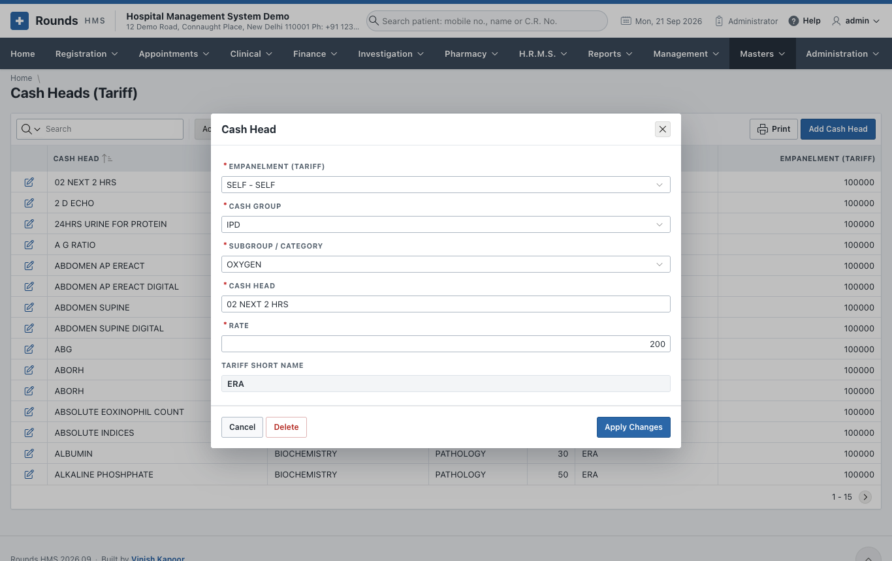

!!! tip
    To raise many rates at once from a given day, use a [tariff version](../finance/rates.md#tariff-versions)
    instead of changing each cash head.

## Empanelled Companies

The companies, insurers, TPAs and schemes whose patients are billed on credit:

- **Short Name**, **Full Name**, **Address**, **City**, **Phone Nos.** and **Email**;
- **Contract Starts on** / **Ends on** and the **Credit Limit**;
- **Is Active?**, the **TPA** and a **Remark**;
- **GSTIN**, **GST State Code** and **PIN Code**. With a GSTIN, the company's credit bills are B2B invoices
  in the [GST returns](../finance/gst-accounts.md#gst-returns).

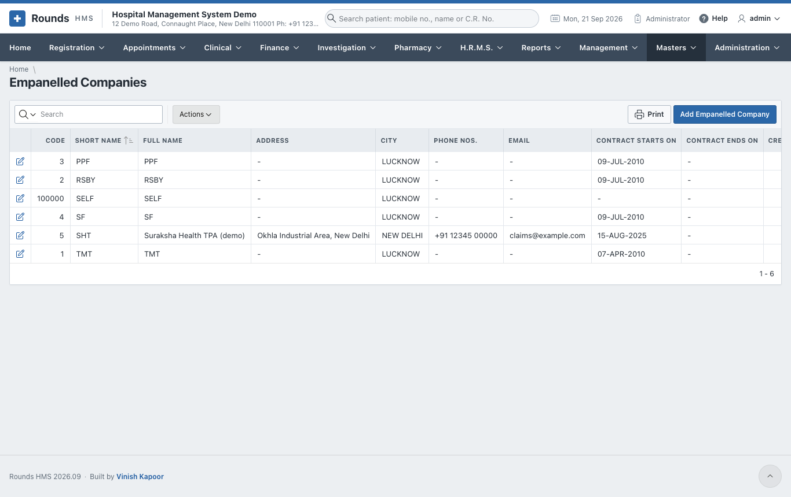

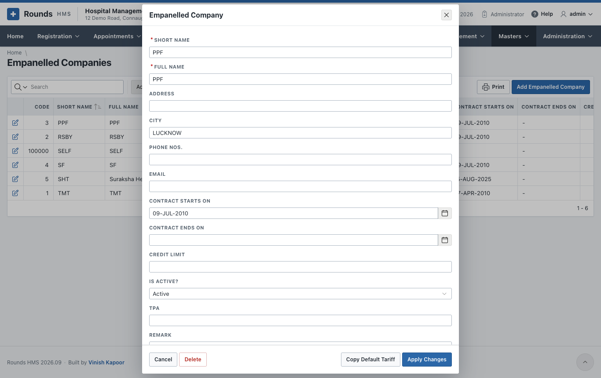

## I.P. Wards

Each ward, with its **Charges per day** and its beds (**From Bed No.** to **To Bed No.**). The
[Bed Board](../registration/beds.md) and the ward charges of the I.P. bill come from here.

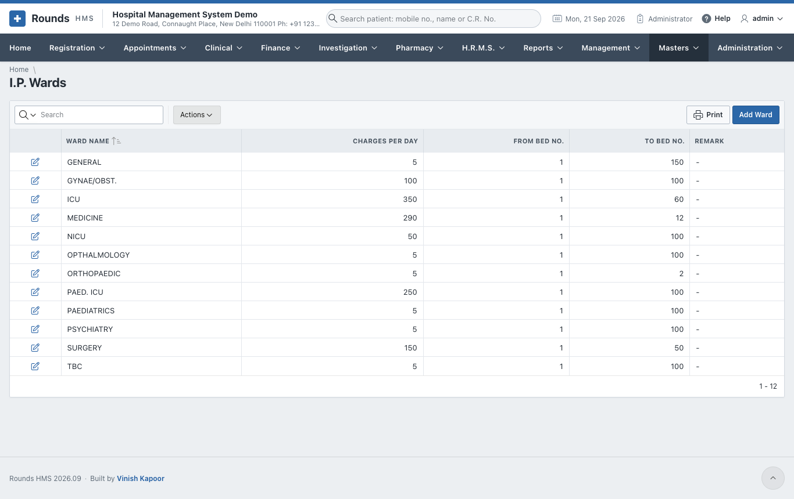

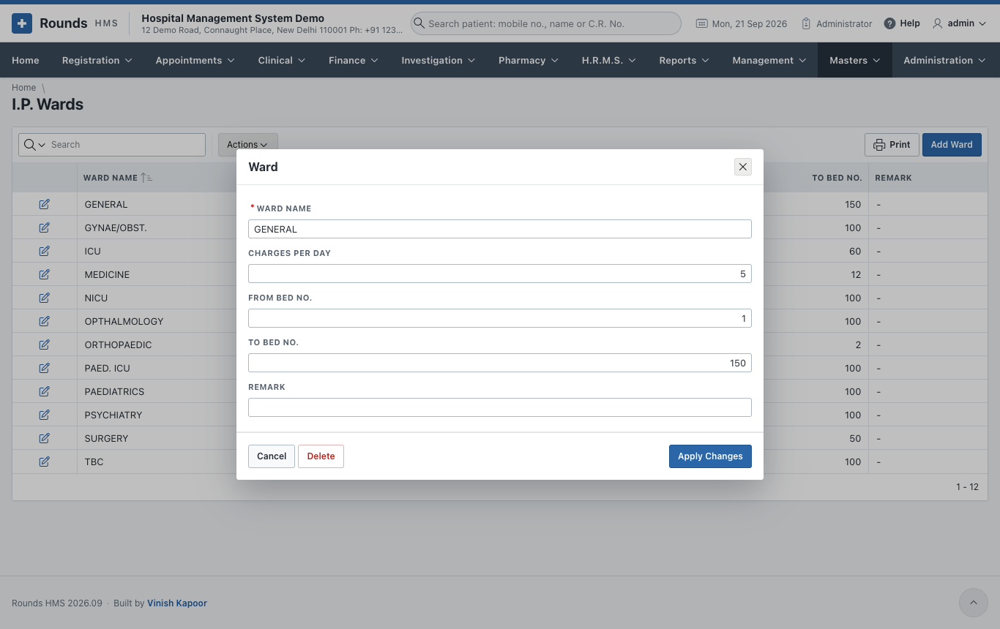

## I.P. Bill Items

The charges offered on the [I.P. final bill](../finance/inpatient-billing.md#ip-final-bill), each with its
**Rate**: nursing, doctor's visit, oxygen, monitor ...

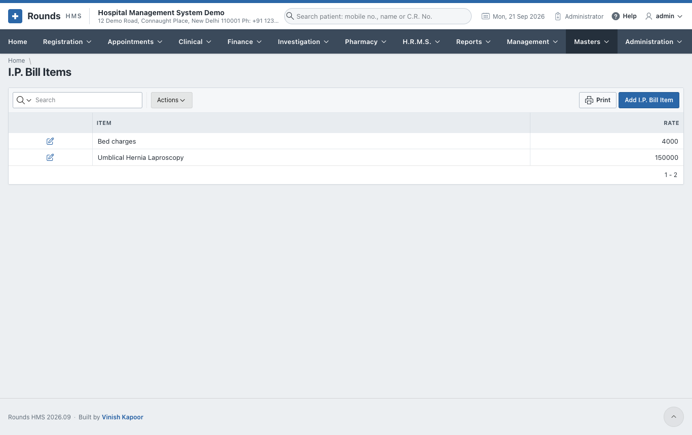
