# Clinical Reports

## Appointments Register

**Reports > Appointments Register**. Every appointment, **By Status** (seen, no-show, cancelled ...).

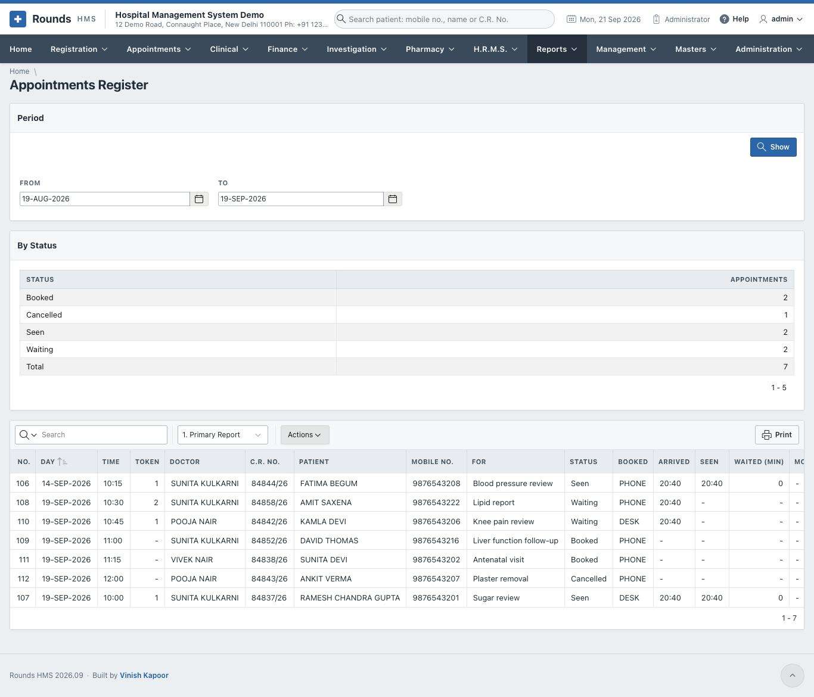

## O.P.D. Queue and Waiting Times

**Reports > O.P.D. Queue and Waiting Times**. How long patients waited for their token to be called, and
how long the consultation took, **By Doctor** and **By Hour of Arrival**. It counts the visits that
finished - seen, or did not come. See [O.P.D. Queue](../appointments/queue.md#how-long-patients-waited).

## Doctor Utilisation

**Reports > Doctor Utilisation**. How busy each doctor was: the appointments and patients of the period, **By Doctor**.

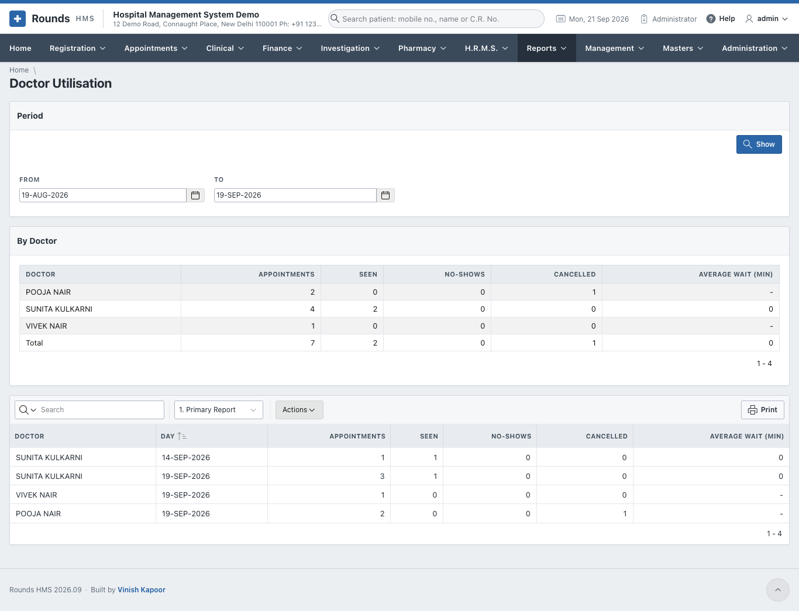

## Consultations and Diagnoses

**Reports > Consultations and Diagnoses**. The consultations of the period and the **Diagnoses of the Period** by I.C.D.-10 code, the most frequent first.

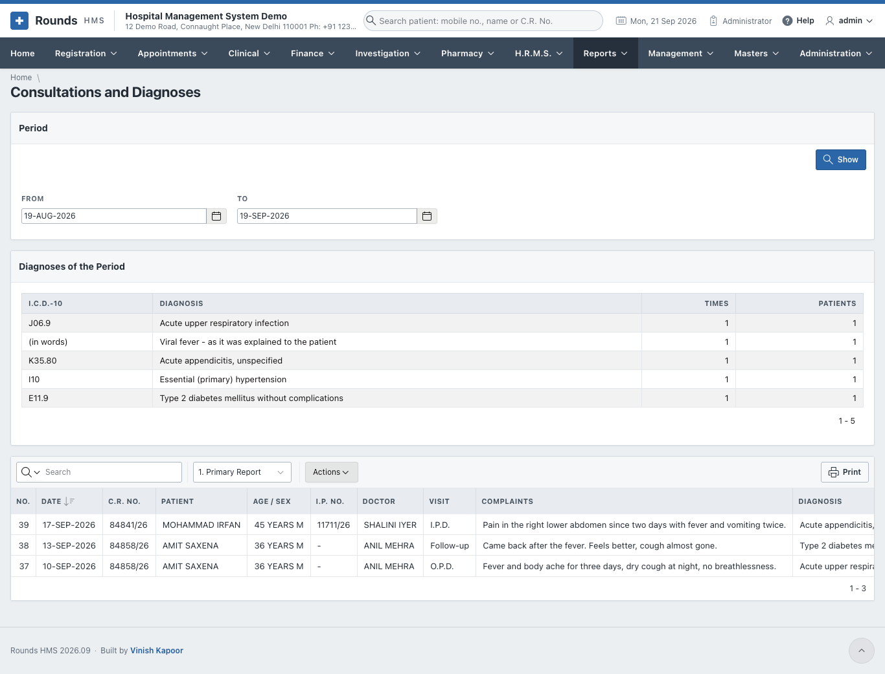

## Operation Register

**Reports > Operation Register**. Every operation, with **Operations by Surgeon**.

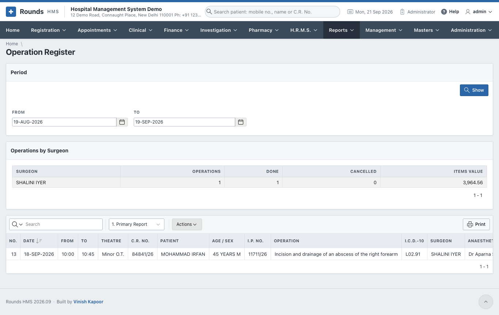

## Casualty Register

**Reports > Casualty Register**. Every casualty case, with **Cases by Triage**.

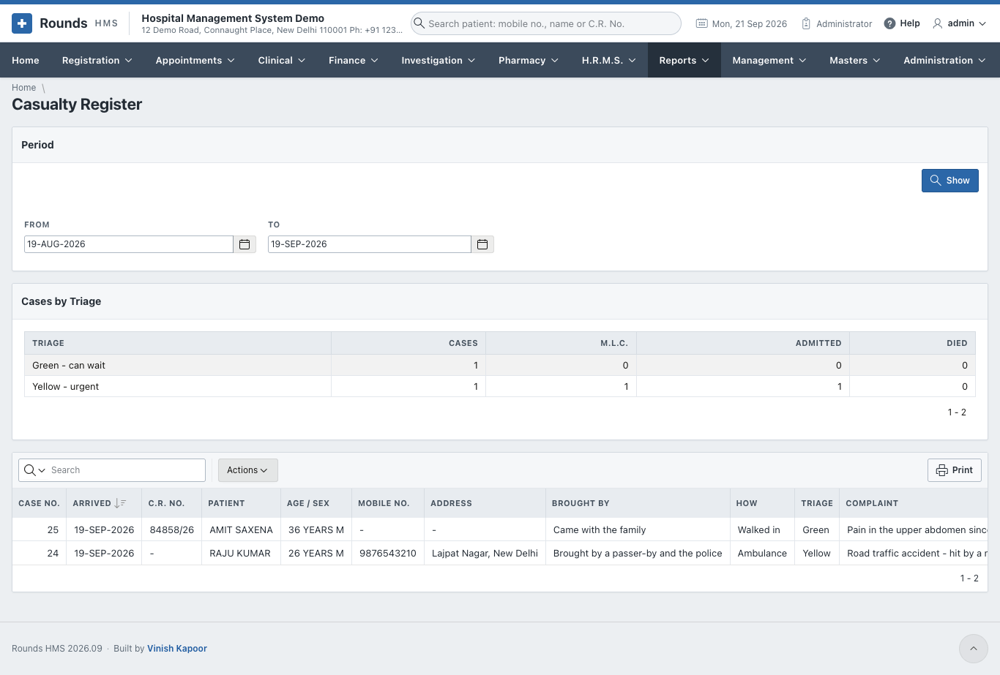

## M.L.C. Register

**Reports > M.L.C. Register**. Every medico-legal case, with the police station, the F.I.R. and whom the hospital informed.

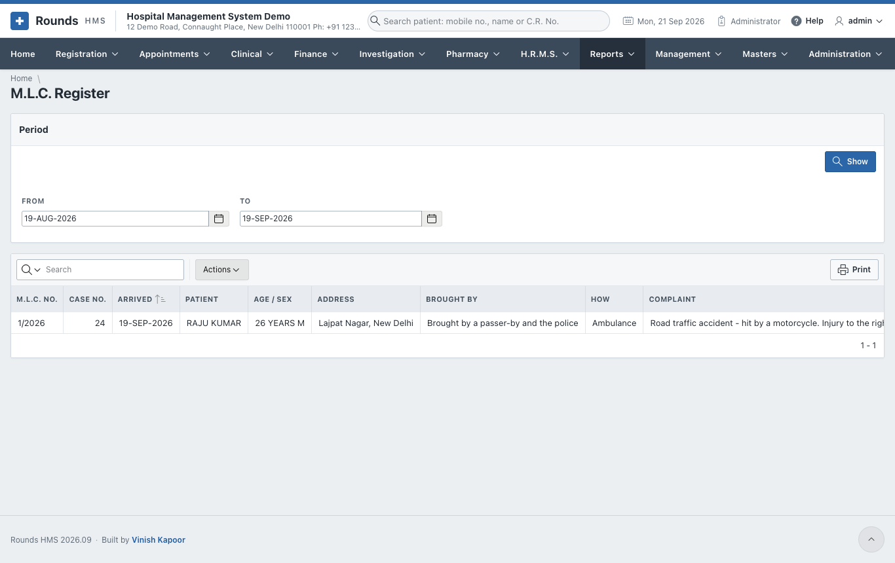

## Blood Bank Register

**Reports > Blood Bank Register**. The bags collected, issued, expired and thrown away. **In the Fridge Today** shows the stock by group.

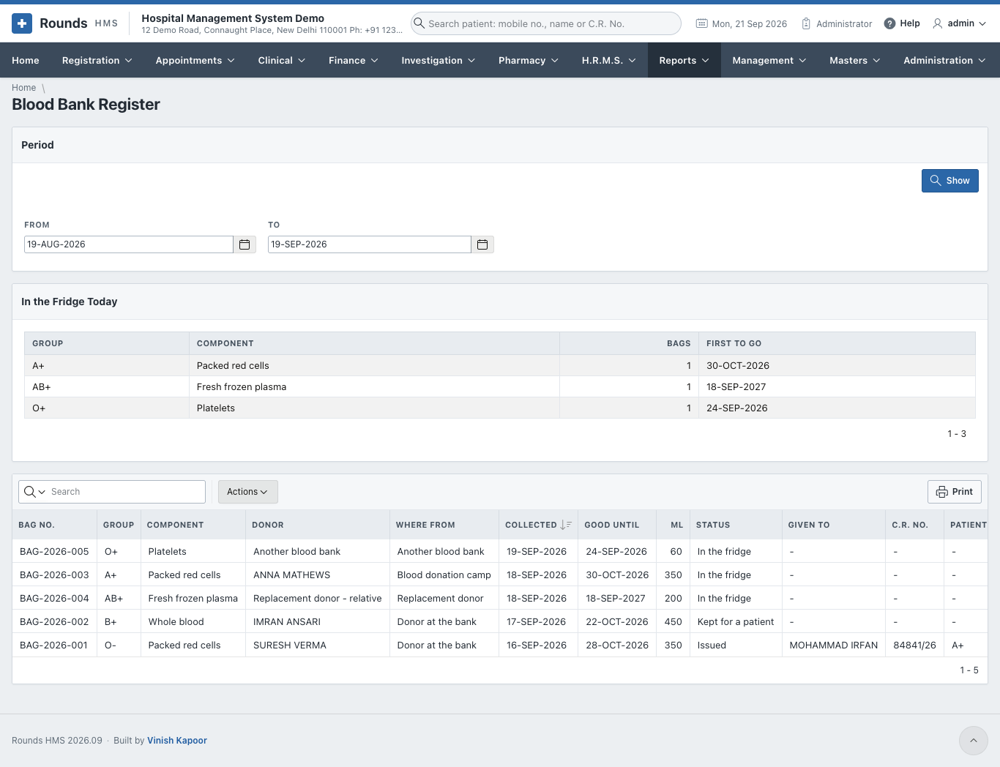

## Immunisation Due

**Reports > Immunisation Due**. The children whose vaccines are due or late, with the parents' mobile numbers, to call them in.

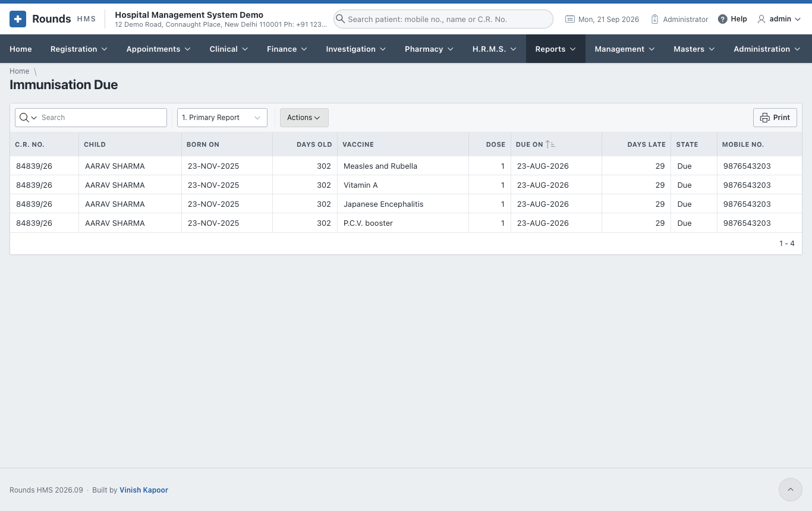

## Birth Register

**Reports > Birth Register**. The births of the period, as the registrar asks for them.

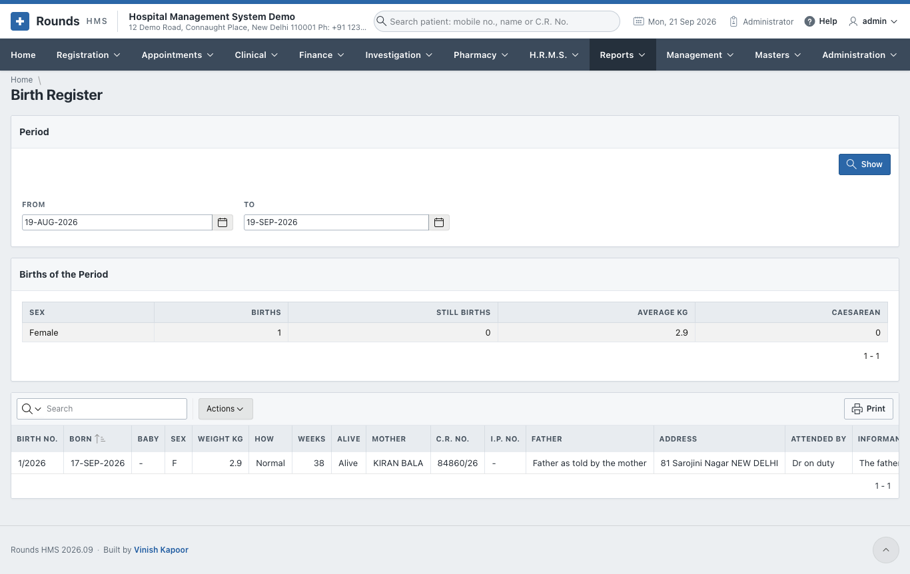

## Death Register

**Reports > Death Register**. The deaths of the period, with **Deaths by Cause**.

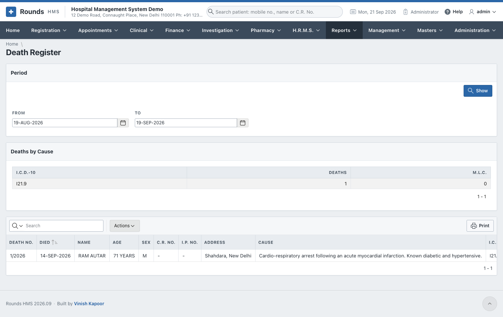

## A.N.C. Register

**Reports > A.N.C. Register**. The antenatal cards, with the expected dates of birth and the high-risk mothers.

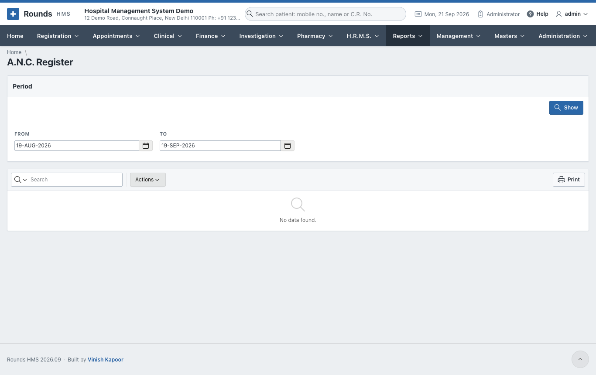
