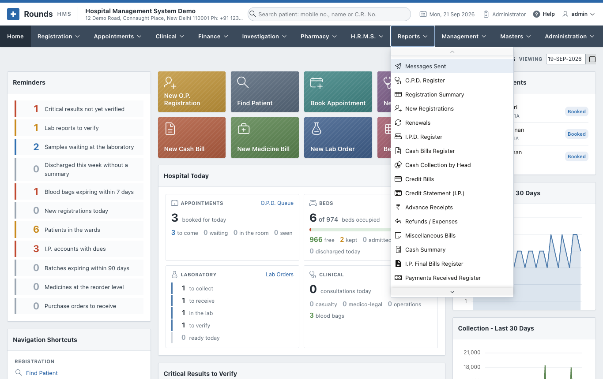
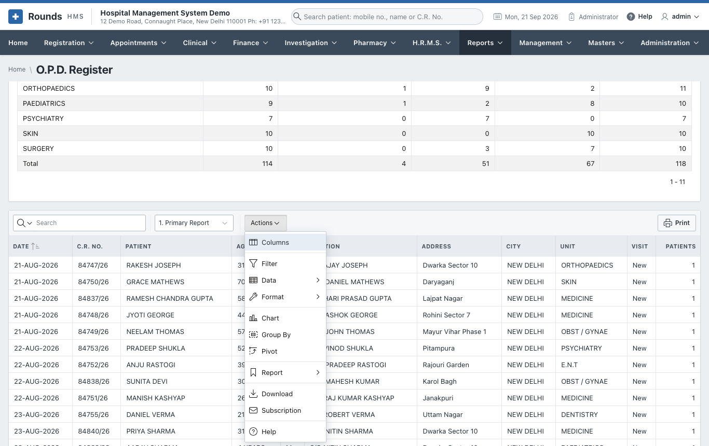

# Reports

The **Reports** menu holds the registers and summaries of the hospital: 34 reports on registrations,
admissions, money, the pharmacy and clinical work, and the log of WhatsApp messages sent.

| Page | Reports |
|---|---|
| [Registration and Admission](registration.md) | O.P.D. Register, Registration Summary, New Registrations, Renewals, I.P.D. Register, Bed Occupancy and Length of Stay |
| [Money](finance.md) | Cash Bills Register, Cash Collection by Head, Credit Bills, Credit Statement (I.P.), Advance Receipts, Refunds / Expenses, Miscellaneous Bills, Cash Summary, I.P. Final Bills Register, Payments Received Register, Discounted Bills, G.S.T. Collected |
| [Pharmacy](pharmacy.md) | Medicine Sales, Medicine Returns Register, Purchase Orders Register, Purchase Entries Register, Stock Movements |
| [Clinical](clinical.md) | Appointments Register, O.P.D. Queue and Waiting Times, Doctor Utilisation, Consultations and Diagnoses, Operation Register, Casualty Register, M.L.C. Register, Blood Bank Register, Immunisation Due, Birth Register, Death Register, A.N.C. Register |
| [Messages Sent](messages.md) | Every WhatsApp message opened from Rounds HMS |

## How every report works

1. **Period**: choose **From** and **To**, then click **Show**. A report opens on the current month.
2. Most reports start with a **summary** (by unit, ward, counter, company, doctor ...), then the
   **details** line by line.
3. The details are an interactive report. The **Search** box finds any text in it, and **Actions** does
   the rest:

| Action | Use it to |
|---|---|
| **Columns** | show, hide and order the columns |
| **Filter** | keep only the rows you want, e.g. one unit or one doctor |
| **Data** | sort, add totals (aggregate), compute a new column |
| **Format** | highlight rows, control breaks, rows per page |
| **Chart** / **Group By** / **Pivot** | see the data as a chart, grouped, or as a pivot table |
| **Report** | save your layout as your own report, and pick it next time from the list beside **Actions** |
| **Download** | Excel, CSV, PDF or HTML |
| **Subscription** | receive the report by e-mail on a schedule (when e-mail is set up) |

4. The list beside **Actions** holds the **saved views** of the report, e.g. *Unit wise*, *Doctor wise*,
   *By Medicine*. **1. Primary Report** is the plain list.
5. **Print** prints the details on a clean page, with the hospital's name, the period and the filters
   applied. The page opens in a new tab and has its own filters by column.

!!! tip
    A layout you save with **Actions > Report > Save Report** is yours alone. It does not change the report
    for anyone else.
